1.信息和信息系统

## 1.1信息与信息技术

### 1.1.1什么是信息

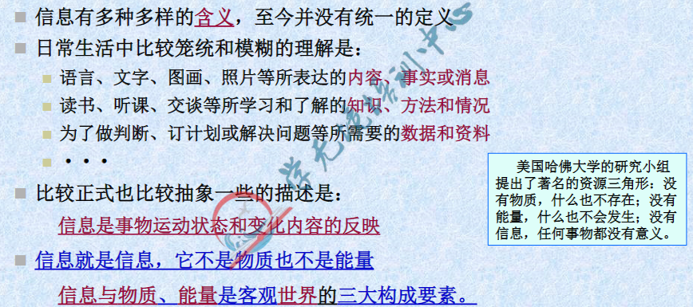

**（重要）信息是事物运动状态和变化内容的反应**

信息与物质、能量是客观世界的三大构成要素（多选）


信息：有价值的资讯

多媒体信息：包含文字，图，声音，视频的信息

电子邮件支持多媒体信息：（采用MIME协议）

计算机中的所有信息均是用0,1表示（编码）

```
请问以下属于信息的是：ABC
A.上课的知识
B.图片
C.音乐
D.呼噜声
```


**信息有哪些性质**（了解）

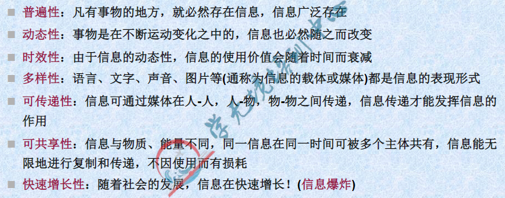

数据的存储单位：

- 信息的最小单位：bit b 比特 位
- 信息的基本单位：byte B 字节
  - 1B=8b
  - B--KB--MB--GB--TB--PB
  - 2^10


**什么是信息处理（重要）**

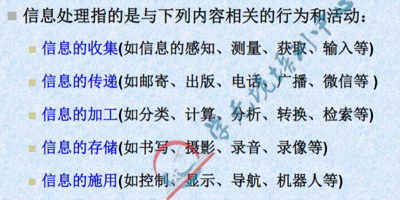

信息处理指的是与下列内容相关的行为和活动

- 信息的收集（如信息的感知，测量、获取、输入等）
- 信息的传递（如邮寄、出版、电话、广播、微信等）
- 信息的加工（如分类、计算、分析、转换、检索等）
- 信息的存储（如书写、摄影、录音、录像等）
- 信息的施用（如控制、显示、导航、机器人等）


**人工进行信息处理的过程**

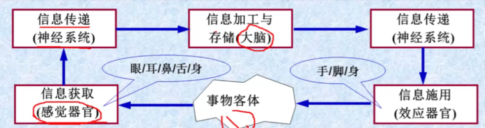

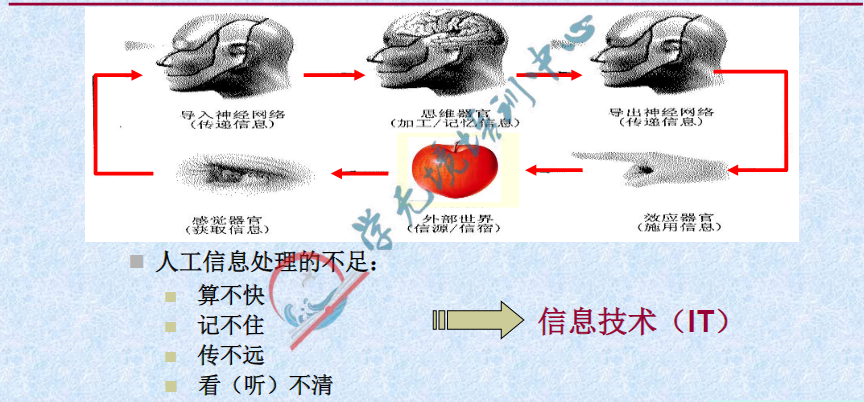

人工信息处理的不足：

- 算不快
- 记不住
- 传不远
- 看（听）不清


### 1.1.2信息技术与信息产业

**什么是信息技术**

信息技术简称**IT**，指的是用来扩展人们信息器官功能、协助人们有效地进行信息处理的一门技术（可能考判断）

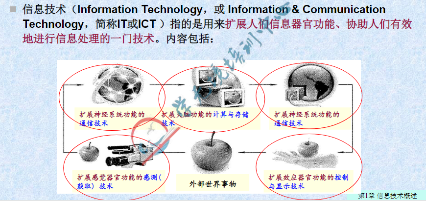

**信息技术包括4个方向：**

- 扩展感觉器官功能的感测与识别技术-----雷达（信息收集能力）
- 扩展神经系统功能的通信技术----互联网（信息传递能力）
- 扩展大脑功能的计算与存储技术----计算机（信息加工和存储能力）
- 扩展效应器官功能的控制与显示技术----投影技术（信息施用能力）


**信息技术的发展历史**（了解）

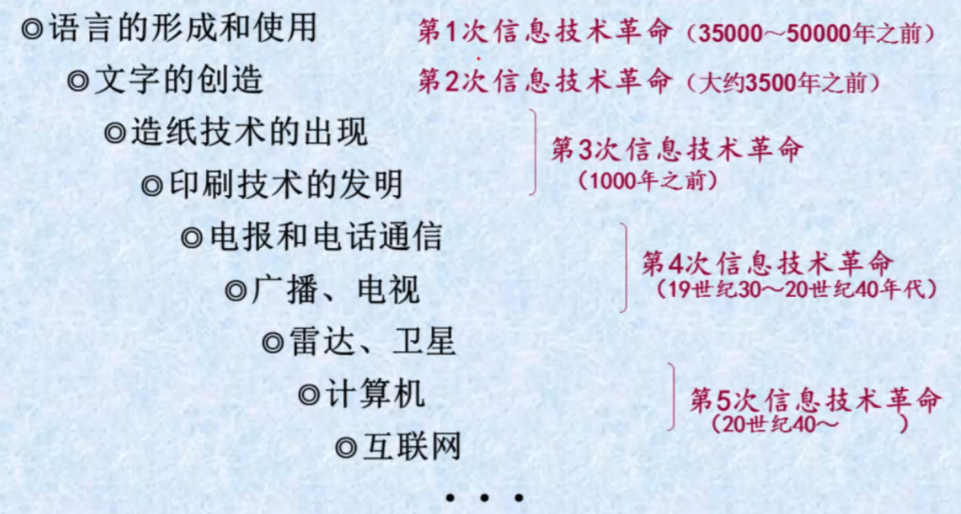

电子商务（EC或EB）（最开始由电报开始）

现代信息技术是由电报开始的


**现代信息技术有什么特征**

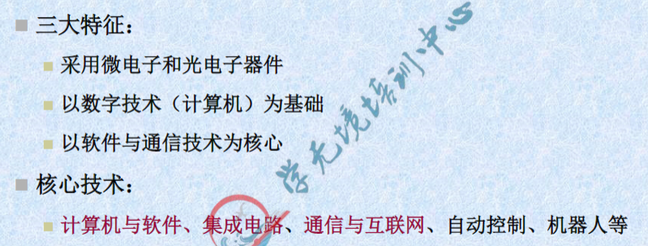

**【现代】信息技术三大特征**

- 采用微电子和光电子器件
- 以数字技术（计算机）为基础
- 以软件与通信技术为核心

**核心技术：**

计算机软件、集成电路、通信与互联网、自动控制、机器人等


**信号：**

- 数字信号：D离散（计算机）
- 模拟信号：A连续（人的声音  光  电）


```
麦克风的功能是将人的声音转换成数字信号。（错） 
						 （电）

扫描仪的CCD（电荷耦合器件）是将光信号转成电信号，且均为模拟信号。（对）
         光电转换原理
```


**现代信息技术的基础与核心**


**信息技术对社会和经济的影响**（了解）

有正有负

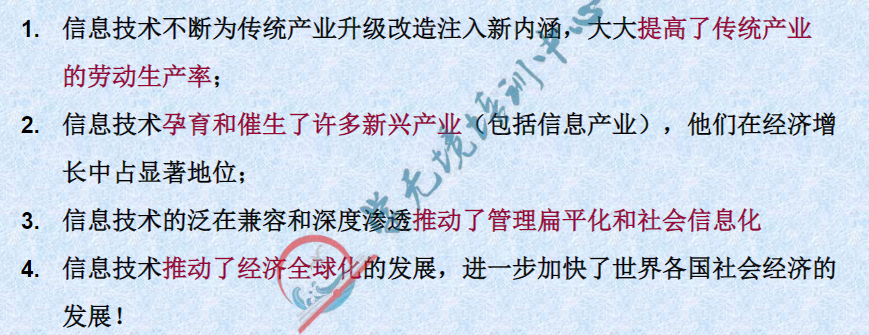


**什么是信息产业**（了解）

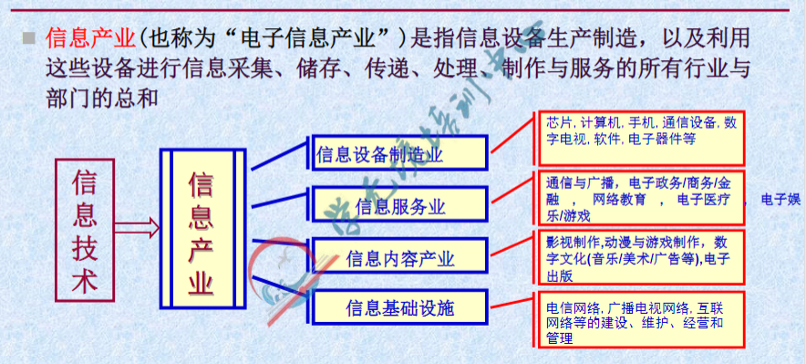

DBMS：数据库管理系统（系统数据库）

​	ACCESS，VFP，SQLSERVER，MYSQL，ORACLE，DB2


**世界知名IT企业**

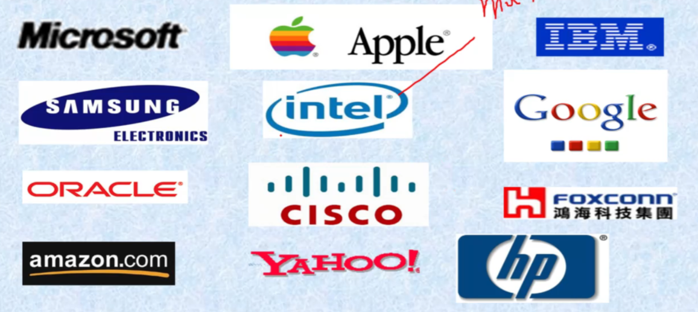

**国内的IT企业**

BATJ（一线）

百度，阿里巴巴，腾讯，京东


### 1.1.3信息化与信息社会

**科技进步对人类社会发展的影响**（普通）

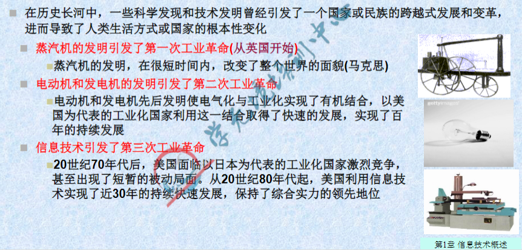

**人类进入信息社会**（了解）

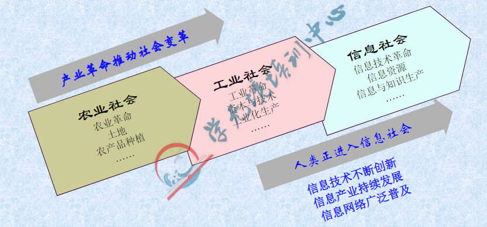

**什么是信息化**（了解）

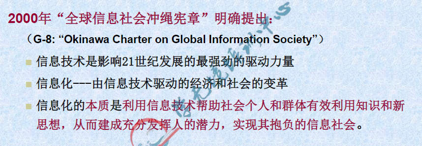

**我国信息化建设的历程（了解）**

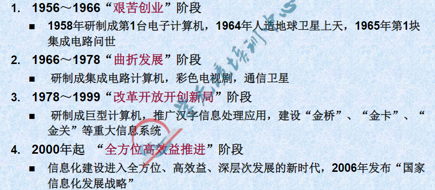

**信息化是实现“四化”的关键（了解）**

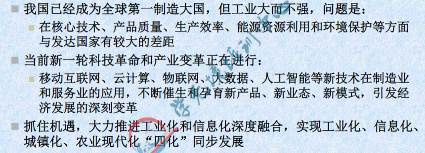


**（重要）"互联网+"的行动计划**

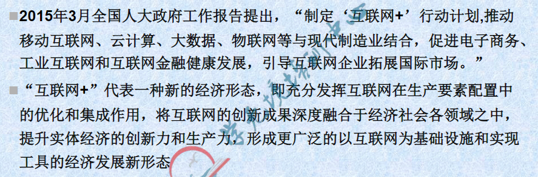

加的是各行各业


## 1.2信息通信技术

### 1.2.1通信的基本原理

通信：信息的远距离传递

【现代】通信：光（电），信息的远距离传递

#### 1.2.1.1通信系统模型

**什么是通信**

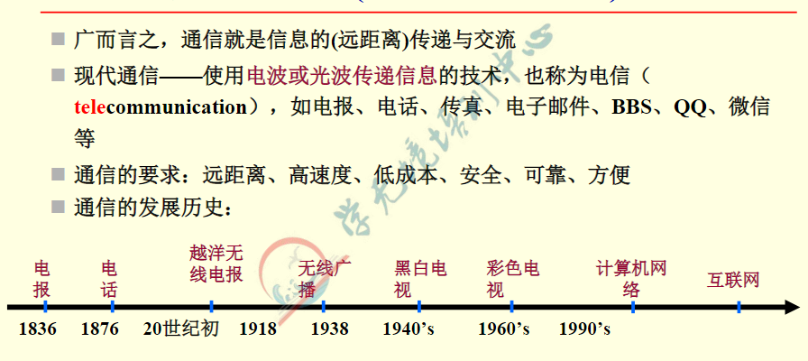

**（重要）通信的要求：**远距离、高速度、低成本、安全、可靠、方便


EDI：电子数据交换网——（电报、电话）


**通信系统的模型**

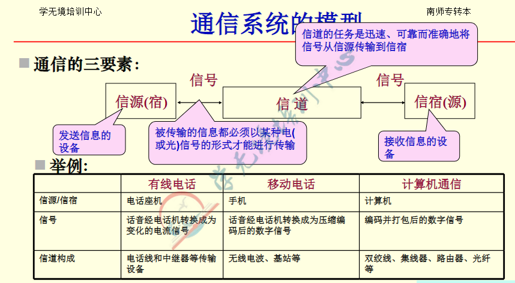

通信系统的三要素

1. 信源
2. 信道
3. 信宿


1.远距离

​	高频振荡的正弦波（频率很高，波长很短的波）

调制器：

- ​	调频（FM）
- ​	调幅（AM）
- ​	调相（PM）

解调器：还原

​	调制解调器（MODEM）插- 电话线  RJ11（不是双绞线）


```
请问有一个函数y=sin(x-3)的波形变成了y=sin(x)需要做：C
请问有一个函数y=sin(x)的波形变成了y=sin(2x)需要做：A
请问有一个函数y=sin(x)的波形变成了y=2sin(x)需要做：B
A.调频（FM）
B.调幅（AM）
C.调相（PM）
D.解调
```


2.低成本

**多路复用**

多路信号使用同一条传输线同时进行传输

```
多路复用技术:B
A.多种信号在多条信道上同时传播
B.多种信号在1条信道上同时传播
C.1种信号在多条信道上同时传播
D.1种信号在1条信道上同时传播
```

方法：

- 频分多路复用（FDM）
- 时分多路复用（TDM）
- 波分多路复用（WDM）
- 码分多址（CDMA）


#### 1.2.1.2有线通信与无线通信

信道（传输介质）：

- 有线
  - 金属导体（电）	中继器（信号放大）（因为有电阻，电流会变弱）
    - 双绞线
    - 同轴电缆
  - 光纤（光）
    - 光纤
- 无线
  - 无线电波
    - 灵活，抗灾能力强


**传输介质的类型与特点**

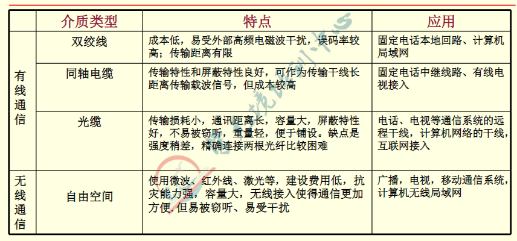

**误码率：**出错的位数除以总共位数的比例

光缆：强度差，精确连接两根光纤比较困难

**双绞线和同轴电缆**

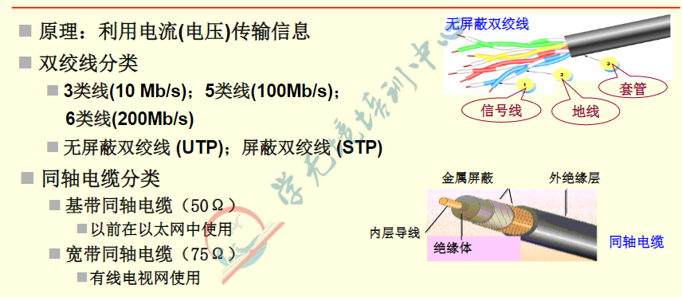

**重要**

**双绞线的水晶头是RJ45——插在网卡里的**——网卡插在主板的PCR上

**电话线的水晶头是RJ11——插在MODEM（调制解调器）**

日常生活还是用5类线

无屏蔽双绞线（UTP）（就是裸线）屏蔽双绞线（STP）（有保护壳，牢固能力，抗干扰能力加强）


PCI：声卡，网卡

AGP，PCI-E：显卡


基带适合传数字信号（D）

宽带适合传模拟信号（A）


```
金属导体每过一段距离需要安装中继器来方法信号，且能力损耗是由于电阻的削弱引起的。	正确的
```


**光纤与光缆**

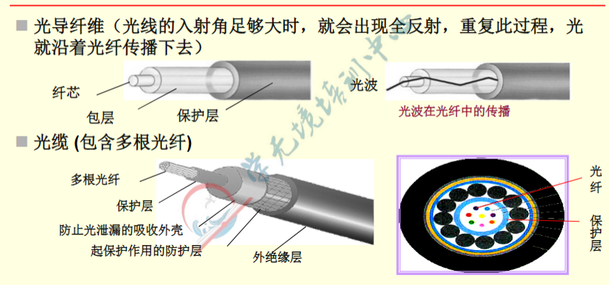

**光纤的通信原理**

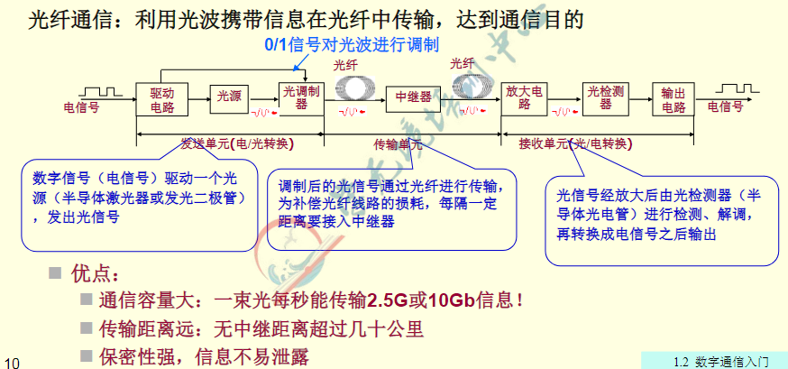

光纤也需要中继器，但是它的距离比较远，可以隔几十公里


**无线通信**

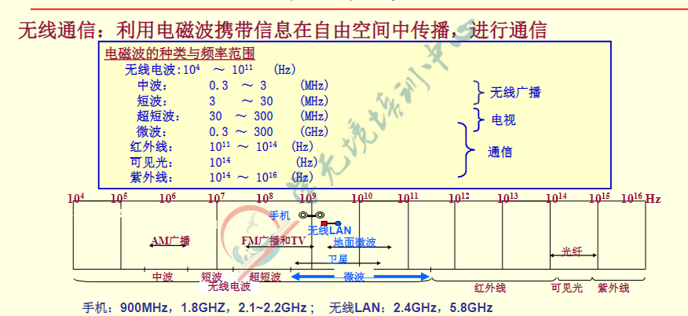

微波适合远距离传递


**微波通信（重要）**

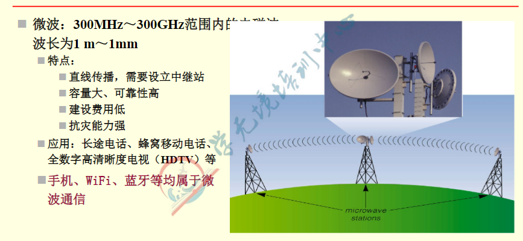

**特点**

- 直线传播，需要建设中继站，无穿透力（最重要）
- 容量大，可靠性高
- 建设费用低
- 抗灾能力强

微波通信的三大例子：

1. 地面微波接力通信（雷达）
2. 对流层
3. 卫星通信


**卫星通信**

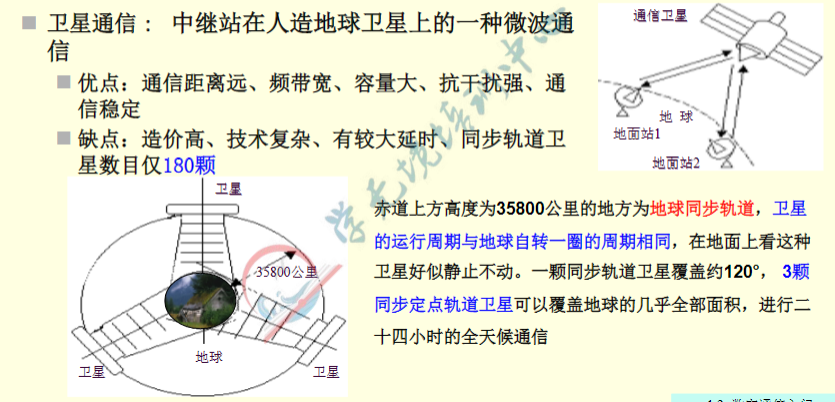

卫星通信：中继站在人在地球卫星上的一种微波通信

- 优点：通信距离远，频带宽、容量大、抗干扰、通信稳定
- 缺点：造价高、技术复杂、有较大的延时、同步轨道卫星数目仅180颗


**卫星通信的重要应用——导航定位**

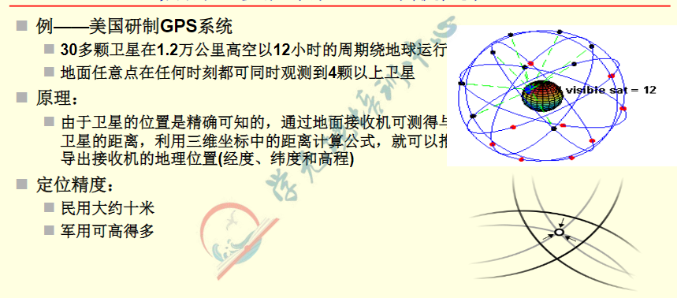

**北斗卫星导航定位系统**

全球四大卫星定位系统

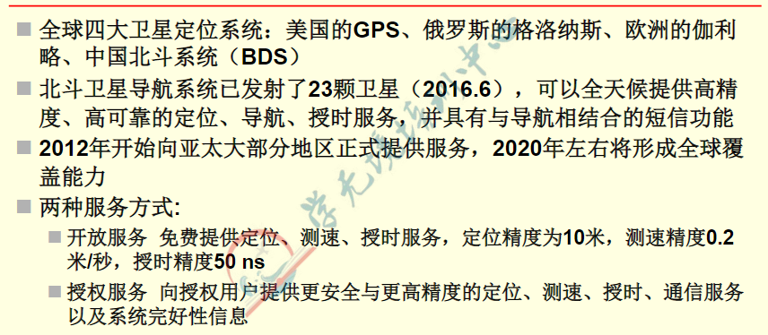


**（重要）个人移动通信**

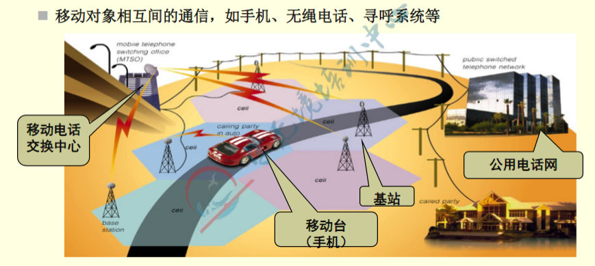

**移动通信的三要素（重要）**

- 移动台（手机）
- 基站
- 移动电话交换中心


1G 第一代移动通信系统

​	A 模拟信号

2G 第二代移动通信系统

​	D 数字信号

​	电话  短信

​	GSM 全球通

​	CDMA 码分多址

3G

​	CDMA2000 WCDMA TD-SCDMA

4G

5G


**移动通信原理**

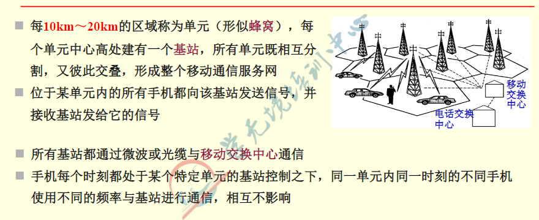

（蜂窝）移动通信原理：基站

- 所有的基站都通过微波或光缆与移动交换中心通信
- 手机每个时刻都处于某个特定单元的基站控制之下，同一单元内同一时刻的不同手机使用不同的频率与基站进行通信，相互不影响，基站相邻的6个加上自己共七个频率不相同


非接触的IC卡：10CM

蓝牙：10m


**第二代移动通信2G**

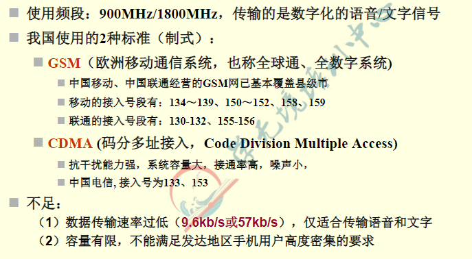

**第三代通信系统（3G）**

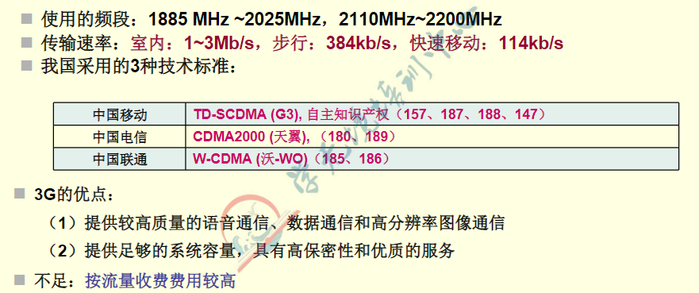

**第四代通信系统（4G）**

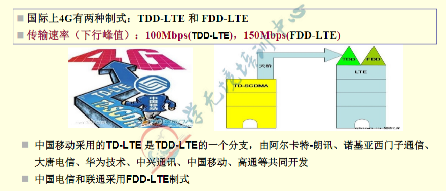


### 1.2.2调制解调和多路复用

**频分多路复用**

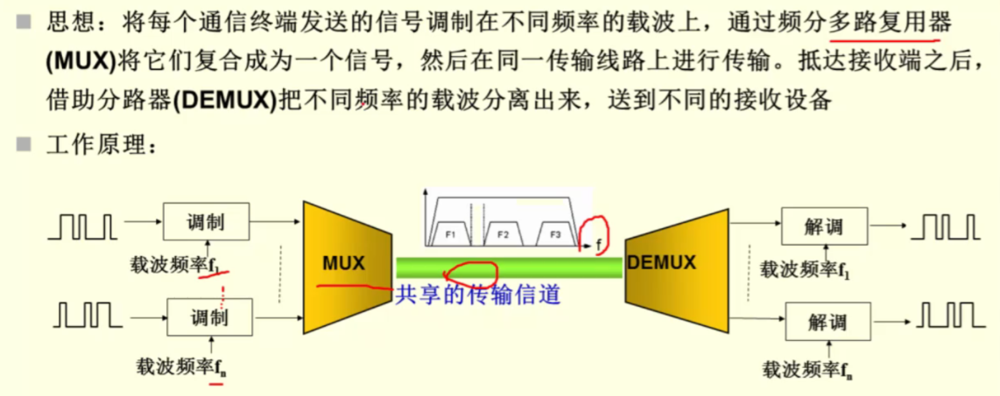

**时分多路复用**

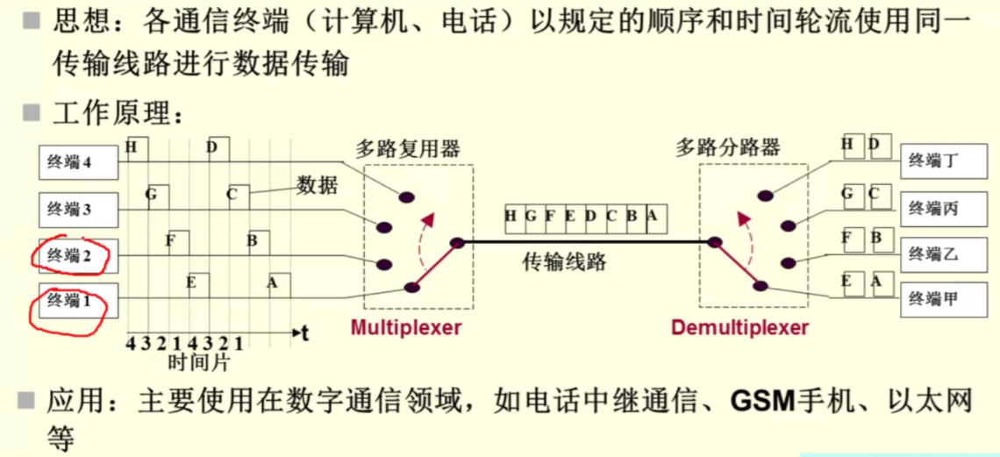

**波分多路复用**

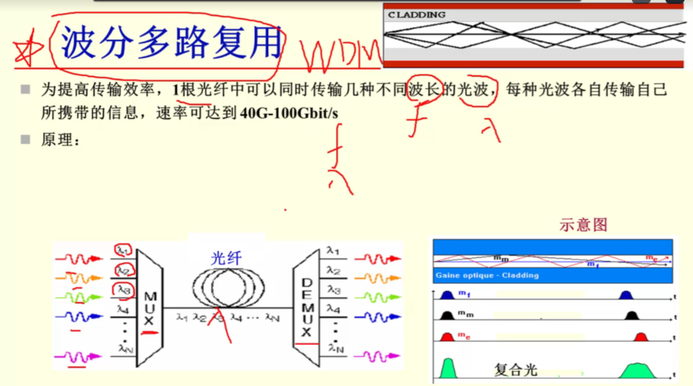

有线电视：

FDM（频分多路复用）为主+TDM（时分多路复用）


**异步时分多路复用（了解）**

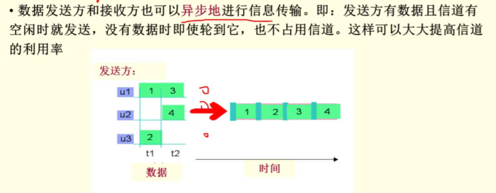


### 1.2.3交换技术


## 1.3计算机信息系统

IS 信息系统

MIS 管理信息系统

DBS 数据库系统

## 1.4典型信息系统介绍

## 1.5关系数据库系统（非常重要）

人类管理数据的发展：

1. 人工管理阶段
2. 文件管理阶段
3. 数据库管理阶段
4. 分布式数据库管理阶段


**（高频考点）数据库系统 DBS（信息系统IS 管理信息系统MIS）**

组成

1. DB 数据库（外存）
2. DBMS 数据库管理系统
3. 用户（DBA 数据库管理员）
4. 软硬件支持
5. 界面

```
请问一个完整的数据库系统应包含：ABCD
A.数据库
B.数据库管理系统
C.前端界面
D.数据库管理员等用户
```


**关系型数据库（重要）**

1. 为什么采用：关系代数的支持

2. **什么是关系型：**

   1. 关系（二维表）

      行：元组（记录）

      列：属性（字段）


**两个概念（注意区分）：**

​	关系模式：静态的，稳定的（表的结构）

​						S（学号，姓名，性别）

​	关系[模型]：动态的，变化的

​						行：元组（记录）

​						列：属性（字段）


**题目**

| A    | B    | C    | D    |
| ---- | ---- | ---- | ---- |
| a1   | b1   | c1   | d1   |
| a2   | b2   | c2   | d2   |
| a3   | b3   | c3   | d3   |

​																													X

关系模式：X（A,B,C,D）


软件：

1. 系统软件
   1. BIOS 基本输入/输出系统
   2. OS 操作系统
   3. DBMS 数据库管理系统（ACCESS VFP SQLSERVER MYSQL ORACLE DB2 高斯DB）
   4. 程序语言的处理程序
      1. 汇编程序
      2. 解释（口译）
      3. 编译（笔译）
2. 应用软件
   1. 通用  定制


### 1.5.1什么是计算机信息系统

**什么是计算机信息系统（1）**

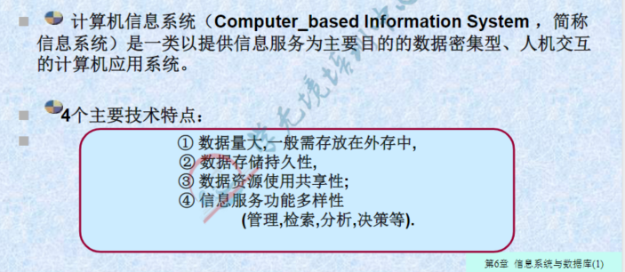

**计算机信息系统：**简称信息系统，是一类以提供信息服务为主要目的的数据密集型、人机交互的计算机应用系统

4个主要技术的特点：

1. 数据量大，一般需存放在外存中
2. 数据存储持久性
3. 数据资源使用共享性
4. 信息服务功能多样性（管理，检索，分析，决策等）


**什么是计算机信息系统（2）**

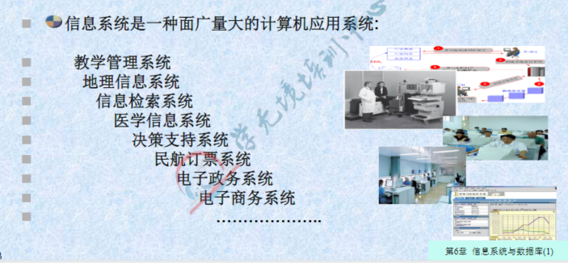


### 1.5.2计算机信息系统的类型

**（重要）计算机信息系统的类型（1）**

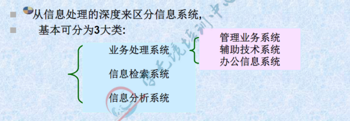

从信息处理的深度来区分信息系统

**（重要）基本分为3大类：**

- 业务处理系统
- 信息检索系统
- 信息分析系统
  - DSS：决策支持系统
  - ES：专家系统（知识库+推理机）


下图都是业户处理系统（看一下，了解一下即可）

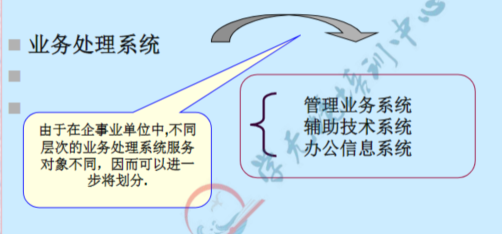


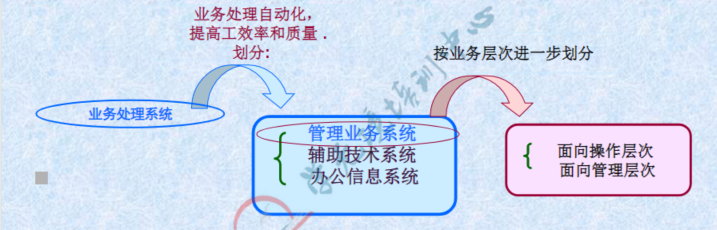

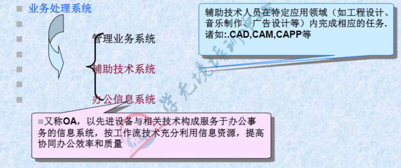

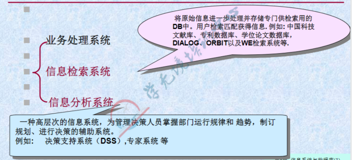

CAD：计算机辅助设计

CAI：计算机辅助教学

CAPP：计算机辅助工艺规划


### 1.5.3信息系统的结构和发展趋势（选学）

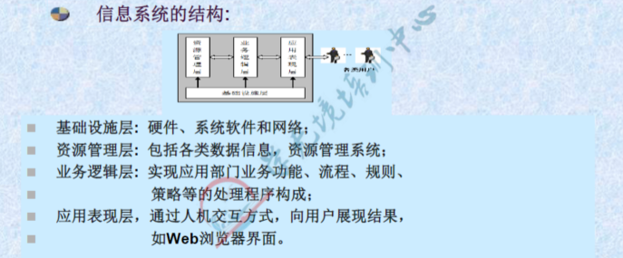

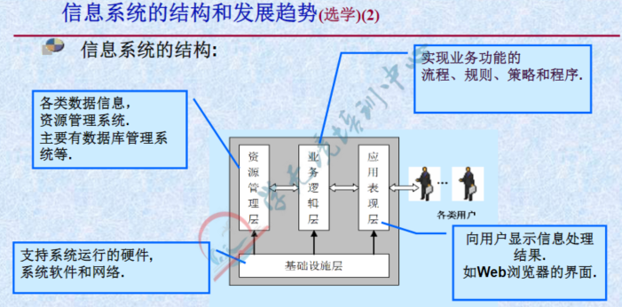

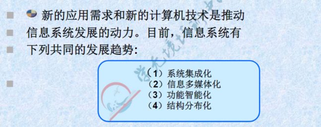


## 1.6信息系统与数据库

### 1.6.1关系数据库系统（非常重要）

数据库的三大模型

（设计阶段）

概念模型——逻辑模型——物理模型

E-R图			表（关系）		数据库（硬盘）


**E-R图：（实体-联系）**

1. 组成

   ​	实体（矩形）

   ​	属性（椭圆）

   ​	联系（菱形）

2. 分类

   1:1（1对1）：实体集A中每一个元素在实体集B至多有一个元素与之对应，反之亦然。（不需要每个元素都要有对应）

   1:n（1对多）：实体集A中元素在实体集B中有多个元素与之对应。（母亲跟孩子）

   n:m（多对多）：（学生与课程）


E（实体）——二维表

R（联系）——二维表

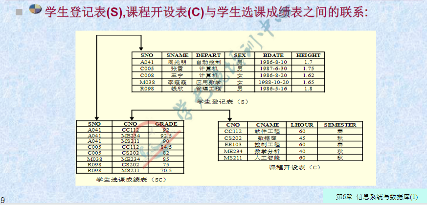


```
实体有属性，联系没有包含属性。错

已知A,B,C,D四个实体，两两发生联系，每个实体均有20个属性，请问需要多少张二维表。10张 4+（4*3）/2

```


**特点：**

每一行称为元组

元组是可以交换的，但是不能重复

属性的顺序可以调整，但是不能重复

属性具备原子性（不可以变的更小）


1个数据库能不能包含多张表？ 可以

MYSQL文件？（共有4类）

- .frm文件：存储数据表的框架结构
- .MYD：即 MY Data，表数据文件
- .MYI：即MY Index，索引文件
- .log：日志文件


```
显示所有数据库：show databases;

使用某一数据库：use phonesy;

查询数据表：select * from 供货商表；
```


**数据库完整性的约束**

- 实体完整性约束（不能为空）
  - 主键（主码）：能够区分任意两条元组的最少属性或属性组 （primary key）
    - （sname,sbirthday）作为一个主键
- 用户自定义完整性约束
  - 域：某个属性的取值范围
- 参照（应用）完整性约束
  - 外键：下面的选择题可以说明外键
    - foreign key


```
一个表中能够作为主键的一定是单属性。 	错

不同属性的域一定不同。				错
不同属性的域一定相同。				错

delete from s; 	删除s表中的所有数据
drop s;			销毁s

请选出删除S,C,SC表中数据，保留表结构的命令：BC
A.	delete from S;
	delete from C;
	delete from SC;
	
B.	delete from SC;
	delete from C;
	delete from S;

C.	delete from SC;
	delete from S;
	delete from C;

D.	drop from SC;
	drop from S;
	drop from C;
```


**关系数据模型（结构）**

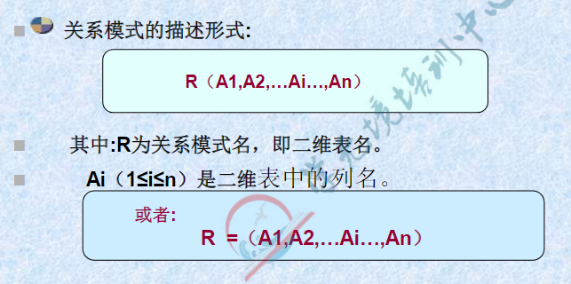

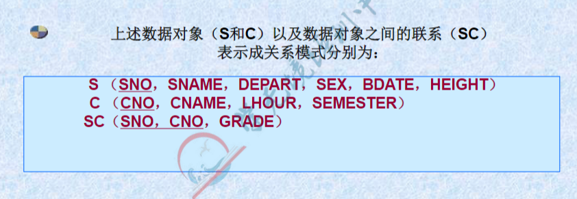


**（高频考点）关系数据模型（操作）**


- 传统集合的关系操作
  - 交
  - 差
  - 笛卡尔积
  - 除
- 专门的关系操作
  - 插入（insert）
  - 更新（update）
  - 删除（delete）
  - 选择（δ）
  - 连接（∞）
  - 投影（π）


**关系数据模型（传统集合的关系操作）**

**并：∪**


**交：∩**


**差：-**


**笛卡尔积：**× 属性个数相加，元组条数相乘（复合交换律）


**除法：÷**


```
已知关系R和S具备一样的关系模式，R中有100条元组，S中有200条元组
请问RUS元组[200,300]
请问R∩S元组[0,100]

已知关系R和S具备一样的关系模式，R中有1000元组，S中有2000元组,请问以下成立的是：C
A.R∪S=1999 且R∩S=1001
B.R∪S=2500 且R∩S=1000
C.R∪S=2300 且R∩S=700
D.R∪S=2001 且R∩S=1001
	R∪S + R∩S=R+S
	
已知R有10个属性，1000条元组，S中有20个属性，10000条元组，那么R×S有 30 属性，1000 0000  条元组

请问以下运算复合交换律的是：ABD
请问R和S需具备相同的关系模式的是：ABC
A.∪
B.∩
C.-
D.×
E.除÷
请问传统的关系运算中需要两个关系具备一样的关系模型的是：ABC
A.并
B.交
C.差
D.笛卡尔积
E.选择


```


**插入（insert）：**


```
SQL 结构化查询语句
INSERT INTO 表（属性1，属性2，...）
VALUES（值1，值2，...）
例1：
s(SNO,SNAME,SSEX,AGE)其中SNO,SNAME,SSEX为字符型，AGE为整形。请写出插入数据 95002，张三，男，24 的SQL命令：
写法1：
INSERT INTO S(SNO,SNAME,SEXX,AGE) VALUES('95002','张三','男',24);
写法2：
INSERT INTO S VALUES('95002','张三','男',24);

```


**删除（delete）：**


```
DELETE FROM 表
[WHERE 条件]
例2：
已知s(SNO,SNAME,SSEX,AGE)其中SNO,SNAME,SSEX为字符型，AGE为整形。删除学号是95001的学生信息。
DELETE FROM S WHERE SNO='95001'
```


**更改（update）：**


```
UPDATE 表
SET 属性1=值1，属性2=值2...
[WHERE 条件]
已知s(SNO,SNAME,SSEX,AGE)其中SNO,SNAME,SSEX为字符型，AGE为整形。将张三的性别改为男性，年龄改成22.写出SQL语句
UPDATE S  SET SSEX='男', AGE=22 WHERE SNAME='张三';

写出SQL命令
已知表C(CNO,CNAME,XF)CNO,CNAME为字符型，XF为数值型
（1）插入1，数据库原理，5的命令
INSERT  INTO C VALUES('1','数据库原理',5);
（2）将课程号为03的课程改名成高级数据库，学分改为6
UPDATE FROM C SET CNAME='高级数据库',XF=6 WHERE CNO='03';
（3）删除表中所有数据的命令
DELETE FROM C;
```


**选择（δ）：**

选择选的是行


**投影（π）：**

投影选的是列


例1：


```
写法1：(这个方法更好)
A=δ_(sex='男')（people）
B=π_(ID,NAME,SEX)（A）
写法2：
A=π_(ID,NAME,SEX)（people）
B=δ_(sex='男')（A）

```


**连接（∞）：**


**等值连接：**

一定要有一样的属性，才能连接到一块去


**自然连接：**

在等值连接的基础上，把重复的列删掉


**左外连接：**

自然连接上的基础上，把左边不重复的也加上，没有的填null


**右外连接：**

自然连接上的基础上，把右边不重复的也加上，没有的填null


**（全）外连接：**

自然连接上的基础上，把不重复的也加上，没有的填null（左右都有）


### 1.6.2关系数据库语言SQL

```
SQL是专门为MYSQL服务的。  错误！

SQL 通用的关系型数据库语言。
```

**关系数据库语言SQL特点**

- 是一种“非过程语言”
- 体现关系模型在结构，完整性和操作方面的特征 
- 有命令和嵌入程序两种使用方式
- 功能齐全，简洁易学，使用方便
- 为主流DBMS产品所支持


**SQL数据定义语言DDL（date define language）**

```
创建数据库 TEST
CREATE DATABASE TEST;

写出创建数据库student，使用数据库student，显示所有数据库的命令
CREATE DATABASE student;
USE student;
SHOW DATABASES;

CREATE TABLE 创建表
CREATE VIEW  创建视图
CREATE INDEX 创建索引

```


**DML 数据操纵语言（SELECT INSERT DELETE UPDATE）**

```
select 属性1，属性2...(*)	--投影
from 表1,表2,...,视图1		--连接
[where 条件				--选择
group by 属性
having 分组条件
order by 属性  asc 升序  desc降序
]
```


**DCL 数据控制语言 并发控制**


**单表查询**

左边是SQL语句，右边是关系代数（**注意**题目说些什么）


```
S(SNO,SNAME,SEX,SBIRTHDAY) 书写SQL语句
1.查询所有男生信息
	SELECT * FROM S WHERE SEX='男'
	
补充知识
	数据库的通配符：
	%:任意字符
	_:任一字符
2.查询所有姓“张”学生的姓名和出生年月
SELECT SNAME,SBIRTHDAY FROM S WHERE SNAME LIKE '张%'

3.翻译意思
SELECT SNAME,SBIRTHDAY FROM S WHERE SNAME LIKE '%张%'
寻找名字含有张的人的出生年月
SELECT SNAME,SBIRTHDAY FROM S WHERE SNAME LIKE '张_'
寻找姓张两个字的人的出生年月


SELET SNO FROM S ORDER BY SNO;
寻找学号，默认升序

```


# 2.物联网技术

1936年 eniac 第一电子计算机

internet 互联网：计算机等智能设备联网（全球硬件和软件的联网）---->物联网（IOT）

www	万维网（全球所有的网站）

”互联网+ “：加各行各业

物联网：IOT


## 2.1物联网概述

### 2.1.1物联网的基本概念

IOT，internet of things


物物相连的互联网


```
自动驾驶中，汽车感应可以用一下传感器，请问反应速度最快的是：A
A.红外线传感器
B.声波传感器
```


**（重要）物联网包含两层含义**

1. 物联网的基础和支撑是强大的计算机系统，它是以计算机网络为核心进行延伸和扩展而形成的网络
2. 物联网的终端用户已经延伸和扩展到众多物品之间，进行数据交换和通讯。


**物联网的相关说明**：像家用电器一样的物体的互联网络

打*重要


**（重要）物联网的其他表述**：M2M（Machine to Machine）、传感网（Sensor Networks）、普适计算（Pervasive Computing）、泛在计算（Ubiquitous computing）、环境感知智能（Ambient Intelligence）等等

```
多选题：
物联网可以称作：BCD
A.ICT
B.IOT
C.泛在计算（普适计算）
D.M2M
```


**物联网发展的划时代意义**


推动人类进入智能化时代，实现智能互动，带来不可估量的实现意义

```
物理网是物物相连的网络，所以只能是人和物，人人之间的通信，还不能实现物体和物体之间的通信。  错误！
```


### 2.1.2物联网的发展历程及国内外现状

1995年比尔盖茨提到了物联网的概念

2005年比较正式提出了概念

2009年是对物联网比较重要的一个年份

无锡，国家传感网创新示范中心

2011年我国成为ISO传感器网络标准工作组（WG7）的主导国之一


### 2.1.3物联网与互联网的区别

1. 物联网是互联网的延伸
2. 物联网是一种建立在互联网上广泛存在的网络
3. 物联网技术的重要基础与核心仍就是互联网


```
一以下说法正确的是：BD
A.互联网包含了物联网
B.物联网包含了互联网
C.物联网的核心是终端设备
D.物联网是互联网的延伸和拓展
```


## 2.2物联网关键技术

**物联网的三大特征（重要）**


### 2.2.1物联网三层体系结构

感知层：全面感知

网络层：可靠传输

应用层：智能应用


**感知层：**


感知层是物联网的皮肤和五官——识别物体，采集信息

代表技术：二维码标签，识读器，RFID标签和读写器，摄像头，GPS、传感器、终端、传感器网络等。


**网络层：**（特点：可靠的传输）

网络层是物联网的神经中枢和大脑——信息传递和处理

类似于人体结构中的神经中枢和大脑


**应用层：**

应从层是物联网的“社会分工”——与行业需求结合，实现广泛智能化。

类似于人类的社会分工，做种构成人类社会


```
1.请问物联网的三大特征是：ACD
A.全面感知
B.智能传输
C.智慧应用
D.可靠传输

2.请问物联网的体系结构关于层次说法正确的是：BD
A.网络层支撑感知层工作
B.应用层必须与行业结合，形成广泛的智能应用
C.感知层的技术代表是计算机网络
D.网络层的核心是计算机等网络

3.请问物联网感知层的技术代表有：ABC
A.传感器
B.RFID
C.高清探头
D.WIFI
```


### 2.2.2物联网感知层关键技术


**RFID**


条形码


**EPC（Electronic Product Code EPC）电子产品代码**

代码全球唯一


**指纹传感器**


**其他传感器**

1. 环境光感应器
2. 近距离传感器
3. 气压传感器
4. 三轴陀螺仪
5. 重力传感器
6. 磁力计
7. 3D触摸传感器


```
请问在GPS定位时，为了测飞机的飞行高度，需要的传感器为：C
A.3D触摸传感器
B.磁力计
C.气压传感器
D.环境光感应器
```


### 2.2.3物理网网络层关键技术——ZigBee

**ZigBee**


**ZigBee来源**


ZigBee设备类型（了解）


**Wi-Fi（重要）**

是802.11的另一种说法


Wi-Fi的优势


**蓝牙**

10米以内（建筑物内部）


**GPS**


### 2.2.4物联网应用层关键技术原理

注意红色标记出来的内容


**物联网的关键技术还包括：**


## 2.3物联网主要应用领域

### 2.3.1物联网主要应用领域

**智慧物流**


**智慧医疗**


**智能家居**


**智能制造**

人机一体化智能系统

**智能交通**


**智慧农业**


### 2.3.2物联网技术未来发展趋势

1. 物联网和人工智能相互促进
2. 5G成为物联网必须的燃料
3. 路由器将变得更安全，以阻止不安全的访问


```
物联网的简称：
IOT

物联网分成哪三层：
应用层（智能应用）
网络层（可靠传输）
感知层（全面感知）

RFID中文：
无线射频识别技术（电子标签）

例举手机常见的传感器（不少于5个）：
看PPT

我们国家物联网中心在哪个城市：
无锡
```


# 3.移动互联网技术

EC（EB）：电子商务


- 网络：
  - 电子数据交换网络 EDI：电报，电话
    - Internet 互联网--------物联网 IOT
    - 移动互联网

```
请问传统固定电话属于：B
A.IOT
B.EDI
C.INTERNET
D.移动互联网
```


**移动互联网的兴起**


- APP 应用程序：
  - 优点：功能复杂软件，底层功能
  - 缺点：推广难，开发成本高
- 微信小程序：内嵌在微信平台
- 微信公众号：支持HTML5，推广容易，不占空间


- 手机操作系统：
  - android 安卓 ————.apk -------JAVA
  - IOS ——————object-C
  - WINDOWS phone ——————


```
某小型企业，为了推广自己的产品，选择何种技术较经济和快捷：B
A.开发自己的手机APP，两个平台
B.微信公众号
C.开发苹果端的APP
D.购买大型商务网站，架构自己的服务器
```


**移动互联网的发展状况**

摩尔定律：（moore）

单块集成电路（IC）的集成度平均18-24月翻一番

集成度：元器件的总和

集成电路：Si（硅） 砷化镓（GaAs）


**移动情景及用户行为特点**


**移动互联网的定义**


```
Internet 有多种发展方向，体现万物皆可连接的是：__物联网____,与移动通信网络结合成一体的是__移动互联网____.
```


**移动互联网的定义**


**（重点）移动互联网的分层**

应用层

接入层

终端层


1G：第一代移动通信系统

​	A 模拟信号

2G

​	D 数字信号

3G

4G

5G


windows 平台下查看IP地址：ipconfig

linux 平台下查看IP地址：ifconfig

安装linux方法：

​	原版安装运行

​	虚拟机安装


**移动互联网四要素**


**移动互联网与互联网、移动通信网及手机互联网**


**移动互联网的特征**

1. 精准化
2. 泛在化
3. 社交化


**移动物联网的现在与未来**


**移动互联网展业的发展现状**


用户的发展


内容与业务的发展


终端技术的发展


终端厂商，电信运营商、服务提供商面临的基于和挑战


ISP：互联网服务提供商


**中国关于移动互联网标准化方面的动态及进展**


**移动互联网的业务体系**


```
以下属于移动通信业务的是：ABD
A.短信
B.彩信
C.移动微信
D.电话
```

SAAS:软件即服务


**移动互联网的业务体系**


移动互联网的性能指标

```
8000Kbps=8Mbps=1MBps  
```

带宽：100M————100Mbps

1.最快的传输速率

2.频率的范围  20HZ—20000HZ


```
人耳的带宽是20000HZ		错是19980HZ

某网络的带宽是1G，请问1G表示：1Gbps

通信系统三要素：
信源——————————(信宿)——————————信道

```

传输速率

服务质量

网络延时

丢包率


```
一下参数值越高，移动互联网性能反而越差：BCE
A.带宽
B.延时
C.丢包率
D.网速
E.误码率（网络是否稳定指标）
```

### SOA 面向服务架构的基本概念

面向服务的体系结构（Service-Oriented-Architecture SOA）

是一个组件模型

```
面向服务的体系结构（SOA）是一个组件模型，能够比较自由和灵活的进行服务的组装和切换
```


**组件模型**


Web Service

Web service 是技术规范 SOA是设计原则


软件工程：

规则  高内聚，低耦合


为什么要使用SOA

优点：代码可以重用 低耦合 平台独立 语言无关


SOA角色（需要了解）

服务提供者

服务注册中心

服务请求者


SOA的相关标准


SOA应用——统一认证


### web

HTML  超文本标记语言


web2.0时代


web3.0时代

HTML5

HTML5将成为主流


任何一个网页是由head和body两部分构成

```html
<HTML>
	<head>
		<title>中国，你好！</title>
		<style type="text/css">
		div
		{
			background-color:Blue;
			padding-left:200px;
			padding-top:300ps;		//控制内部距离
		}
		.oushu
		{
			background-color:red;	
		}
		#mytest
		{
			background-color:yelow;	
            margin-left:200px;
            margin-top:200px;	//控制外部距离
		}
	</head>
	<body>
		<div>111111</div>
		<div class="oushu">222222</div>
		<div>333333</div>
		<div class="oushu">444444</div>
		<div>555555</div>
		<div class="oushu" id="mytest">666666</div>
		test!
	</body>
</HTML>

现在网页布局
DIV+CSS
块标记（定位）+样式表（风格）
就近原则

盒子模型：
左上方是为（0,0）点
然后向右为x轴
向下为y轴
```

**HTML5的优点**

1. 多设备跨平台
   1. 跨平台性非常强大，可以轻易额已知，这也是大多数人对HTML5有兴趣的主要原因
2. 自适应网页设计
   1. 一次设计，普遍使用，自动适应不同大小的屏幕，自动调整布局
3. 即时更新
   1. 不需要非常慢的加载，几乎马上，即时的更新
4. 多媒体
   1. 可以支持多媒体信息

**缺点**

并非所有浏览器支持

存在争议，视频格式方面，各大互联网公司在为具体标准争论，影响HTML5标准的分流


**HTML5的新特性**

增强标记能力

交互体验更好

完善的表单功能

丰富的多媒体元素

强大的移动支持


块标记 DIV

样式表 CSS


padding- （表示内部距离）

margin- 表示外部距离


### Android 的系统架构

java语言开发———Google开发

内核Linux


**Android的系统架构**


**1.应用程序（Application）**


**2.应用程序框架（Application Framework）**


**3.类库（Libraries）**


**.dll 文件  动态链接库**


**4.Androld 运行时（Android Runtime）**


**5.操作系统（OS）**

操作系统的作用：

硬件（冯·诺依曼 存储程序控制原理）

​	运算器，控制器，存储器，输入设备，输出设备

OS 操作系统


### IOS的系统架构

**IOS object-C 苹果**


IOS的系统架构


TMSO


媒体层


## 移动互联网的应用领域

移动电子商务


**电子商务：**

1. 交易对象不同
   1. B-B（企业-企业）
   2. B-C（企业-客户）
   3. B-G（企业-政府）
2. 网络
   1. 基于EDI的电子商务：电子数据交换网（电报，电话）
   2. 基于其他网络（互联网。。。）


移动支付


电子政务


## 移动互联网的发展趋势

面临安全问题


SQL注入，在密码中放入恒等式，就会越过验证密码问题


**移动互联网的未来发展**


# 4.云计算技术

核心：虚拟化

PASS：软件即服务

IAAS：平台即服务

SAAS：基础设施即服务


## 4.1云计算概述

### 4.1.1云计算产生的历史背景


淘宝

1. 平时（20000台）
2. 11.11（100000万台服务器）

储备服务器只能存储100000台服务器，不能存少，否则会崩

利用率比较低，所以闲置的时候，就拿出去卖


### 4.4.2云计算的基本概念

政府视角


企业视角


学术视角


### 4.1.3云计算的优势

（1）规模和计算额能力巨大


（2）安全可靠


（3）虚拟化（数据放在虚拟化平台上，并不是放在具体的某个服务器上。所以除非全崩了，否则不可能删的光数据）


```
某小型企业为了存储和处理数据，可以向华为，中兴等公司购买云计算 服务，
这样可以避免自己购买服务器，维护服务器的问题，且数据是存储在华为云计算平台上，
不需要考虑具体华为数据中心的某一个服务器上，体现了云计算技术的，虚拟化 特点。
```

（4）方便快捷


（5）动态灵活


（6）经济可持续


## 4.2云计算的关键技术

### 4.2.1分布式计算的概念及特点


### 分布式计算的优缺点

- 优点
  - 超大规模
  - 虚拟化
  - 高可靠性
  - 通用性
  - 高可伸缩性
  - 按需服务
  - 极其廉价
  - 容错性
- 弱点
  - 多点故障
    - 一台或多台计算机的故障，或一条或多条网络链路的故障，都会导致分布式系统出现问题
  - 安全性
    - 分布式系统为非授权用户的攻击提供了更多机会


### 4.2.2虚拟化技术的概念及特点

虚拟化技术


虚拟化的定义


**服务器虚拟化的两种类型**


**特点**


**什么是云存储**


**云存储的概念**


## 4.2云计算的技术应用


### 4.3.1云计算的部署模型


 **服务模型**


### 4.3.2云计算服务应用


IAAS 基础设施即服务  计算机，网络等硬件

PAAS 平台即服务    SQL server

SAAS 软件即服务


云计算的核心：虚拟化

**连线题**

| 云计算服务模型 | 云计算服务的内容  |
| -------------- | ----------------- |
| SAAS（1）      | 硬件，网络等（3） |
| PAAS（2）      | JAVA语言（2）     |
| IAAS（3）      | 智能APP（1）      |
|                |                   |


重要的商用云计算平台


**google大数据方面的技术：**

GFS 、 MapReduce

 

**Google云计算（选择题会考）**


最重要的是1~3点

```
请问以下属于分布式的文件系统有D
A.NTFS
B.FAT16
C.FAT32
D.GFS和HDFS

请问在U盘上要存储超过4GB的大文件应该将U盘文件系统设置为：NTFS

本地文件系统：NTFS（>4GB）  FAT32

大数据：（Hadoop）横向扩展
        HDFS  分布式文件系统（开源实现）————————GFS（前生）
        MapReduce分布式并行计算（开源实现）——————MapReduce（前生）


```


Amazon 云计算


微软云计算平台

中国移动BigCloud

腾讯云

百度云

华为云

京东云


**云计算五大特征**


1. 随时接入
2. 自助服务
3. 资源共享
4. 弹性扩展
5. 服务可计量


# 5.大数据技术

## 5.1大数据概述

**第三次信息化浪潮**


**信息科技为大数据时代提供技术支撑**

1. 存储设备容量不断增加
2. CPU处理能力大幅上升
3. 网络带宽不断增加


moore（摩尔）定律：

单块集成电路IC的集成度平均18-24个月翻一番


带宽：

1.最快的传输速率  100Mbps

2.人耳的频率的范围 20HZ-20000HZ


**数据产生方式的变革促成大数据时代的来临**


大数据的发展历程


ES 专家系统=知识库+推理机


### 5.1.2大数据概念


大数据不仅仅是数据的大量化，而是包含快速化，多样化，价值化等多重属性

价值性

价值密度低


**数据量大**


TB-PB-EB-ZB-YB

**大数据类型繁多**


```
请问以下属于结构化数据的是：A
A.关系型数据库
B.长短不同的文档
C.各种格式的图片
D.视频文件

NOSQL型数据库：
1.列族数据库：HBASE
2.文档型数据库:MongoDB
3.键值数据库:redis
4.图数据库：:NEO4J
```

**处理速度快**


价值密度低


### 5.1.3 大数据的影响

本科之前：消费知识

硕士，博士：创造知识


- 在思维方式方面，大数据完全覆盖了传统的思维方式：
  - 全样而非抽样
  - 效率而非精确
  - 相关而非因果


### 5.1.3大数据的应用


### 5.1.4 大数据关键技术


### 5.1.5大数据关键技术


```
hadoop（单机版，伪分布式，分布式）
 HDFS 分布式文件系统 主从方式工作
      主节点：NAMENODE 名称结点
      从结点：DATANODE 数据结点
      
      Hadoop基本数据大小
      1.0  64MB
      2.0  128MB
      3.0  356MB
      
      每一份数据会默认保存三份。其中两份尽量保存在一个机架上，另外一份会分配在另外一个机架上（防止电脑死机）

下面演示HDFS启动
Linux平台
jps查看结点运行状态


```


### 5.1.6大数据计算模式


### 5.1.7 大数据产业


### 5.1.8云计算和物联网的关系

**大数据与云计算、物联网的关系**

三者既有区别又有联


**小结**


```
1.大数据技术属于第（3）带信息化浪潮的产物

第1代信息化浪潮的产物：计算机
第2代信息化浪潮的产物：互联网
第3代信息化浪潮的产物：大数据

2.请问以下属于大数据时代到来的因素：ABC
A.存储设备容量越来越大，单价越来越便宜
B.CPU复合MOORE定律
C.网络带宽越来越快
D.人类能力越来越弱

3.请问构成HDFS的基本结点为：AB
A.NAMENODE
B.DATANODE
C.JOBTRACK
D.TASLTRACK

4.HDFS的文件副本默认保留3份，HADOOP2.0中，单个文件单位为128MB

```


# 6.人工智能技术

AI

python（面向对象 AI）

### 6.1.1 人工智能的定义和发展

物联网IOT 最早谁提出：比尔盖茨


人工智能的定义


人机中国象棋大战


 **人工智能的起源和发展**


### 6.1.2 人工智能的各种认知观

**人工智能的主要学派**

1. 符号主义
2. 连接主义
3. 行为主义


```
人工智能有三大学派，哪一个学派是跟维纳有关系？C
                哪一个学派和逻辑符号（亚里士多德）有关系？A
                哪一个学派起源于人脑模型？ B
A.符号主义（逻辑符号）
B.连接主义（神经元）
C.行为主义（控制论）
```

**人工智能的争论**


### 6.1.3人类智能与人工智能

**研究认知过程的任务**


**智能信息处理系统的假设**


### 6.1.4 人工智能的研究目标和内容

**人工智能的研究目标**


**人工智能研究的基本内容**


### 6.1.5 人工智能研究的主要方法


### 6.1.6 人工智能的研究和应用领域


......

### 6.1.7 人工智能人类的影响

**人工智能对经济的影响**


**人工智能对社会的影响**


**人工智能对人类文化的影响**


### 6.1.8 对人工智能的展望

 **更新的理论框架**


**数据挖掘的常用算法**

apriori算法


```
数据挖掘算法：
1.Apriori算法
 支持度 support
             表示同时包含A和B事物占所有事物的比例
             support=P(A&B)
 置信度（可信度） confidence
             表示使用包含A的事务中同时包含的B的事务的比例
             confidence=P(A&B)/P(A)
 
```


K-means算法


感觉有点像无监督的聚类算法

**KNN——最近邻分类法**


**Naive bayes朴素贝叶斯**


**CART（决策树）**


**Adaboost算法**


**PageRank算法**


**最大期望EM**


**SVM支持向量机**


**决策树**


## 深度学习

深度学习场景


### 深度学习常用的算法介绍

**人工神经网络**


**卷积神经网络**


 **其他深度学习算法**


**开源框架概述**


```
人工智能AI：
1.起源发展
2.三大学派
3.人工智能研究内容（很多）
4.深度学习（算法，框架）
5.数据挖掘（算法）
```


# 7.区块链

“去中心化”的分布式技术

可信任，不可篡改

比特币	以太坊

## 7.1 区块链概述

```
区块链：“去中心化的”分布式数据库 不可篡改，可信任

比方说：
	80
```


```
timestamp 时间戳  唯一
2021-12-16 18：  13:01
```

**重点**

### 7.1.1 区块链简介


```
以下说法正确的是：BCD
A.区块链是采用一种新技术的方案
B.区块链具备去中心化的特点
C.区块链的诞生后于比特币
D.区块链建立在对等网络上
```

### 7.1.2 特征及分类


区块链最重要的特征：去中心化


**分类**


```
区块链的分类：
	请问区块链无管理方可以自由接入的是：公有链
	为某个企业，例如金融行业采用的区块链：联盟链（联合链 行业链）
	为某个企业所采用的，规则由企业制定的区块链：私有链
```


区块链货币时代

区块链合约时代

区块链治理时代

## 7.2 典型区块链技术介绍

### 7.2.1 以太坊技术框架

底层服务，核心层，顶层应用


```
NOSQL型数据库：
	文档型 Mongodb
	列族 HBASE
	键值 Redis，LEVEL DB
	图 NEO4J
	
```


### 7.2.2 超级账本Fabric技术框架


## 7.3 区块链主要应用领域


合约方面


**可编程货币**


**可编程金融**


**可编程社会**


### 7.3.2 发展趋势


