# 1.信息和信息系统

## 1.1信息与信息技术

### 1.1.1什么是信息

第一章最重要

```
IS		信息系统
MIS		管理信息系统
DBS		数据库系统
这三者是等价的
```


**（重要）信息是事物运动状态和变化内容的反应**

**信息与物质、能量**是客观**世界**的三大构成要素（多选）

```
判断题:  有错点打错  没有就打对。

信息：有价值的资讯

多媒体信息：包含文字，图，声音，视频的信息

电子邮件支持多媒体信息：（采用MIME协议）（MIME协议要记住）

计算机中的所有信息均是用0,1表示（编码）
```

```
请问以下属于信息的是：ABC
A.上课的知识
B.图片
C.音乐
D.呼噜声
```


**信息有哪些性质**（了解）

- 普遍性：凡是有事物的地方，就必然存在信息，信息广泛存在
- 动态性：事物实在不断运动变化之中的，信息也必然随之而改变
- 时效性：由于信息的动态性，信息的使用价值会随着时间而衰减
- 多样性：语言、文字、声音、图片等（统称为信息的载体或媒体）都是信息的表现形式
- 可传递性：信息通过媒体在人-人，人-物，物-物之间传递，信息传递才能发挥信息的作用
- 可共享性：信息与物质、能量不同，同一信息在同一时间可被多个主体共有，信息能无限地进行赋值和传递，不因使用而有损耗
- 快速增长性：随着社会的发展，信息在快速增长！（信息爆炸）

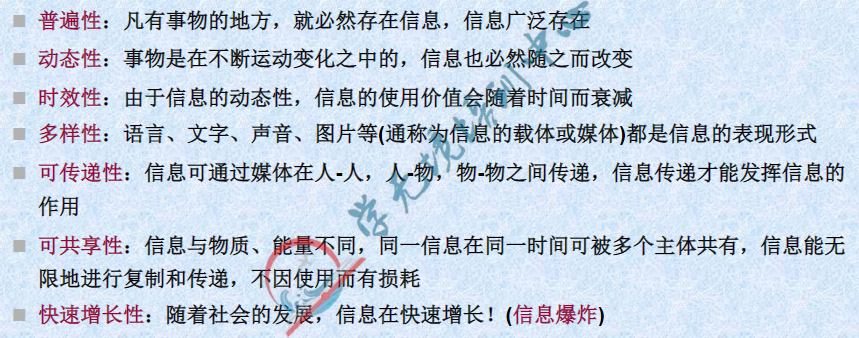

数据的存储单位：

- 信息的最小单位：bit b 比特 位
- 信息的基本单位：byte B 字节
  - 1B=8b
  - B--KB--MB--GB--TB--PB
  - 2^10


**什么是信息处理（重要）**


信息处理指的是与下列内容相关的行为和活动

- 信息的收集（如信息的感知，测量、获取、输入等）
- 信息的传递（如邮寄、出版、电话、广播、微信等）
- 信息的加工（如分类、计算、分析、转换、检索等）
- 信息的存储（如书写、摄影、录音、录像等）
- 信息的施用（如控制、显示、导航、机器人等）


**人工进行信息处理的过程**


人工信息处理的不足：

- 算不快
- 记不住
- 传不远
- 看（听）不清


### 1.1.2信息技术与信息产业

**什么是信息技术**

信息技术简称**IT**，指的是用来**扩展人们信息器官功能、协助人们有效地进行信息处理的一门技术**（可能考判断）


**信息技术包括4个方向：**

- 扩展感觉器官功能的感测与识别技术-----雷达（信息收集能力）
- 扩展神经系统功能的通信技术----互联网（信息传递能力）
- 扩展大脑功能的计算与存储技术----计算机（信息加工和存储能力）
- 扩展效应器官功能的控制与显示技术----投影技术（信息施用能力）


**信息技术的发展历史**（了解）

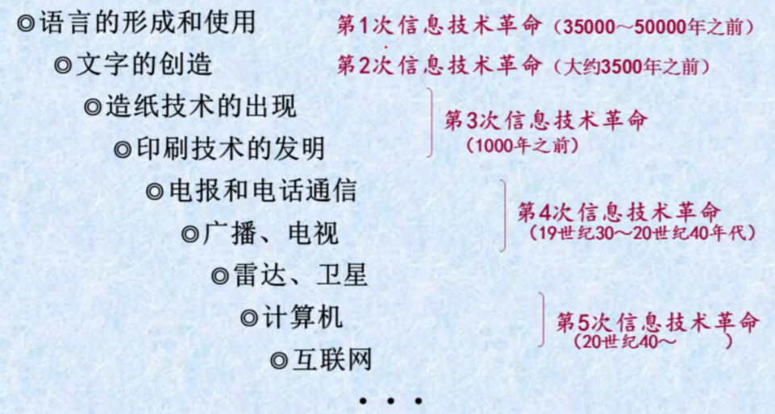

电子商务（EC或EB）（最开始由电报开始）

现代信息技术是由电报开始的（第四次信息技术革命）


**现代信息技术有什么特征**


**【现代】信息技术三大特征**

- 采用微电子和光电子器件
- 以数字技术（计算机）为基础
- 以软件与通信技术为核心

**核心技术：**

**计算机软件、集成电路、通信与互联网**、自动控制、机器人等


**信号：**

- 数字信号：D离散（计算机）
- 模拟信号：A连续（人的声音  光  电）


```
麦克风的功能是将人的声音转换成数字信号。（错） 
						 （电）

扫描仪的CCD（电荷耦合器件）是将光信号转成电信号，且均为模拟信号。（对）
         光电转换原理
```


**现代信息技术的基础与核心**

集成电路、计算机/软件、通信/广播、互联网、自动控制、机器人


**信息技术对社会和经济的影响**（不重要，了解一下）

有正有负


**什么是信息产业**（了解）

这张图了解一下

- 信息产业
  - 信息设备制造业
  - 信息服务业
  - 信息内容产业
  - 信息基础设施


DBMS：数据库管理系统（系统数据库）

​	ACCESS，VFP，SQLSERVER，MYSQL，ORACLE，DB2


**世界知名IT企业**

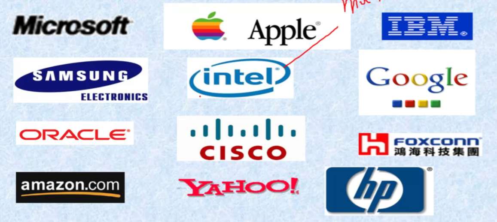

**国内的IT企业**

BATJ（一线）

百度，阿里巴巴，腾讯，京东


### 1.1.3信息化与信息社会

**科技进步对人类社会发展的影响**（可能会考到——填空题）

- 蒸汽机的发明引发了第一次工业革命（从英国开始）
- 电动机和发电机的发明引发了第二次工业革命
- 信息技术引发了第三次工业革命

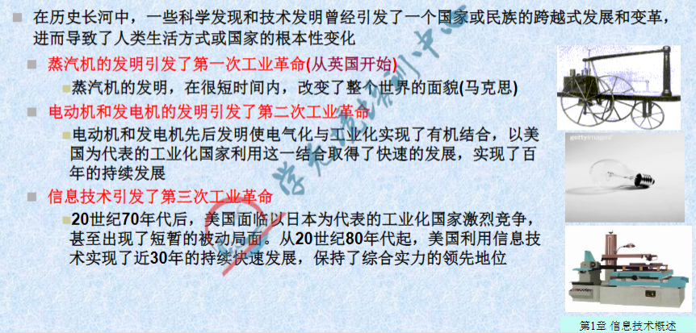

**人类进入信息社会**（了解）

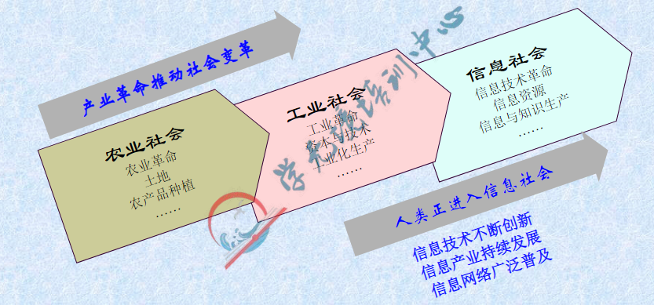

**什么是信息化**（了解）

- 信息技术是影响21世纪发展的最强劲的驱动力量
- 信息化——由信息技术驱动的经济和社会的变革
- 信息化的**本质**是**利用信息技术帮助社会个人和群体有效利用知识和新思想，从而建成充分发挥人的潜力，实现其抱负的信息社会**

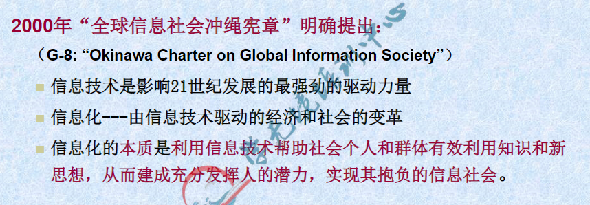

**我国信息化建设的历程（了解）**


**信息化是实现“四化”的关键（了解）**


**（重要）"互联网+"的行动计划**

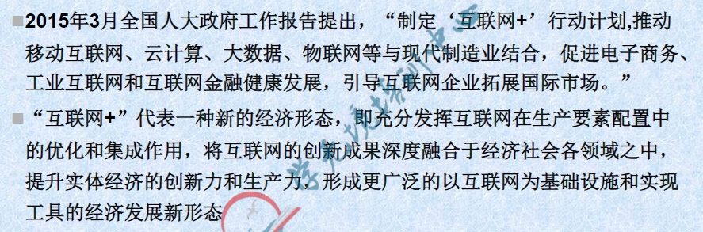

加的是各行各业


## 1.2信息通信技术

### 1.2.1通信的基本原理

通信：信息的远距离传递

【现代】通信：光（电），信息的远距离传递

#### 1.2.1.1通信系统模型

**什么是通信**


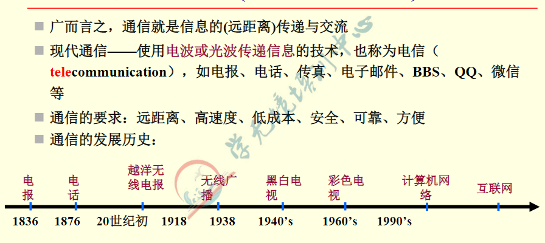

- 广而言之，通信就是信息的（远距离）传递与交流
- 现代通信——使用电波或光波传递信息的技术，也称为电信，如电报、电话、传真、电子邮件...
- **（重要）通信的要求：**远距离、高速度、低成本、安全、可靠、方便


EDI：电子数据交换网——（电报、电话）


**通信系统的模型**


通信系统的三要素

1. 信源
   1. 发送信息的设备

2. 信道
   1. 信道的任务是迅速、可靠而准确地将信号从信源传输到信宿

3. 信宿
   1. 接受信息的设备


信号：被传输的信息都必须以某种电（或光）信号的形式才能进行传输


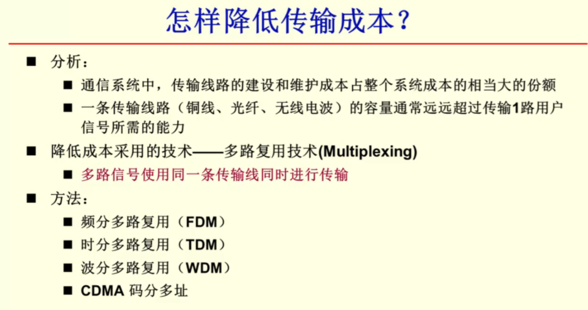

1.远距离

​	高频振荡的正弦波（频率很高，波长很短的波）

调制器：改变

- ​	调频（FM）
- ​	调幅（AM）
- ​	调相（PM）

解调器：还原

​	调制解调器（MODEM）插- 电话线  RJ11（不是双绞线）


```
请问有一个函数y=sin(x-3)的波形变成了y=sin(x)需要做：C
请问有一个函数y=sin(x)的波形变成了y=sin(2x)需要做：A
请问有一个函数y=sin(x)的波形变成了y=2sin(x)需要做：B
A.调频（FM）
B.调幅（AM）
C.调相（PM）
D.解调
```


2.低成本

**多路复用**

多路信号使用同一条传输线同时进行传输

```
多路复用技术:B
A.多种信号在多条信道上同时传播
B.多种信号在1条信道上同时传播
C.1种信号在多条信道上同时传播
D.1种信号在1条信道上同时传播
```

方法：

- 频分多路复用（FDM）
- 时分多路复用（TDM）
- 波分多路复用（WDM）
- 码分多址（CDMA）

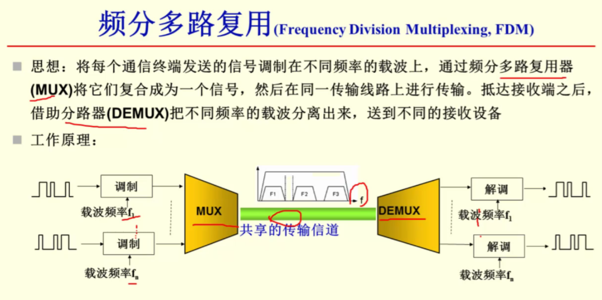

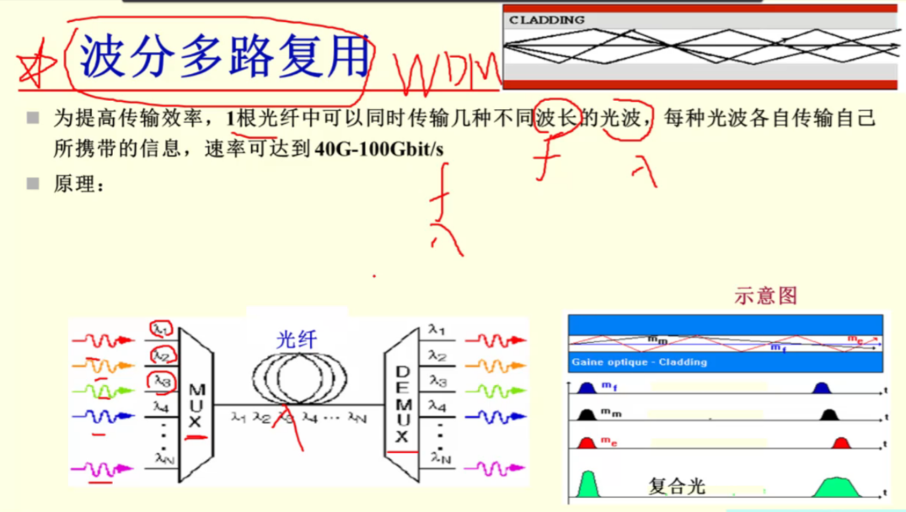

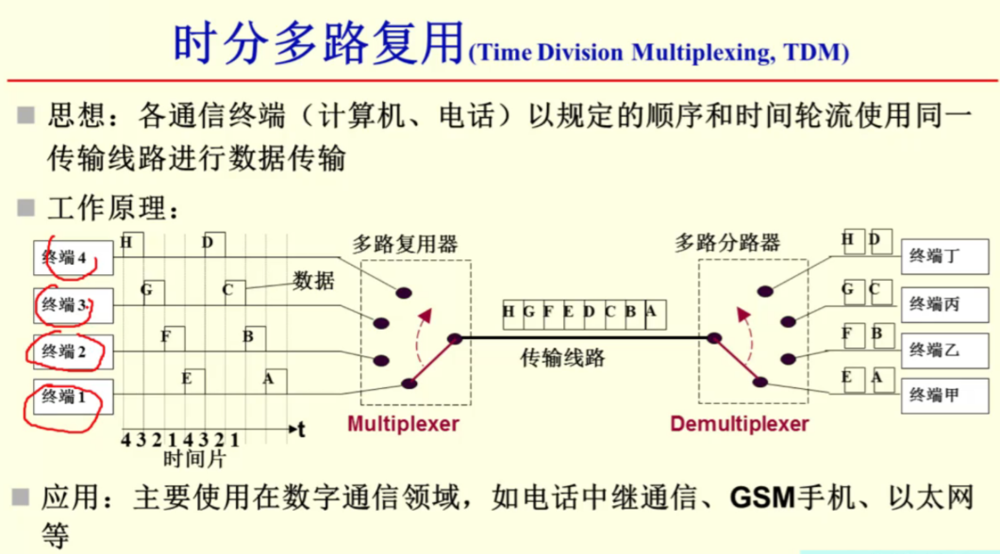

**有线电视：**

FDM（频分多路复用）+TDM（时分多路复用）

**异步时分多路复用（重要）**

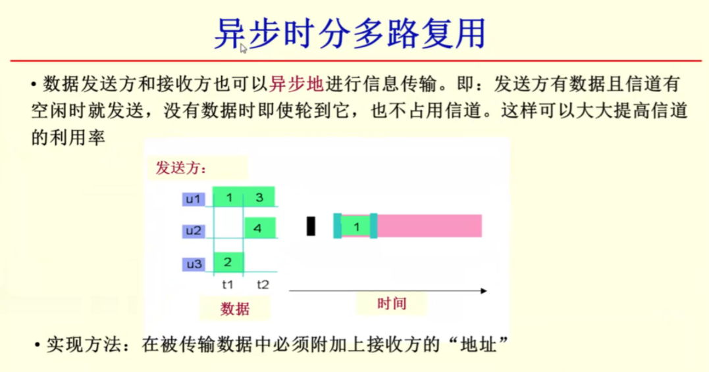

#### 1.2.1.2有线通信与无线通信

信道（传输介质）：

- 有线
  - 金属导体（电）	中继器（信号放大）（因为有电阻，电流会变弱）
    - 双绞线
    - 同轴电缆
  - 光纤（光）
    - 光纤
- 无线
  - 无线电波
    - 灵活，抗灾能力强


**传输介质的类型与特点**

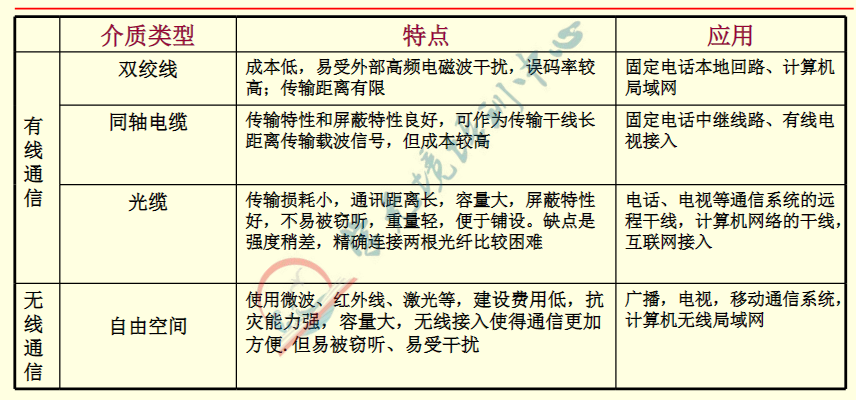

**误码率：**出错的位数除以总共位数的比例

光缆：强度差，精确连接两根光纤比较困难

**双绞线和同轴电缆**


**重要**

**双绞线的水晶头是RJ45——插在网卡里的**——网卡插在主板的PCI上

**电话线的水晶头是RJ11——插在MODEM（调制解调器）**

日常生活还是用5类线

无屏蔽双绞线（UTP）（就是裸线）屏蔽双绞线（STP）（有保护壳，牢固能力，抗干扰能力加强）


PCI：声卡，网卡

AGP，PCI-E：显卡


- 基带同轴电缆（50Ω）
  - 基带适合传数字信号（D）
- 宽带同轴电缆（75Ω）
  - 宽带适合传模拟信号（A）


```
金属导体每过一段距离需要安装中继器来方法信号，且能力损耗是由于电阻的削弱引起的。	正确的
```


**光纤与光缆**

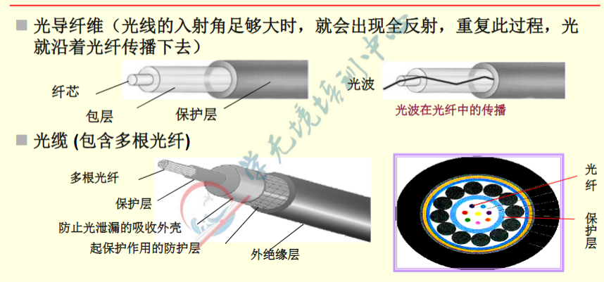

**光纤的通信原理**


```
光纤能量损耗是因为，发生折射时，有一部分光能转换为热能。

光的入射角越大越好
```

光纤通信：利用光波携带信息在光纤中传输，达到通信目的

**优点：**

- 通信容量大：一束光每秒能擦混输2.5G或10Gb信息！
- 传输距离远：无中继距离超过几十公里
- 保密性强，信息不易泄露

光纤也需要中继器，但是它的距离比较远，可以隔几十公里

**过程**

- 数字信号（电信号）驱动一个光源（半导体激光器或发光二极管），发出光信号
- 调制后的光信号通过光纤进行传输，为补偿光纤线路的损耗，每隔一定距离要接入中继器
- 光信号经放大后由光检测器（半导体光电管）进行检测、解调，再转化成电信号之后输出


**无线通信**

无线通信：利用电磁波携带信息在自由空间中擦混播，进行通信


微波适合远距离传递


**微波通信（重要）**


**特点**

- 直线传播，需要建设中继站，无穿透力**（最重要）**
- 容量大，可靠性高
- 建设费用低
- 抗灾能力强

微波通信的三大例子：

1. 地面微波接力通信（雷达）
2. 对流层
3. 卫星通信


**卫星通信**

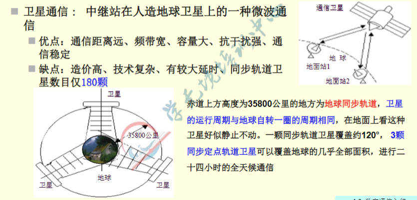

卫星通信：中继站在人在地球卫星上的一种微波通信

- 优点：通信距离远，频带宽、容量大、抗干扰、通信稳定
- 缺点：造价高、技术复杂、有较大的延时、同步轨道卫星数目仅180颗

同步卫星：

35800公里的地方为地球同步轨道

运行周期与地球自转一圈的周期相同

三颗同步定点轨道卫星，可覆盖地球几乎全部面积


**卫星通信的重要应用——导航定位**

```
GPS  全球定位系统
GIS  地理信息系统
```


**北斗卫星导航定位系统（重要）**

全球四大卫星定位系统

- 美国GPS
- 俄罗斯的格洛纳斯
- 欧洲的伽利略
- 中国北斗系统（BDS）

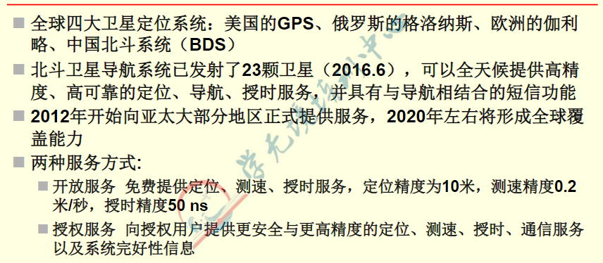


**（重要）个人移动通信**

移动对象相互间的通信，如手机，无绳电话、寻呼系统等

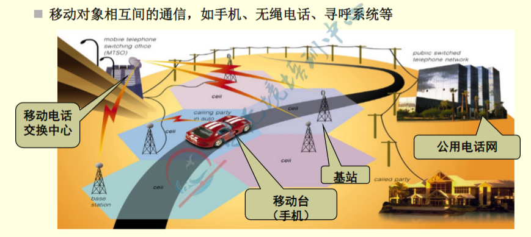

**移动通信的三要素（重要）**

- 移动台（手机）
- 基站
- 移动电话交换中心


```
1G 第一代移动通信系统
	A 模拟信号

2G 第二代移动通信系统
	D 数字信号
	电话  短信
	（2G的标准）GSM 全球通
	（2G的标准）CDMA 码分多址

3G
CDMA2000 WCDMA TD-SCDMA

4G
5G
```


**蜂窝移动通信原理**


- 每10~20km的区域称为单元（形似**蜂窝**），每个单元中心高处建有一个基站，所有单元即相互分割，又彼此交叠，形成整个移动通信服务网
- 位于某单元内的所有手机都向该基站发送信号，并接受基站发给它的信号

（蜂窝）移动通信原理：基站

- 所有的基站都通过微波或光缆与**移动交换中心**通信
- 手机每个时刻都处于某个特定单元的基站控制之下，同一单元内同一时刻的不同手机使用不同的频率与基站进行通信，相互不影响，基站相邻的6个加上自己共七个频率不相同


非接触的IC卡：10CM

蓝牙：10m


**第二代移动通信2G**


**不足：**

1. 数据传输速率过低（9.6kb/s或57kb/s）,仅适合传输语音和文字
2. 容量有限，不能满足发达地区手机用户高度密集的要求

**第三代通信系统（3G）**

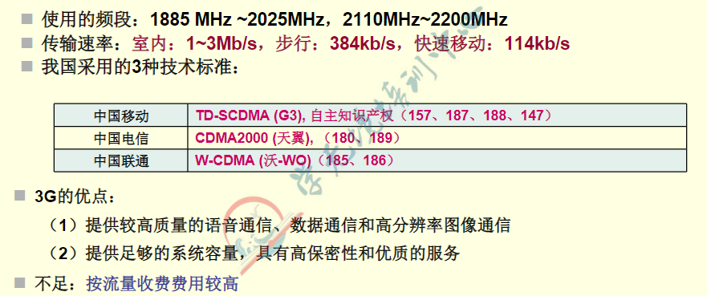

**3G的优点：**

1. 提供较高质量的语音通信。数据通信和高分辨率图像通信、
2. 提供足够的系统容量，具有高保密性的优质的服务

**不足**：按流量收费费用较高


**第四代通信系统（4G）**


### 1.2.2调制解调和多路复用

**频分多路复用**

**思想**：将每个通信终端发送的信号调制在不同频率的载波上，通过频分多路复用器（MUX）将它们复合成为一个信号，然后在同一传输线路上进行传输。抵达接受端之后，借助分路器（DEMUX）把不同频率的载波分离出来，送到不同的接收设备

**工作原理**：（看下图）


**时分多路复用**

思想：各通信终端（计算机、电话）以规定的顺序和时间轮流使用同一传输线路进行数据传输

工作原理：（看下图）

应用：主要使用在数字通信领域，如电话中继器、GSM手机、以太网等


**波分多路复用**

**思想：**为提高传输效率，1根光纤中可以同时传输集中不同波长的光波，每种光波各自传输自己所携带的信息，速率可达到40G-100Gbit/s

原理（看下图）

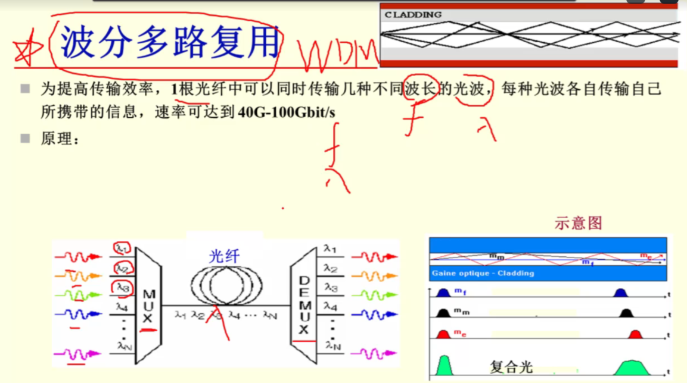

有线电视：

FDM（频分多路复用）为主+TDM（时分多路复用）


**异步时分多路复用（了解）**

思想：数据发送方和接收方也可以异步地进行信息传输。**即**：发送方有数据且信道有空闲时就发送，没有数据时即使轮到它，也不占用信道。这样可以大大提高信道的利用率


### 1.2.3交换技术


1.3 -1.4 课后自己去看，以介绍性为主（下面有整理了）

## 1.3计算机信息系统

IS 信息系统

MIS 管理信息系统

DBS 数据库系统

MIS 管理信息系统	DBS数据库系统

**什么是计算机信息系统**

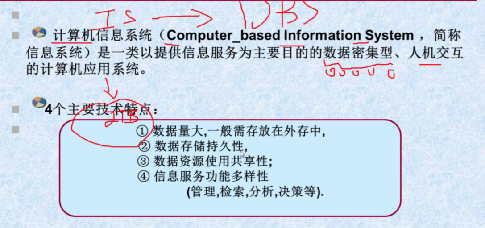

计算机信息系统（简称信息系统）是一类以提供信息服务为主要目的的**数据密集型**、人机交互的计算机应用系统

4个主要技术特点

- 数据量大，一般需要存放在外存中
- 数据存储持久性
- 数据资源使用共享性
- 信息服务功能多样性
  - （管理、检索、分析、决策等）

```
信息分析系统领域的
ES 专家系统
	知识库 + 推理机
DSS 决策支持系统

CAD 计算机辅助设计
CAI 计算机辅助教学
CAM 计算机辅助制造
CAPP 计算机辅助工艺规划
```

### 1.3.1 计算机信息系统的类型

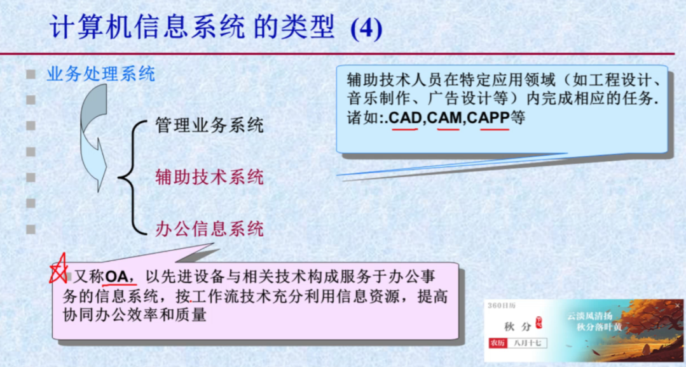


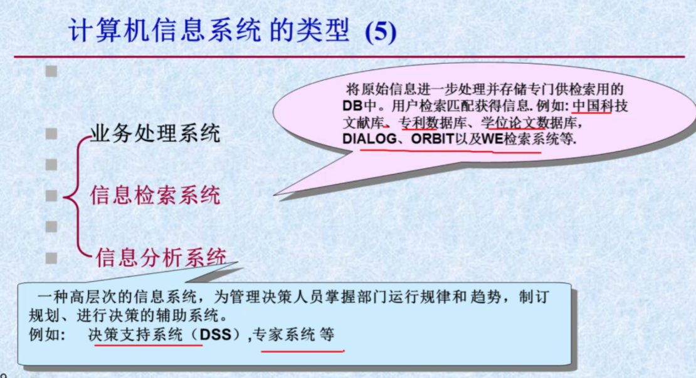

### 1.3.2 信息系统的结构和发展趋势（选学）

信息系统的结构

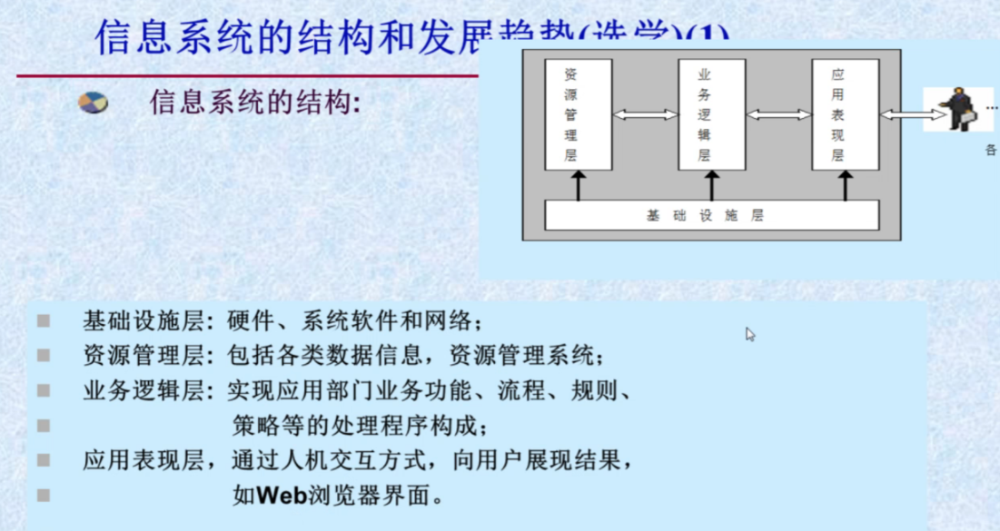

- 基础设施层：硬件、系统软件和网络
- 资源管理层：包括各类数据信息，资源管理系统
- 业务逻辑层：实现应用部门业务功能、流程、规则、策略德国的处理程序构成
- 应用表现层：通过人机交互方式、向用户展现结果如Web浏览器界面。

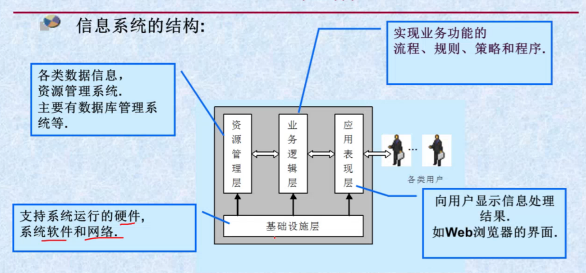


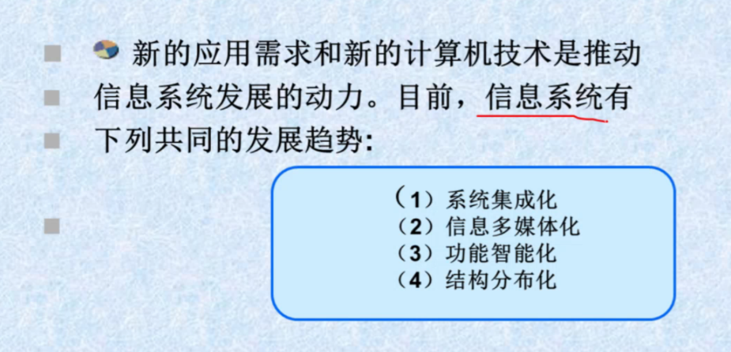


## 1.4典型信息系统介绍

### 1.4.1 制造业信息系统

**（高频考点）制造业信息系统分类**

- 计算机集成制造系统（CIMS）
  - 辅助技术系统
    - 计算机辅助设计（CAD）
    - 计算机辅助工艺规划（CAPP）
    - 计算机辅助制造（CAM）
    - 计算机数字控制（CNC）
    - 计算机辅助质量控制（CAQC）
    - ...
  - 管理业务系统
    - 制造资源计划系统（MRP||）
    - 企业资源计划（ERP）

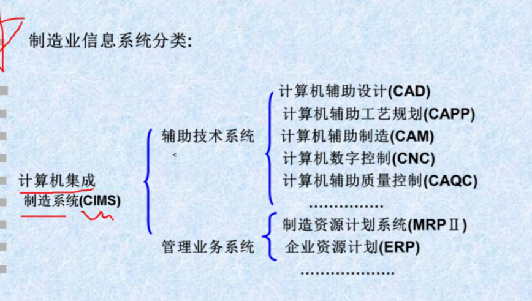

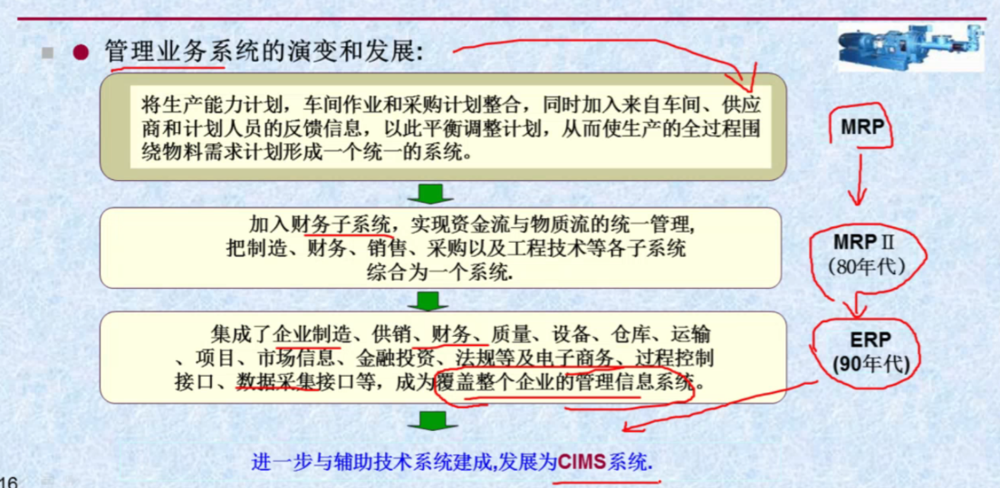

下面标题6个可能会在填空题中出现

### 1.4.2 电子商务


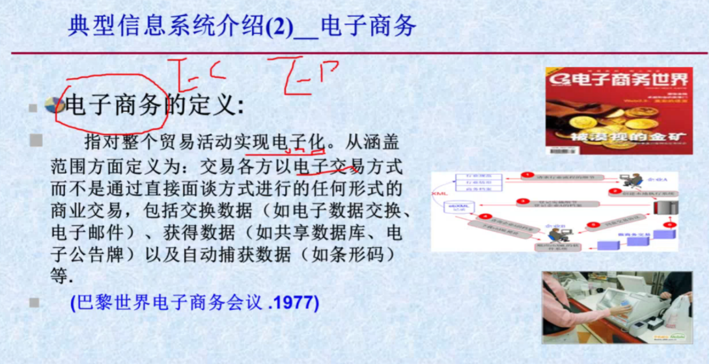

**电子商务的分类**

- 按照交易的双方分类
  - 企业内部的电子商务
  - 企业与客户之间的电子商务（B-C）
  - 企业之间的电子商务（B-B）
  - 企业与政府之间的电子商务
- 按照交易商品性质分类
  - 有形商品的电子订货和付款
  - 无形商品和服务
- 按照使用网络类型分类
  - 电子数据交换（EDI）
  - 基于Internet电子商务
  - 基于Intranet/Extranet的电子商务

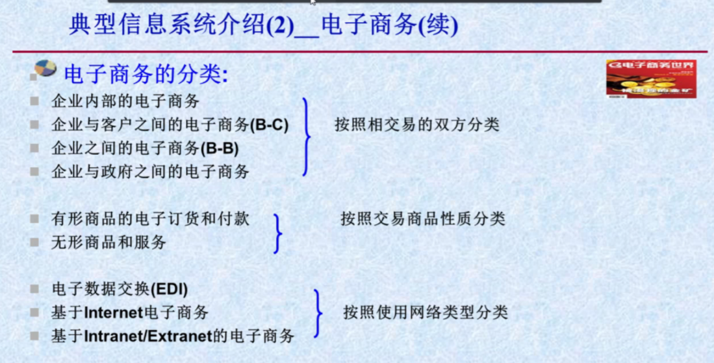

### 1.4.3 电子政务

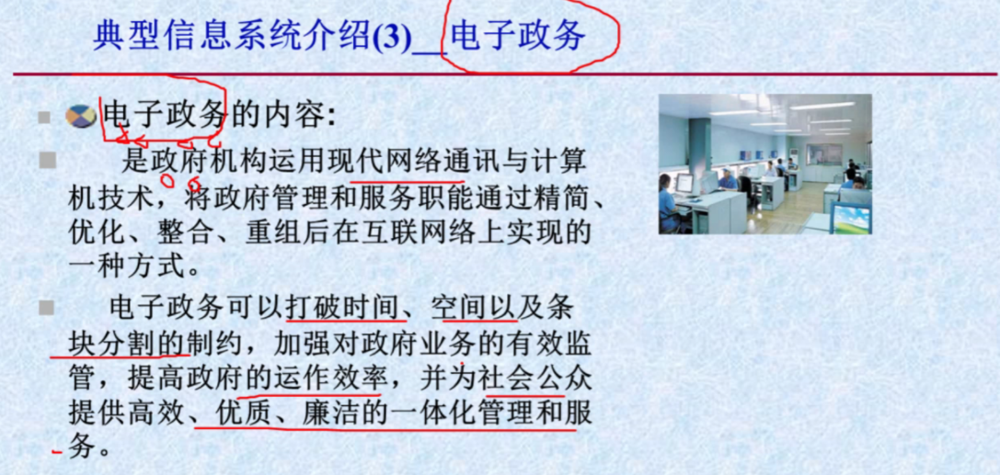

### 1.4.4 地理信息系统和数字地球

地理信息系统（GIS）

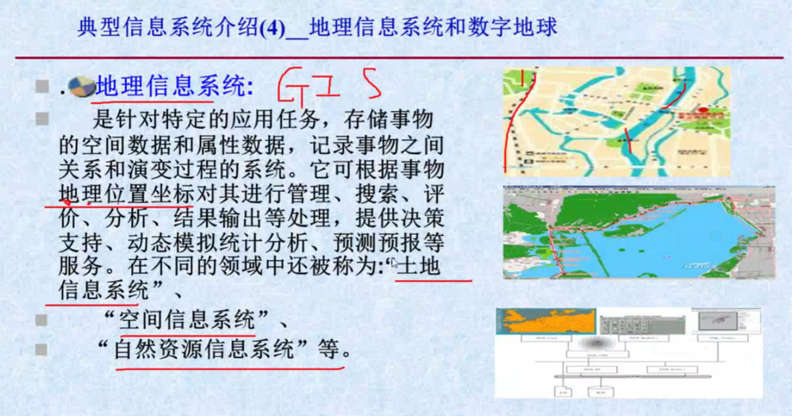

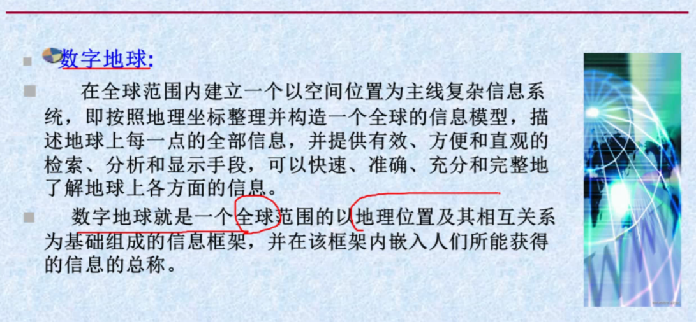

### 1.4.5 远程教育

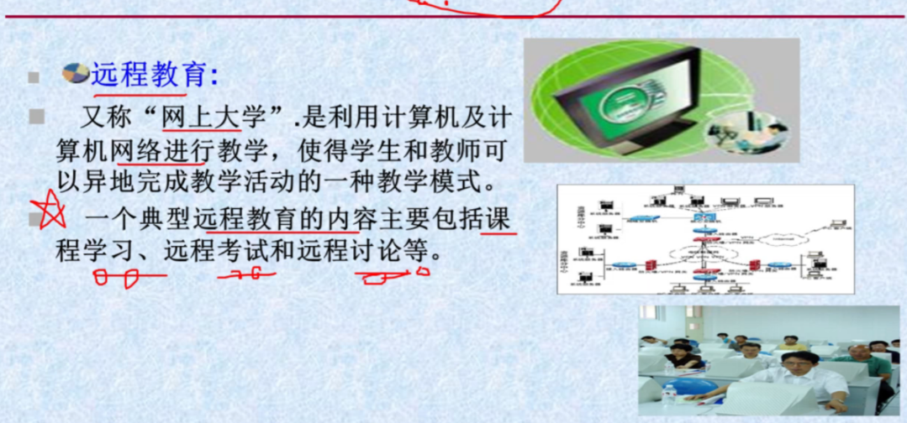

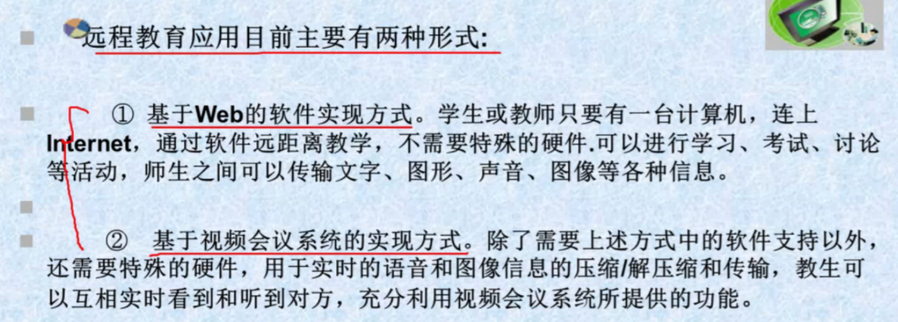

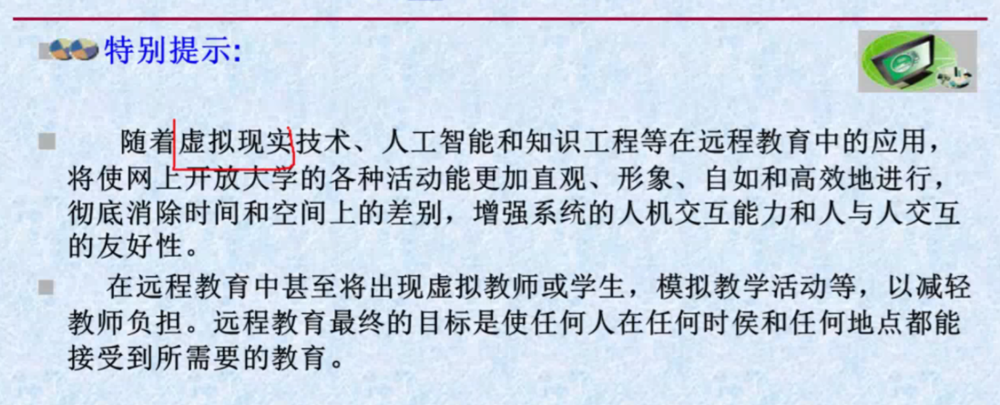

### 1.4.6 远程医疗


### 1.4.7 数字图书馆

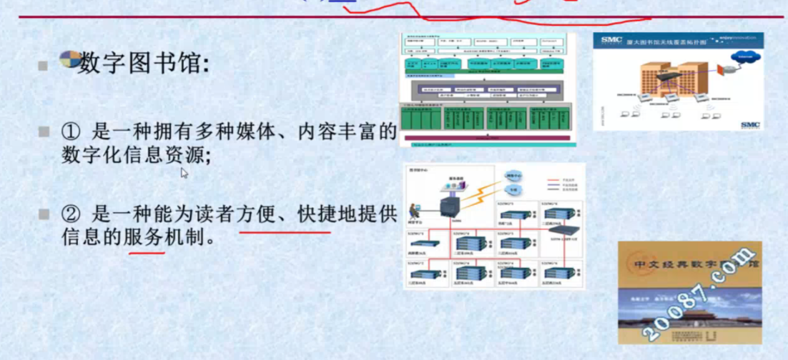

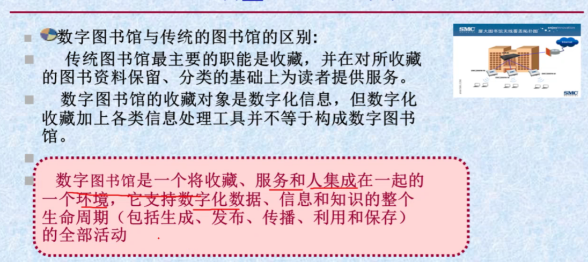

## 1.5关系数据库系统（非常重要）

人类管理数据的发展：

1. 人工管理阶段
2. 文件管理阶段
3. 数据库管理阶段
4. 分布式数据库管理阶段


**（高频考点）数据库系统 DBS（信息系统IS 管理信息系统MIS）**

组成

1. DB 数据库（外存）
2. DBMS 数据库管理系统
3. 用户（DBA 数据库管理员）
4. 软硬件支持
5. 界面

```
请问一个完整的数据库系统应包含：ABCD
A.数据库
B.数据库管理系统
C.前端界面
D.数据库管理员等用户
```


软件：

1. 系统软件
   1. BIOS 基本输入/输出系统
   2. OS 操作系统
   3. DBMS 数据库管理系统（ACCESS VFP SQLSERVER MYSQL ORACLE DB2 高斯DB）
   4. 程序语言的处理程序
      1. 汇编程序
      2. 解释（口译）
      3. 编译（笔译）
2. 应用软件
   1. 通用  定制


**关系型数据库（重要）**

1. 为什么采用：关系代数的支持

2. **什么是关系型：**

   1. 关系（二维表）

      行：元组（记录）

      列：属性（字段）


**两个概念（注意区分）：**

​	关系模式：静态的，稳定的（表的结构）

​						S（学号，姓名，性别）

​	关系[模型]：动态的，变化的

​						行：元组（记录）

​						列：属性（字段）

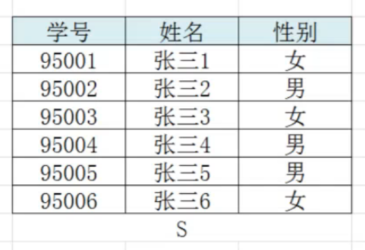


**题目**

| A    | B    | C    | D    |
| ---- | ---- | ---- | ---- |
| a1   | b1   | c1   | d1   |
| a2   | b2   | c2   | d2   |
| a3   | b3   | c3   | d3   |

​																													X

关系模式：X（A,B,C,D）


### 1.5.1什么是计算机信息系统

**什么是计算机信息系统（1）**


**计算机信息系统：**简称信息系统，是一类以提供信息服务为主要目的的**数据密集型**、人机交互的计算机应用系统

4个主要技术的特点：

1. 数据量大，一般需存放在外存中
2. 数据存储持久性
3. 数据资源使用共享性
4. 信息服务功能多样性（管理，检索，分析，决策等）


**什么是计算机信息系统（2）**


### 1.5.2计算机信息系统的类型

**（重要）计算机信息系统的类型（1）**


从信息处理的深度来区分信息系统

**（重要）基本分为3大类：**

- 业务处理系统
- 信息检索系统
- 信息分析系统
  - DSS：决策支持系统
  - ES：专家系统（知识库+推理机）


下图都是业户处理系统（看一下，了解一下即可）


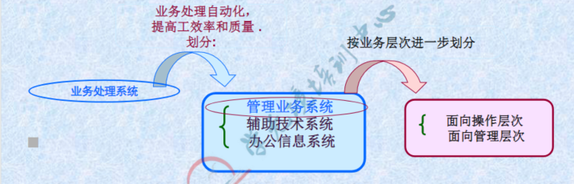

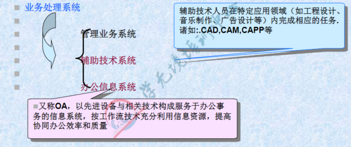

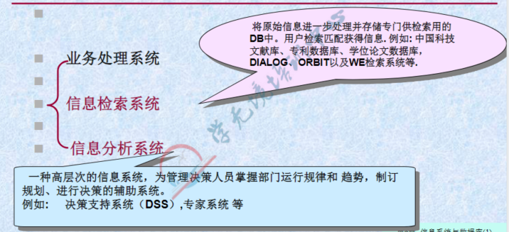

- CAD：计算机辅助设计

- CAI：计算机辅助教学

- CAPP：计算机辅助工艺规划


### 1.5.3信息系统的结构和发展趋势（选学）

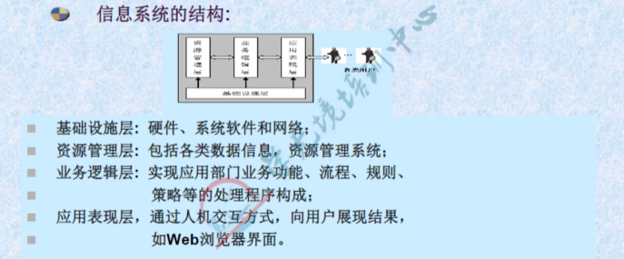

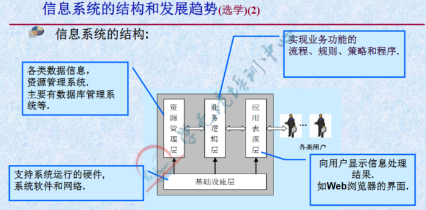


## 1.6信息系统与数据库

### 1.6.1关系数据库系统（非常重要）

```
数据库的三大模型
（设计阶段）
概念模型（设计）——逻辑模型——物理模型
E-R图		二维表（关系）	数据库（硬盘）

1个数据库可以包含多张表

```

1个数据库能不能包含多张表？ 可以

MYSQL文件？（共有4类）

- .frm文件：存储数据表的框架结构
- .MYD：即 MY Data，表数据文件
- .MYI：即MY Index，索引文件
- .log：日志文件


```
显示所有数据库：show databases;

使用某一数据库：use phonesy;

查询数据表：select * from 供货商表；
```


**E-R图：（实体-联系）**

1. 组成

   ​	实体（矩形）

   ​	属性（椭圆）

   ​	联系（菱形）

2. 分类

   1:1（1对1）：实体集A中每一个元素在实体集B至多有一个元素与之对应，反之亦然。（不需要每个元素都要有对应）

   1:n（1对多）：实体集A中元素在实体集B中有多个元素与之对应。（母亲跟孩子）

   n:m（多对多）：（学生与课程）


E（实体）——二维表

R（联系）——二维表

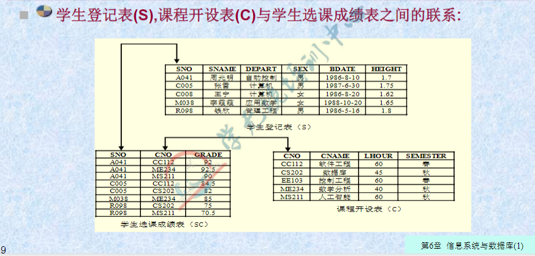


```
实体有属性，联系没有包含属性。错

已知A,B,C,D四个实体，两两发生联系，每个实体均有20个属性，请问需要多少张二维表。10张 4+（4*3）/2

```


**特点：**

每一行称为元组

元组是可以交换的，但是不能重复

属性的顺序可以调整，但是不能重复

属性具备原子性（不可以变的更小）


**数据库完整性的约束**

- 实体完整性约束（不能为空）
  - 主键（主码）：能够区分任意两条元组的最少属性或属性组 （primary key）
    - （sname,sbirthday）作为一个主键
- 用户自定义完整性约束
  - 域：某个属性的取值范围
- 参照（应用）完整性约束
  - 外键：下面的选择题可以说明外键
    - foreign key


```
一个表中能够作为主键的一定是单属性。 	错

不同属性的域一定不同。				错
不同属性的域一定相同。				错

delete from s; 	删除s表中的所有数据
drop s;			销毁s

请选出删除S,C,SC表中数据，保留表结构的命令：BC
A.	delete from S;
	delete from C;
	delete from SC;
	
B.	delete from SC;
	delete from C;
	delete from S;

C.	delete from SC;
	delete from S;
	delete from C;

D.	drop from SC;
	drop from S;
	drop from C;
```


**关系数据模型（结构）**

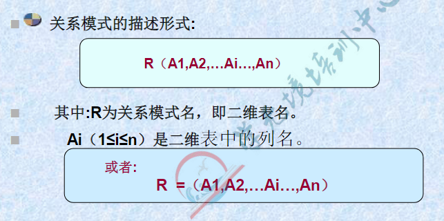

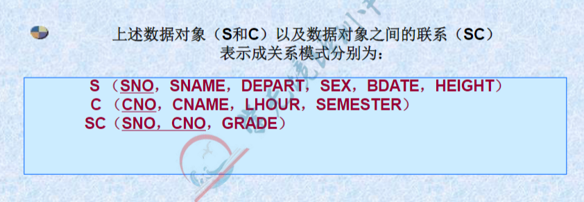

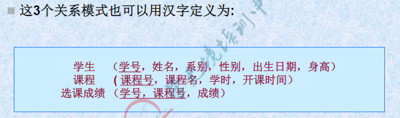


**（高频考点）关系数据模型（操作）**

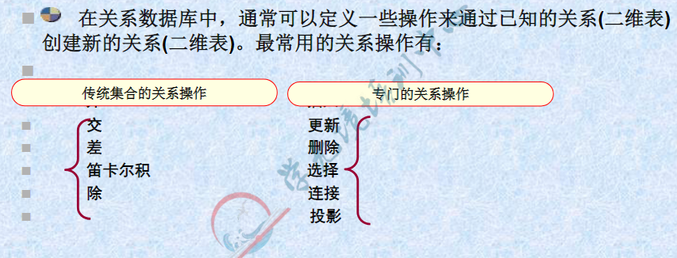

在关系数据库总，通常可以定义一些操作来通过已知的关系（二维表）创建新的关系（二维表）。最常用的关系操作:

- 传统集合的关系操作
  - 并
  - 交
  - 差
  - 笛卡尔积
  - 除
- 专门的关系操作
  - 插入（insert）
  - 更新（update）
  - 删除（delete）
  - 选择（δ）
  - 连接（∞）
  - 投影（π）


**关系数据模型（传统集合的关系操作）**

**并：∪**

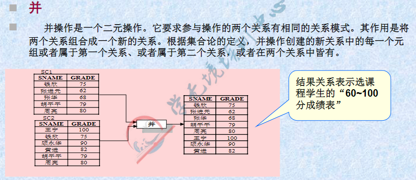


**交：∩**


**差：-**


**笛卡尔积：**× 属性个数相加，元组条数相乘（符合交换律）


**除法：÷**


```
已知关系R和S具备一样的关系模式，R中有100条元组，S中有200条元组
请问RUS元组[200,300]
请问R∩S元组[0,100]

已知关系R和S具备一样的关系模式，R中有1000元组，S中有2000元组,请问以下成立的是：C
A.R∪S=1999 且R∩S=1001
B.R∪S=2500 且R∩S=1000
C.R∪S=2300 且R∩S=700
D.R∪S=2001 且R∩S=1001
	R∪S + R∩S=R+S
	
已知R有10个属性，1000条元组，S中有20个属性，10000条元组，那么R×S有 30 属性，1000 0000  条元组

请问以下运算符合交换律的是：ABD
请问R和S需具备相同的关系模式的是：ABC
A.∪
B.∩
C.-
D.×
E.除÷
请问传统的关系运算中需要两个关系具备一样的关系模式的是：ABC
A.并
B.交
C.差
D.笛卡尔积
E.选择


```


**插入（insert）：**


```
SQL 结构化查询语句
INSERT INTO 表（属性1，属性2，...）
VALUES（值1，值2，...）
例1：
s(SNO,SNAME,SSEX,AGE)其中SNO,SNAME,SSEX为字符型，AGE为整形。请写出插入数据 95002，张三，男，24 的SQL命令：
写法1：
INSERT INTO S(SNO,SNAME,SEXX,AGE) VALUES('95002','张三','男',24);
写法2：
INSERT INTO S VALUES('95002','张三','男',24);

```


**删除（delete）：**


```
DELETE FROM 表
[WHERE 条件]
例2：
已知s(SNO,SNAME,SSEX,AGE)其中SNO,SNAME,SSEX为字符型，AGE为整形。删除学号是95001的学生信息。
DELETE FROM S WHERE SNO='95001'
```


**更改（update）：**


```
UPDATE 表
SET 属性1=值1，属性2=值2...
[WHERE 条件]
已知s(SNO,SNAME,SSEX,AGE)其中SNO,SNAME,SSEX为字符型，AGE为整形。将张三的性别改为男性，年龄改成22.写出SQL语句
UPDATE S  SET SSEX='男', AGE=22 WHERE SNAME='张三';

写出SQL命令
已知表C(CNO,CNAME,XF)CNO,CNAME为字符型，XF为数值型
（1）插入1，数据库原理，5的命令
INSERT  INTO C VALUES('1','数据库原理',5);
（2）将课程号为03的课程改名成高级数据库，学分改为6
UPDATE FROM C SET CNAME='高级数据库',XF=6 WHERE CNO='03';
（3）删除表中所有数据的命令
DELETE FROM C;
```


**选择（δ）：**

选择选的是行


**投影（π）：**

投影选的是列


例1：


```
写法1：(这个方法更好)
A=δ_(sex='男')（people）
B=π_(ID,NAME,SEX)（A）
写法2：
A=π_(ID,NAME,SEX)（people）
B=δ_(sex='男')（A）

```


**连接（∞）：**


**等值连接：**

一定要有一样的属性，才能连接到一块去


**自然连接：**

在等值连接的基础上，把重复的列删掉


**左外连接：**

自然连接上的基础上，把左边不重复的也加上，没有的填null


**右外连接：**

自然连接上的基础上，把右边不重复的也加上，没有的填null


**（全）外连接：**

自然连接上的基础上，把不重复的也加上，没有的填null（左右都有）


### 1.6.2关系数据库语言SQL

```
SQL是专门为MYSQL服务的。  错误！

SQL 通用的关系型数据库语言。
```

**关系数据库语言SQL特点（结构化查询语言）**

- 是一种“非过程语言”（用户只要指出“做什么”，而“如何做”的过程由DBMS完成）
- 体现关系模型在结构，完整性和操作方面的特征 
- 有命令和嵌入程序两种使用方式
  - 命令式：直接用语句操作
  - 嵌入式：将语句嵌入程序

- 功能齐全，简洁易学，使用方便
- 为主流DBMS产品所支持


**SQL数据定义语言DDL（date define language）**

SQL数据定义语言DDL


**SQL数据定义语言DDL**

```
创建数据库 TEST
CREATE DATABASE TEST;

写出创建数据库student，使用数据库student，显示所有数据库的命令
CREATE DATABASE student;
USE student;
SHOW DATABASES;

CREATE TABLE 创建表
CREATE VIEW  创建视图
CREATE INDEX 创建索引

```


**DML 数据操纵语言（SELECT INSERT DELETE UPDATE）**

```
select 属性1，属性2...(*)	--投影
from 表1,表2,...,视图1		--连接
[where 条件				--选择
group by 属性，分组
having 分组条件
order by 属性  asc 升序  desc降序
]
```


**DCL 数据控制语言 并发控制**


**单表查询**

左边是SQL语句，右边是关系代数（图片中红色字）（**注意**题目说些什么）


```
S(SNO,SNAME,SEX,SBIRTHDAY) 书写SQL语句
1.查询所有男生信息
	SELECT * FROM S WHERE SEX='男'
	
补充知识
	数据库的通配符：
	%:任意字符
	_:任一字符
2.查询所有姓“张”学生的姓名和出生年月
SELECT SNAME,SBIRTHDAY FROM S WHERE SNAME LIKE '张%'

3.翻译意思
SELECT SNAME,SBIRTHDAY FROM S WHERE SNAME LIKE '%张%'
寻找名字含有张的人的出生年月
SELECT SNAME,SBIRTHDAY FROM S WHERE SNAME LIKE '张_'
寻找姓张两个字的人的出生年月


SELET SNO FROM S ORDER BY SNO;
寻找学号，默认升序
```


```
这两句语句是不一样的。
```


**SQL的视图**

- 视图是DBMS所提供的一种由用户观察数据库中数据的重要机制。视图可由基本表或其他视图导出。它与基本表不同，视图只是一个虚表，在数据字典中保留其逻辑定义，而不作为一个表实际存储数据。

- SQL 用Create View 语句建立视图，其格式为：

  CREATE  VIEW <视图名> [<列名>,...]

  ​	AS  < 子查询>

```
已知关系 S(SNO,SNAME,SSEX,SBIRTHDAY)
请创建以下视图：
1.男生信息的视图  VIEW1
CREATE VIEW VIEW1 AS SELELCT * FROM S WHERE SSEX='男';
2.建立所有姓名中含有“南”字的学生学号，姓名，出生年月的视图VIEW2
CREATE VIEW VIEW2 AS SELECT SNO,SNAME,SBIRTHDAY FROM S WHERE SNAME LIKE '%南%';
```


### 1.6.3 数据库系统及应用新技术

- 集中式数据库系统
- 客户/服务器结构（C/S）
- 浏览器/服务器结构（B/S）
- 分布式数据库系统
- 并行数据库系统


IIS(windows web服务器)

（位置）安装卸载

​	控制面板——程序和功能——打开或关闭windows功能


DDBMS是分布式数据库管理系统

**（重要）并行数据库系统**


# 2.物联网技术

```
1936年 eniac 第一电子计算机

internet 互联网：计算机等智能设备联网（全球硬件和软件的联网）---->物联网（IOT）

www	万维网（全球所有的网站）

”互联网+ “：加各行各业

物联网：IOT
```


## 2.1物联网概述

### 2.1.1物联网的基本概念

IOT，internet of things


（这句话记住）物物相连的互联网——物联网


```
自动驾驶中，汽车感应可以用一下传感器，请问反应速度最快的是：A
A.红外线传感器
B.声波传感器
```


**（重要）物联网包含两层含义**

1. 物联网的基础和支撑是强大的计算机系统，它是以计算机网络为核心进行延伸和扩展而形成的网络
2. 物联网的终端用户已经延伸和扩展到众多物品之间，进行数据交换和通讯。


**物联网的相关说明**：像家用电器一样的物体的互联网络

打*重要


**（重要）物联网的其他表述**：M2M（Ma   chine to Machine）、传感网（Sensor Networks）、普适计算（Pervasive Computing）、泛在计算（Ubiquitous computing）、环境感知智能（Ambient Intelligence）等等

```
多选题：
物联网可以称作：BCD
A.ICT
B.IOT
C.泛在计算（普适计算）
D.M2M
```


**物联网发展的划时代意义**


推动人类进入智能化时代，实现智能互动，带来不可估量的实现意义

```
物理网是物物相连的网络，所以只能是人和物，人人之间的通信，还不能实现物体和物体之间的通信。  错误！
```


### 2.1.2物联网的发展历程及国内外现状

1995年比尔盖茨提到了物联网的概念

2005年比较正式提出了概念

2009年是对物联网比较重要的一个年份

无锡，国家传感网创新示范中心

2011年我国成为ISO传感器网络标准工作组（WG7）的主导国之一


ISO 国际标准化组织

### 2.1.3物联网与互联网的区别

下面的话，非常重要

互联网：又称因特网。是网络和网络间串联而成的庞大物理网络

物联网：

1. 物联网是互联网的延伸
2. 物联网是一种建立在互联网上广泛存在的网络
3. 物联网技术的重要基础与核心仍就是互联网


```
一以下说法正确的是：BD
A.互联网包含了物联网
B.物联网包含了互联网
C.物联网的核心是终端设备
D.物联网是互联网的延伸和拓展
```


## 2.2物联网关键技术

**物联网的三大特征（重要）**

这三大特征都重要（下面有细节）

- 感知：全面感知
- 传输：可靠传输
- 智能：智能处理


### 2.2.1物联网三层体系结构

感知层：全面感知

网络层：可靠传输

应用层：智能应用


**感知层：**

全面感知


感知层是物联网的皮肤和五官——**识别物体，采集信息**

代表技术：二维码标签，识读器，RFID标签和读写器，摄像头，GPS、传感器、终端、传感器网络等。


**网络层：**（特点：可靠的传输）

网络层是物联网的神经中枢和大脑——**信息传递和处理**

类似于人体结构中的神经中枢和大脑（重要）


**应用层：**（智能应用）

应从层是物联网的“社会分工”——**与行业需求结合，实现广泛智能化。**

类似于人类的社会分工，做种构成人类社会


```
1.请问物联网的三大特征是：ACD
A.全面感知
B.智能传输
C.智慧应用
D.可靠传输

2.请问物联网的体系结构关于层次说法正确的是：BD
A.网络层支撑感知层工作
B.应用层必须与行业结合，形成广泛的智能应用
C.感知层的技术代表是计算机网络
D.网络层的核心是计算机等网络

3.请问物联网感知层的技术代表有：ABC
A.传感器
B.RFID
C.高清探头
D.WIFI
```


### 2.2.2物联网感知层关键技术


一般来说，条码的数为是13位

**RFID**

（重要）RFID技术：

俗称为**电子标签**，是一种**非接触式**的自动识别技术，**可识别高速**运动物体并**可同时识别多个标签**，操作快捷方便

通过射频信号自动识别对象并获取相关数据完成信息的采集工作，**RFID技术是物联网中最关键的一种技术**，它为物体贴上了电子标签，实现了高效灵活管理


RFID技术的组成：（了解一下）

1. 标签（Tag）：由耦合原件及芯片组成。每个标签有唯一的电子编码，附在物体上表示目标对象
2. 阅读器或者读写器：读取（有时还可以写入）标签信息的设备


条形码


**EPC（Electronic Product Code EPC）电子产品代码**

**代码全球唯一**

EPC系统在计算机、物联网和RFID技术的基础上，利用全球统一表示系统编码技术给每个实体对象一个唯一的编码。够早了一个实现全球物品信息实时共享的实物互联网


**指纹传感器**


**其他传感器**

1. 环境光感应器
2. 近距离传感器
3. 气压传感器
4. 三轴陀螺仪
5. 重力传感器
6. 磁力计
7. 3D触摸传感器


```
请问在GPS定位时，为了测飞机的飞行高度，需要的传感器为：C
A.3D触摸传感器
B.磁力计
C.气压传感器
D.环境光感应器
```


### 2.2.3物理网网络层关键技术——ZigBee

**ZigBee技术**：

是一种近距离、低复杂度、低功耗、低速度、低成本的双向无线通信技术

特点：

功耗低、成本低、时延短、网络容量大、可靠、安全、主要适用于自动控制和远程控制领域，可以嵌入各种设备


**ZigBee来源**


ZigBee设备类型（了解）

一个ZigBee网络由一个协调器结点，多个路由器和多个终端设备结点组成


**Wi-Fi（重要）**

是802.11的另一种说法

Wi-Fi是一个无线网络通信技术的品牌，由Wi-Fi联盟（Wi-Fi Alliance）持有，目的是改善基于IEEE802.11标准的无线网络产品之间的胡通性。Wi-Fi是一种可以将计算机、手持设备（如PDA、手机）等终端以无线方式互相连接的技术


Wi-Fi的优势

- 无线电波的覆盖范围广
- 传输速度非常快
- 厂商进入该领域的门槛比较低


**蓝牙**

10米以内（建筑物内部）

蓝牙是一种支持设备**短距离通信**（一般10m内）的无线电技术，能够在包括移动电话，掌上电脑，无线耳机，笔记本电脑，相关外设等众多设备之间进行无线信息交换。

**蓝牙技术的优势：**
稳定、全球可用、设备范围广、易于使用、采用了通用规格


**GPS**

全球定位系统是利用定位卫星，在全球范围实时进行定位、导航的系统

**全球四大定位系统**

- 美国：GPS
- 俄罗斯：格洛纳斯
- 欧洲：伽利略
- 中国：北斗


### 2.2.4物联网应用层关键技术原理

注意红色标记出来的内容

应用层的关键问题在于信息的社会化共享和开发利用以及信息安全的保障。

**（注意）云计算平台**作为海量感知数据存储、分析平台，将是物联网网络层的重要组成部分，也是应用层众多应用的基础。

**（注意）数据挖掘技术**也是应用层众多应用的推理。

物联网应用层利用经过分析处理的感知数据，为用户提供丰富的特定服务


将物联网技术与行业专业技术相结合，实现广泛智能化应用的解决方案集，提供物物共联的丰富应用。

应用层是物联网**发展的目的**，软件开发、智能控制技术将会为用户提供丰富多彩的物联网应用。

**物联网通过应用层最终实现信息技术与行业的深度融合，对国民经济和社会发展具有广泛影响。**


**物联网的关键技术包括云计算所涉及的关键技术还包括：**

- **最底层——基础设施层即服务（IAAS）：**该层提供最基本的**计算**与**存储**能力，其中**自动化和虚拟化是核心技术**。
- **中间层——平台即服务（PAAS）**：这层设计两个关键技术，基于云的软件开发，测试及运行技术和大规模分布式运行环境
- **最顶层——软件即服务（SAAS）：**关键技术有WEB2.0中的Mashup、应用多租户、应用虚拟化等


- 软件与算法
  - 软件与算法是物联网智慧集中体现。其中的关键技术包括面向服务的体系架构和**中间件技术**
- 信息和隐私安全技术
  - 信息和隐私安全技术包括安全体系架构、网络安全技术、以及“智能物体”的广泛部署给社会带来的安全威胁、隐私保护技术、安全管理机制和保证措施等。
- 标识和解析技术
  - 标识和解析技术是赋予物理、通信和应用实体或其本身固有的一个或一组属性，并能实现正确解释的技术。物联网的表示主要包括**物体标识和通信标识**。


## 2.3物联网主要应用领域

### 2.3.1物联网主要应用领域

**智慧物流**


**智慧医疗**


**智能家居**


**智能制造**

人机一体化智能系统

**智能交通**


**智慧农业**


### 2.3.2物联网技术未来发展趋势

**重要**

1. 物联网和人工智能相互促进
2. 5G成为物联网必须的燃料
3. 路由器将变得更安全，以阻止不安全的访问


```
物联网的简称：
IOT

物联网分成哪三层：
应用层（智能应用）
网络层（可靠传输）
感知层（全面感知）

RFID中文：
无线射频识别技术（电子标签）

例举手机常见的传感器（不少于5个）：
看PPT

我们国家物联网中心在哪个城市：
无锡
```


# 3.移动互联网技术

EC（EB）：电子商务

- 网络：
  - 电子数据交换网络 EDI：电报，电话
    - Internet 互联网--------物联网 IOT
    - 移动互联网

```
请问传统固定电话属于：B
A.IOT
B.EDI
C.INTERNET
D.移动互联网
```


**移动互联网的兴起**（了解一下）


- APP 应用程序：
  - 优点：功能复杂软件，底层功能
  - 缺点：推广难，开发成本高
- 微信小程序：内嵌在微信平台
- 微信公众号：支持HTML5，推广容易，不占空间


- 手机操作系统：
  - android 安卓 ————.apk -------JAVA
  - IOS ——————object-C
  - WINDOWS phone ——————


```
某小型企业，为了推广自己的产品，选择何种技术较经济和快捷：B
A.开发自己的手机APP，两个平台
B.微信公众号
C.开发苹果端的APP
D.购买大型商务网站，架构自己的服务器
```

```
摩尔定律：（moore）
单块集成电路（IC）的集成度平均18-24月翻一番
集成度：元器件的总和
集成电路：Si（硅） 砷化镓（GaAs）
```

**移动互联网的发展状况（建议整理）**

- 移动互联网仍处于早期发展阶段
- 移动互联网以**6个月**为周期快速迭代
- 移动智能终端操作系统格局彻底颠覆
  - Android初步占据主导地位
- 移动智能终端成为历史上渗透速度最快的终端产品
- 移动互联网与桌面应用组织盈利模式的差异化正在继续


**移动情景及用户行为特点**

- 位置可变性
- 缺乏专注性
- 及时响应性
- 任务突变性
- 随时随地性

**移动互联网的用户需求特征**

- 需求动力的原始性
- 需求思维的懒惰性
- 需求心里的猎奇性
- 需求费用的低廉性


**移动互联网的定义**

- 移动互联网，就是将移动通信和互联网二者结合起来，成为一体。（百度百科）
- 移动互联网是基于移动通信技术、广域网、局域网及各种移动信息终端按照一定的通信协议组成的互联网络
- 广义上指的是手持移动终端通过各种无线网络进行通信，与互联网结合就产生了移动互联网。
- 可以认为移动互联网是互联网的延伸，亦可认为移动互联网是互联网的发展方向。其他类似的定义如下所述。


```
Internet 有多种发展方向，体现万物皆可连接的是：__物联网____,与移动通信网络结合成一体的是__移动互联网____.
```


**移动互联网的定义**


**（重点）移动互联网的分层**

- 应用层
  - 应用层是指能够体现终端移动性和位置信息的业务，以及在终端和带宽条件满足的情况下固定互联网的各种业务
- 接入层
  - 接入层是指第二层接入2G/3G/4G,或第三层接入移动IPv4/移动IPv6
- 终端层
  - 终端层包括移动互联网设备（MID）、手机、PDA等。


```
1G：第一代移动通信系统
A 模拟信号
2G
D 数字信号
3G
4G
5G
```


```
windows 平台下查看IP地址：ipconfig
linux 平台下查看IP地址：ifconfig

安装linux方法：
	原版安装运行
	虚拟机安装
```


**移动互联网四要素**

四大成功因素

- 终端：满足易用性、便携性及与应用紧密结合
- 网络：确保覆盖范围与速度
- 平台+应用：提供基于移动互联网的创新应用
- 定价：通过合理的定价实现多方共赢


**移动互联网与互联网、移动通信网及手机互联网**

- 互联网与移动互联网的区别主要在终端上
- 移动互联网是移动通信网和互联网的融合
- 移动互联网≠移动网+互联网
- 手机互联网为用手机登录互联网，完成用电脑完成的操作


**移动互联网的特征**

1. 精准化
   1. 包括用户身份精准、用户行为记录精准以及用户位置精准

2. 泛在化
   1. 包括终端形式泛在化、网络类型泛在化和用户行为泛在化

3. 社交化


**移动物联网的现在与未来**


**移动互联网展业的发展现状**


用户的发展


内容与业务的发展


终端技术的发展

- 芯片技术后摩尔定律突破
- 系统软件云端发展（谷歌ChromeOS、阿里云OS、盛大云OS）
- 应用开发开放式创新
- 人机交互技术前景无限（显示技术、多点触控技术、语音识别技术）


终端厂商，电信运营商、服务提供商面临的基于和挑战

**终端厂商**

- 在智能化道路上，我国移动终端厂商初期略显滞后，正在奋起直追
- 化为、中兴、天语等国内厂家占据本土制造优势在新增市场中的占比稳步提升
- 但在核心技术自有知识产权的掌握上依然有限
- 相比国外主流阵营在产品成熟度、产业链生态支持等方面存在一定差距


**电信运营商**


电信运营商应把控好移动互联网营销三要素

- 目标用户选择
- 业务产品审计
- 营销规则设计

移动互联网营销规划应从客户需求出发，把握“用户、产品、时机”三要素开展精确营销


ISP：互联网服务提供商

服务提供商要丰富业务移动化的用户体验

- 内容精品化
- 营销策略多元化
- 界面设置移动化


**中国关于移动互联网标准化方面的动态及进展**


**移动互联网的业务体系（重点）**


```
以下属于移动通信业务的是：ABD
A.短信
B.彩信
C.移动微信
D.电话
```

SAAS:软件即服务


**移动互联网的业务体系**


**移动互联网六个主要技术领域（了解）**


**移动互联网的性能指标**

- 传输速率
- 服务质量
- 网络延时
- 丢包率

```
8000Kbps=8Mbps=1MBps  
```

带宽：100M————100Mbps

1.最快的传输速率

2.频率的范围  20HZ—20000HZ


```
人耳的带宽是20000HZ		错是19980HZ

某网络的带宽是1G，请问1G表示：1Gbps

通信系统三要素：
信源——————————(信道)——————————信宿

```


```
一下参数值越高，移动互联网性能反而越差：BCE
A.带宽
B.延时
C.丢包率
D.网速
E.误码率（网络是否稳定指标）
```

### SOA 面向服务架构的基本概念

面向服务的体系结构（Service-Oriented-Architecture SOA）


是一个组件模型

```
面向服务的体系结构（SOA）是一个组件模型，能够比较自由和灵活的进行服务的组装和切换  对！
```


**组件模型**


**Web Service**

Web service 是技术规范 SOA是设计原则


**软件工程：**

规则  高内聚，低耦合


**为什么要使用SOA**

**优点：代码可以重用 低耦合 平台独立 语言无关**


**SOA角色（需要了解）**

- 服务提供者：发布自己的服务，并且对服务请求进行响应

- 服务注册中心：注册已经发布的web service，对其进行分类，并提供搜索服务

- 服务请求者：利用服务中心查找所需要的服务，然后使用该服务


**SOA的相关标准（了解一下）**

- SOAP ：简单对象访问协议（Simple Object Access Protocol）
- WSDL ：Web服务描述语句（Web Services Description Language）
- UUSI：统一描述、发现和集成 （Universal Description Discovery and Integration）

WSDL用来描述服务；WDDI用来注册和查找服务；而SOAP，作为传输层，用来在消费者和服务提供者之间传送消息。


**SOA应用——统一认证**


### web

HTML  超文本标记语言


web2.0时代


web3.0时代


HTML5

HTML5将成为主流


任何一个网页是由head和body两部分构成

```html
<HTML>
	<head>
		<title>中国，你好！</title>
		<style type="text/css">
		div
		{
			background-color:Blue;
			padding-left:200px;
			padding-top:300ps;		//控制内部距离
		}
		.oushu
		{
			background-color:red;	
		}
		#mytest
		{
			background-color:yelow;	
            margin-left:200px;
            margin-top:200px;	//控制外部距离
		}
	</head>
	<body>
		<div>111111</div>
		<div class="oushu">222222</div>
		<div>333333</div>
		<div class="oushu">444444</div>
		<div>555555</div>
		<div class="oushu" id="mytest">666666</div>
		test!
	</body>
</HTML>

现在网页布局
DIV+CSS
块标记（定位）+样式表（风格）
就近原则

盒子模型：
左上方是为（0,0）点
然后向右为x轴
向下为y轴
```

**HTML5的优点**

1. 多设备跨平台
   1. 跨平台性非常强大，可以轻易额已知，这也是大多数人对HTML5有兴趣的主要原因
2. 自适应网页设计
   1. 一次设计，普遍使用，自动适应不同大小的屏幕，自动调整布局
3. 即时更新
   1. 不需要非常慢的加载，几乎马上，即时的更新
4. 多媒体
   1. 可以支持多媒体信息


**缺点**

并非所有浏览器支持

存在争议，视频格式方面，各大互联网公司在为具体标准争论，影响HTML5标准的分流


**HTML5的新特性**

- 增强标记能力

- 交互体验更好

- 完善的表单功能

- 丰富的多媒体元素

- 强大的移动支持


```
块标记 DIV
样式表 CSS
```


```
padding- （表示内部距离）
margin- 表示外部距离
```


### Android 的系统架构

java语言开发———Google开发

内核Linux


**Android的系统架构（需要知道一下）**


**1.应用程序（Application）**


**2.应用程序框架（Application Framework）**


**3.类库（Libraries）**


**.dll 文件  动态链接库**


**4.Androld 运行时（Android Runtime）**


**5.操作系统（OS）**

操作系统的作用：

硬件（冯·诺依曼 存储程序控制原理）

​	运算器，控制器，存储器，输入设备，输出设备

OS 操作系统


### IOS的系统架构

**IOS object-C 苹果**


IOS的系统架构


TMSO


媒体层


## 移动互联网的应用领域

移动电子商务


**电子商务：**

1. 交易对象不同
   1. B-B（企业-企业）
   2. B-C（企业-客户）
   3. B-G（企业-政府）
2. 网络
   1. 基于EDI的电子商务：电子数据交换网（电报，电话）
   2. 基于其他网络（互联网。。。）


移动支付


电子政务


## 移动互联网的发展趋势

面临安全问题


SQL注入，在密码中放入恒等式，就会越过验证密码问题


**移动互联网的未来发展**


# 4.云计算技术

核心：虚拟化

PASS：软件即服务

IAAS：平台即服务

SAAS：基础设施即服务


## 4.1云计算概述

### 4.1.1云计算产生的历史背景


淘宝

1. 平时（20000台）
2. 11.11（100000万台服务器）

储备服务器只能存储100000台服务器，不能存少，否则会崩

利用率比较低，所以闲置的时候，就拿出去卖


**（重要）云计算得以实现的机遇**

- 大部分企业IT基础设施的利用率只有35%。还有许多企业的IT资源利用率不到15%（IDC报告）
- Google的数据表明其绝大部分服务器的利用率在10%到50%之间
- 突发性的数据访问行为

云计算实现了资源和计算能力的分布式共享，能够很好的应对当前互联网数据量高速增长的势头。


### 4.4.2云计算的基本概念

政府视角


企业视角


学术视角


### 4.1.3云计算的优势

1. 规模和计算能力巨大
2. 安全可靠
3. 虚拟化
4. 方便快捷
5. 动态灵活
6. 经济可持续

（1）规模和计算能力巨大


（2）安全可靠


（3）虚拟化（数据放在虚拟化平台上，并不是放在具体的某个服务器上。所以除非全崩了，否则不可能删的光数据）


```
某小型企业为了存储和处理数据，可以向华为，中兴等公司购买云计算 服务，
这样可以避免自己购买服务器，维护服务器的问题，且数据是存储在华为云计算平台上，
不需要考虑具体华为数据中心的某一个服务器上，体现了云计算技术的，虚拟化 特点。
```

（4）方便快捷


（5）动态灵活


（6）经济可持续


## 4.2云计算的关键技术

### 4.2.1分布式计算的概念及特点


### 分布式计算的优缺点

- 优点
  - 超大规模
  - 虚拟化
  - 高可靠性
  - 通用性
  - 高可伸缩性
  - 按需服务
  - 极其廉价
  - 容错性
- 弱点
  - 多点故障
    - 一台或多台计算机的故障，或一条或多条网络链路的故障，都会导致分布式系统出现问题
  - 安全性
    - 分布式系统为非授权用户的攻击提供了更多机会


### 4.2.2虚拟化技术的概念及特点

**（重要）虚拟化技术**

虚拟化技术是云计算最重要的核心技术之一，它为云计算服务提供基础设施层面的支撑，是ICT服务快速走向云计算的最主要驱动力。可以说，没有虚拟化技术就没有云计算服务的落地与成功


**（重要）虚拟化的定义**

在计算机技术中，虚拟化是将计算机物理资源（如服务器、网络、内存及存储等）予以抽象、转换后呈现出来，使用用户可以比原来的组态更好的方式来应用这些资源。这些资源的新虚拟部分是不受现有资源的架构方式、地域或物理组态所限制的。


**（重要）服务器虚拟化的两种类型**

- **原生虚拟化**
  - **也称为1型虚拟化**，直接运行在硬件上的不是宿主操作系统，而是虚拟化平台。虚拟机运行在虚拟化平台上，虚拟化平台提供指令和设备接口，一提供对虚拟机的支持。这种实现通常具有较好的性能，但是实现起来更为复杂
- **寄宿虚拟化**
  - **也称为二型虚拟化**，虚拟监视器（VMM）是运行在宿主操作系统上的应用程序，利用宿主操作系统的功能来实现硬件资源的抽象和虚拟机的管理。这种模式的虚拟化实现起来比较容易，但由于虚拟机对资源的管理需要通过宿主操作系统来完成，因此通用性比较低。


**特点**

将一台服务器当做N台服务器来使用


**虚拟化技术特点**

- 分区
  - 在一个物理机上运行多个OS
  - 更充分利用服务器资源
  - 支持高可用——分区之间可以组建集群（负载均衡、双机容错）
- 隔离
  - 从硬件层面隔离系统故障和安全威胁
  - 在虚拟机之间动态的分配CPU、内存等系统资源
  - 保证服务可用
- 封装
  - 将虚拟机封装成与硬件配置无关的文件
  - 随时对虚拟机进行快照
  - 通过简单的文件拷贝对虚拟机进行迁徙

**什么是云存储**


**云存储的概念**


## 4.2云计算的技术应用


### 4.3.1云计算的部署模型


 **服务模型**


### 4.3.2云计算服务应用


IAAS 基础设施即服务  计算机，网络等硬件

PAAS 平台即服务    SQL server

SAAS 软件即服务


云计算的核心：虚拟化

**连线题**

| 云计算服务模型 | 云计算服务的内容  |
| -------------- | ----------------- |
| SAAS（1）      | 硬件，网络等（3） |
| PAAS（2）      | JAVA语言（2）     |
| IAAS（3）      | 智能APP（1）      |
|                |                   |


重要的商用云计算平台


**google大数据方面的技术：**

GFS 、 MapReduce

 

**Google云计算（选择题会考）**

1. Google文件系统GFS
2. 分布式数据处理MapReduce
3. 分布式结构化数据表Bigtable
4. 分布式锁服务Chubby
5. 分布式存储系统Megastore
6. 大规模分布式系统监控架构Dapper
7. 海量数据的交互式分析工具Dremel
8. 内存大数据分析系统Power Drill
9. Google应用程序引擎


最重要的是1~3点

```
请问以下属于分布式的文件系统有D
A.NTFS
B.FAT16
C.FAT32
D.GFS和HDFS

请问在U盘上要存储超过4GB的大文件应该将U盘文件系统设置为：NTFS

本地文件系统：NTFS（>4GB）  FAT32

大数据：（Hadoop）横向扩展
        HDFS  分布式文件系统（开源实现）————————GFS（前生）
        MapReduce分布式并行计算（开源实现）——————MapReduce（前生）


```


Amazon 云计算


微软云计算平台

中国移动BigCloud

腾讯云

百度云

华为云

京东云


**（重要）云计算五大特征**


1. 随时接入
   1. 网络中提供许多可用功能，通过各种统一的标准机制从不同终端接入

2. 自助服务
   1. 消费者可单方面部署资源，无需与云服务商人工交互

3. 资源共享
   1. 即资源池化。通过虚拟化将物理资源与逻辑资源解耦，实现计算、存储和网络的资源池化

4. 弹性扩展
   1. 因资源池资源远远大于单用户/客户所需，使得看上去近似资源无限。在此基础上，资源可以快速部署和释放，有时是自动化的，以便能迅速扩大和缩减规模

5. 服务可计量
   1. 为对资源的抽象使用提供可计量的能力


# 5.大数据技术

## 5.1大数据概述

**第三次信息化浪潮**


**信息科技为大数据时代提供技术支撑**

1. 存储设备容量不断增加
2. CPU处理能力大幅上升
3. 网络带宽不断增加


moore（摩尔）定律：

单块集成电路IC的集成度平均18-24个月翻一番


带宽：

1.最快的传输速率  100Mbps

2.人耳的频率的范围 20HZ-20000HZ


**数据产生方式的变革促成大数据时代的来临**


大数据的发展历程


ES 专家系统=知识库+推理机


### 5.1.2大数据概念


大数据不仅仅是数据的大量化，而是包含快速化，多样化，价值化等多重属性

价值性

价值密度低


- 数据量大
- 大数据类型繁多
- 处理速度快
- 价值密度低

**数据量大**


TB-PB-EB-ZB-YB

**大数据类型繁多**


```
请问以下属于结构化数据的是：A
A.关系型数据库
B.长短不同的文档
C.各种格式的图片
D.视频文件

NOSQL型数据库：
1.列族数据库：HBASE
2.文档型数据库:MongoDB
3.键值数据库:redis
4.图数据库：:NEO4J
```

**处理速度快**


价值密度低


### 5.1.3 大数据的影响

本科之前：消费知识

硕士，博士：创造知识


- 在思维方式方面，大数据完全覆盖了传统的思维方式：
  - 全样而非抽样
  - 效率而非精确
  - 相关而非因果
- 在社会发展方面，大数据决策逐渐称为一种新的决策方式，大数据应用有力促进了信息技术与各行业的深度融合，大数据开发大大推动了新技术和新应用的不断涌入
- 在就业市场方面，大数据的兴起使得数据科学家成为热门职业
- 在人才培养方面，大数据的兴起，将在很大程度上改变中国高效信息技术相关专业的现有教学和科研体质


### 5.1.3大数据的应用


### 5.1.4 大数据关键技术

- 数据采集
- 数据存储和管理
- 数据处理与分析
- 数据隐私和安全


### 5.1.5大数据关键技术


```
hadoop（单机版，伪分布式，分布式）
 HDFS 分布式文件系统 主从方式工作
      主节点：NAMENODE 名称结点
      从结点：DATANODE 数据结点
      
      Hadoop基本数据大小
      1.0  64MB
      2.0  128MB
      3.0  356MB
      
      每一份数据会默认保存三份。其中两份尽量保存在一个机架上，另外一份会分配在另外一个机架上（防止电脑死机）

下面演示HDFS启动
Linux平台
jps查看结点运行状态


```


### 5.1.6大数据计算模式

- 批处理计算
  - 针对大规模数据的批量处理
- 流计算
  - 针对流数据的实时计算
- 图计算
  - 针对大规模图结构数据的处理
- 查询分析计算
  - 大规模数据的存储管理和查询分析


### 5.1.7 大数据产业

大数据产业是指一切与支撑大数据组织管理和价值发现相关的企业经济活动的集合


### 5.1.8云计算和物联网的关系

**大数据与云计算、物联网的关系**

云计算、大数据和物联网代表了IT领域最新的技术发展趋势

三者既有区别又有联

- 云计算为大数据提供了技术基础，大数据为云计算提供用武之地
- 物联网是大数据的重要来源，大数据技术为物联网数据分析提供支撑
- 云计算为物联网提供海量数据存储能力，物联网为云计算技术提供了广阔的应用空间


**小结**


```
1.大数据技术属于第（3）带信息化浪潮的产物

第1代信息化浪潮的产物：计算机
第2代信息化浪潮的产物：互联网
第3代信息化浪潮的产物：大数据

2.请问以下属于大数据时代到来的因素：ABC
A.存储设备容量越来越大，单价越来越便宜
B.CPU复合MOORE定律
C.网络带宽越来越快
D.人类能力越来越弱

3.请问构成HDFS的基本结点为：AB
A.NAMENODE
B.DATANODE
C.JOBTRACK
D.TASLTRACK

4.HDFS的文件副本默认保留3份，HADOOP2.0中，单个文件单位为128MB

```


# 6.人工智能技术

AI

python（面向对象 AI）

### 6.1.1 人工智能的定义和发展

物联网IOT 最早谁提出：比尔盖茨


人工智能的定义


人机中国象棋大战


 **人工智能的起源和发展**


### 6.1.2 人工智能的各种认知观

**人工智能的主要学派**

1. 符号主义
   1. 基本原理：物理符号系统（即符号操作系统）假设和有限合理性原理

2. 连接主义
   1. 基本原理：神经网络及神经网络间的连接机制和学习算法

3. 行为主义
   1. 基本原理：控制论及感知-动作模式控制系统


```
人工智能有三大学派，哪一个学派是跟维纳有关系？C
                哪一个学派和逻辑符号（亚里士多德）有关系？A
                哪一个学派起源于人脑模型？ B
A.符号主义（逻辑符号）
B.连接主义（神经元）
C.行为主义（控制论）
```

**人工智能的争论**


### 6.1.3人类智能与人工智能

**研究认知过程的任务**


**智能信息处理系统的假设**


### 6.1.4 人工智能的研究目标和内容

**人工智能的研究目标**


**人工智能研究的基本内容**


### 6.1.5 人工智能研究的主要方法


### 6.1.6 人工智能的研究和应用领域


......

### 6.1.7 人工智能人类的影响

**人工智能对经济的影响**


**人工智能对社会的影响**


**人工智能对人类文化的影响**


### 6.1.8 对人工智能的展望

 **更新的理论框架**


**数据挖掘的常用算法**

apriori算法


```
数据挖掘算法：
1.Apriori算法
 支持度 support
             表示同时包含A和B事物占所有事物的比例
             support=P(A&B)
 置信度（可信度） confidence
             表示使用包含A的事务中同时包含的B的事务的比例
             confidence=P(A&B)/P(A)
 
```


K-means算法


感觉有点像无监督的聚类算法

**KNN——最近邻分类法**


**Naive bayes朴素贝叶斯**


**CART（决策树）**


**Adaboost算法**


**PageRank算法**


**最大期望EM**


**SVM支持向量机**


**决策树**


## 深度学习

深度学习场景


### 深度学习常用的算法介绍

**人工神经网络（ANN）**


**卷积神经网络（CNN）**


 **其他深度学习算法**


**开源框架概述**


```
人工智能AI：
1.起源发展
2.三大学派
3.人工智能研究内容（很多）
4.深度学习（算法，框架）
5.数据挖掘（算法）
```


# 7.区块链

“去中心化”的分布式技术

可信任，不可篡改

比特币	以太坊

## 7.1 区块链概述

```
区块链：“去中心化的”分布式数据库 不可篡改，可信任

比方说：
	80
```


```
timestamp 时间戳  唯一
2021-12-16 18：  13:01
```

**重点**

### 7.1.1 区块链简介

**定义**

区块链是一个分布式账本，一种通过去中心化、去信任的方式集体维护一个可靠数据库的技术方案。


```
以下说法正确的是：BCD
A.区块链是采用一种新技术的方案
B.区块链具备去中心化的特点
C.区块链的诞生后于比特币
D.区块链建立在对等网络上
```

### 7.1.2 特征及分类

特征

- 开放性
- 去中心化
- 交易透明（匿名性）
- 不可篡改可追溯（安全性）
- 独立性


区块链最重要的特征：去中心化


**分类**

- 公有链
- 私有链
- 联合（行业）区块链


```
区块链的分类：
	请问区块链无管理方可以自由接入的是：公有链
	为某个企业，例如金融行业采用的区块链：联盟链（联合链 行业链）
	为某个企业所采用的，规则由企业制定的区块链：私有链
```


区块链货币时代

区块链合约时代

区块链治理时代

## 7.2 典型区块链技术介绍

### 7.2.1 以太坊技术框架

底层服务，核心层，顶层应用


```
NOSQL型数据库：
	文档型 Mongodb
	列族 HBASE
	键值 Redis，LEVEL DB
	图 NEO4J
	
```


### 7.2.2 超级账本Fabric技术框架


## 7.3 区块链主要应用领域


合约方面


**可编程货币**


**可编程金融**


**可编程社会**


### 7.3.2 发展趋势


