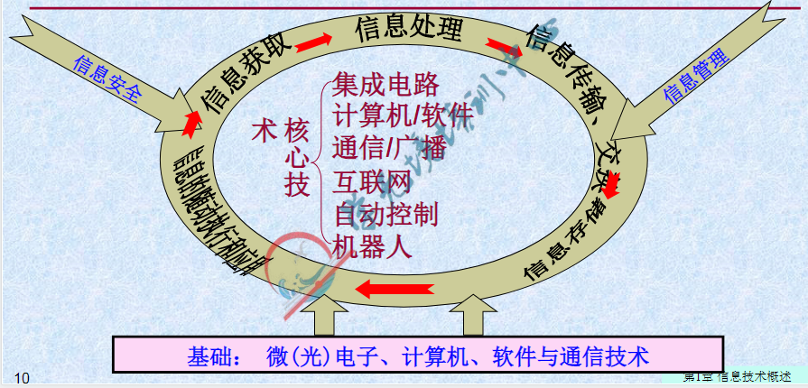

# 1.信息和信息系统

## 1.1信息与信息技术

### 1.1.1什么是信息


**（重要）信息是事物运动状态和变化内容的反应**

信息与物质、能量是客观世界的三大构成要素（多选）


信息：有价值的资讯

多媒体信息：包含文字，图，声音，视频的信息

电子邮件支持多媒体信息：（采用MIME协议）

计算机中的所有信息均是用0,1表示（编码）

```
请问以下属于信息的是：ABC
A.上课的知识
B.图片
C.音乐
D.呼噜声
```


**信息有哪些性质**（了解）


数据的存储单位：

- 信息的最小单位：bit b 比特 位
- 信息的基本单位：byte B 字节
  - 1B=8b
  - B--KB--MB--GB--TB--PB
  - 2^10


**什么是信息处理（重要）**


信息处理指的是与下列内容相关的行为和活动

- 信息的收集（如信息的感知，测量、获取、输入等）
- 信息的传递（如邮寄、出版、电话、广播、微信等）
- 信息的加工（如分类、计算、分析、转换、检索等）
- 信息的存储（如书写、摄影、录音、录像等）
- 信息的施用（如控制、显示、导航、机器人等）


**人工进行信息处理的过程**


人工信息处理的不足：

- 算不快
- 记不住
- 传不远
- 看（听）不清


### 1.1.2信息技术与信息产业

**什么是信息技术**

信息技术简称**IT**，指的是用来扩展人们信息器官功能、协助人们有效地进行信息处理的一门技术（可能考判断）


**信息技术包括4个方向：**

- 扩展感觉器官功能的感测与识别技术-----雷达（信息收集能力）
- 扩展神经系统功能的通信技术----互联网（信息传递能力）
- 扩展大脑功能的计算与存储技术----计算机（信息加工和存储能力）
- 扩展效应器官功能的控制与显示技术----投影技术（信息施用能力）


**信息技术的发展历史**（了解）


电子商务（EC或EB）（最开始由电报开始）

现代信息技术是由电报开始的


**现代信息技术有什么特征**


**【现代】信息技术三大特征**

- 采用微电子和光电子器件
- 以数字技术（计算机）为基础
- 以软件与通信技术为核心

**核心技术：**

计算机软件、集成电路、通信与互联网、自动控制、机器人等


**信号：**

- 数字信号：D离散（计算机）
- 模拟信号：A连续（人的声音  光  电）


```
麦克风的功能是将人的声音转换成数字信号。（错） 
						 （电）

扫描仪的CCD（电荷耦合器件）是将光信号转成电信号，且均为模拟信号。（对）
         光电转换原理
```


**现代信息技术的基础与核心**




**信息技术对社会和经济的影响**（了解）

有正有负


**什么是信息产业**（了解）


DBMS：数据库管理系统（系统数据库）

​	ACCESS，VFP，SQLSERVER，MYSQL，ORACLE，DB2


**世界知名IT企业**


**国内的IT企业**

BATJ（一线）

百度，阿里巴巴，腾讯，京东


### 1.1.3信息化与信息社会

**科技进步对人类社会发展的影响**（普通）


**人类进入信息社会**（了解）


**什么是信息化**（了解）


**我国信息化建设的历程（了解）**


**信息化是实现“四化”的关键（了解）**


**（重要）"互联网+"的行动计划**


加的是各行各业


## 1.2信息通信技术

### 1.2.1通信的基本原理

通信：信息的远距离传递

【现代】通信：光（电），信息的远距离传递

#### 1.2.1.1通信系统模型

**什么是通信**


**（重要）通信的要求：**远距离、高速度、低成本、安全、可靠、方便


EDI：电子数据交换网——（电报、电话）


**通信系统的模型**


通信系统的三要素

1. 信源
2. 信道
3. 信宿


减少成本

1.远距离

​	高频振荡的正弦波（频率很高，波长很短的波）

调制器：

- ​	调频（FM）
- ​	调幅（AM）
- ​	调相（PM）

解调器：还原

​	调制解调器（MODEM）插- 电话线  RJ11（不是双绞线）


```
请问有一个函数y=sin(x-3)的波形变成了y=sin(x)需要做：C
请问有一个函数y=sin(x)的波形变成了y=sin(2x)需要做：A
请问有一个函数y=sin(x)的波形变成了y=2sin(x)需要做：B
A.调频（FM）
B.调幅（AM）
C.调相（PM）
D.解调
```


2.低成本

**多路复用**

多路信号使用同一条传输线同时进行传输

```
多路复用技术:B
A.多种信号在多条信道上同时传播
B.多种信号在1条信道上同时传播
C.1种信号在多条信道上同时传播
D.1种信号在1条信道上同时传播
```

方法：

- 频分多路复用（FDM）
- 时分多路复用（TDM）
- 波分多路复用（WDM）
- 码分多址（CDMA）


**频分多路复用**


**时分多路复用**


**波分多路复用**


有线电视：

FDM（频分多路复用）为主+TDM（时分多路复用）


**异步时分多路复用（了解）**


#### 1.2.1.2有线通信与无线通信


### 1.2.2调制解调和多路复用


### 1.2.3交换技术


## 1.3计算机信息系统

IS 信息系统

MIS 管理信息系统

DBS 数据库系统

## 1.4典型信息系统介绍

## 1.5关系数据库系统

# 2.物联网技术

1.三层

​	感知层

​	传输层

​	应用层

# 3.移动互联网技术


# 4.云计算技术

核心：虚拟化

PASS：软件即服务

IAAS：平台即服务

SAAS：基础设施即服务


# 5.大数据技术


# 6.人工智能技术

AI

python（面向对象 AI）

# 7.区块链

“去中心化”的分布式技术

可信任，不可篡改

比特币	以太坊