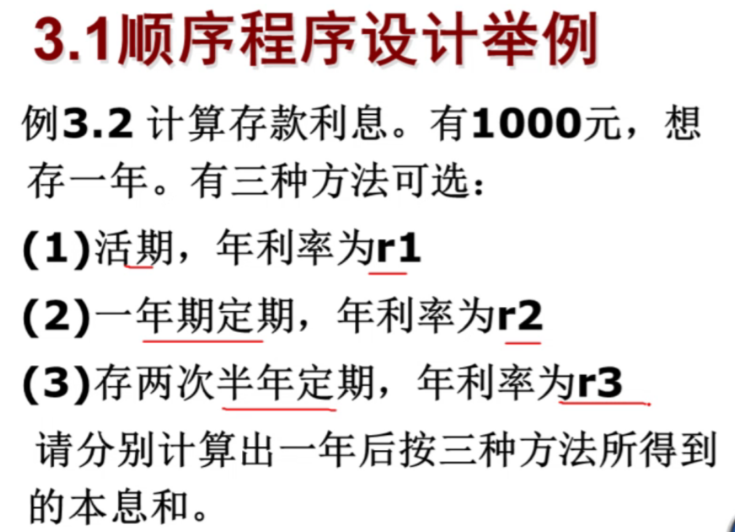
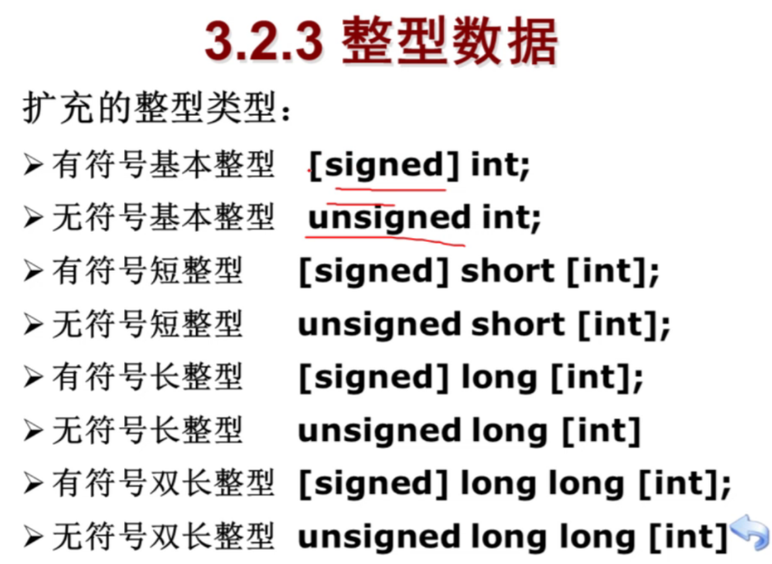
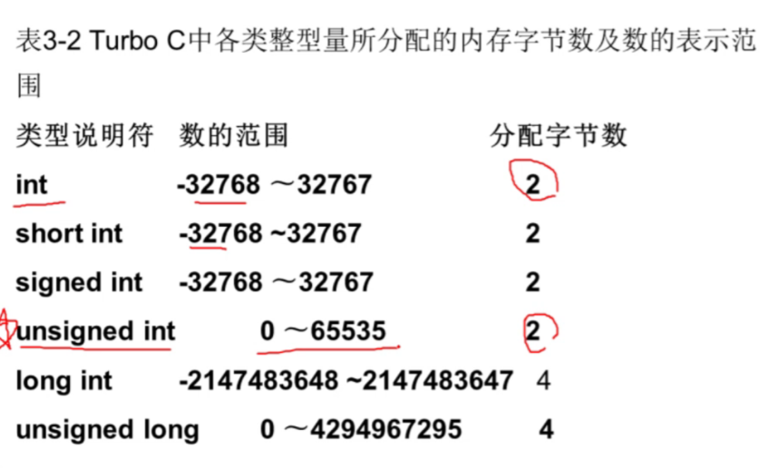
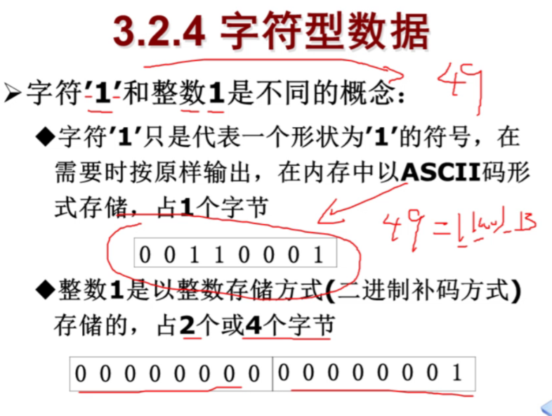
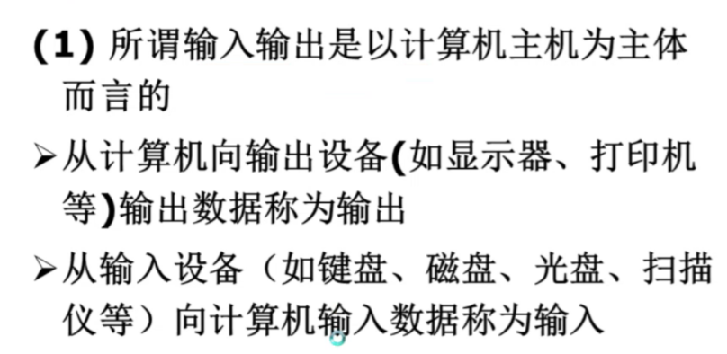
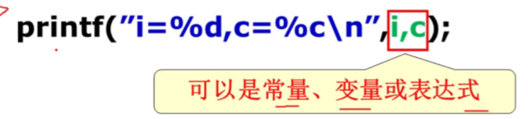
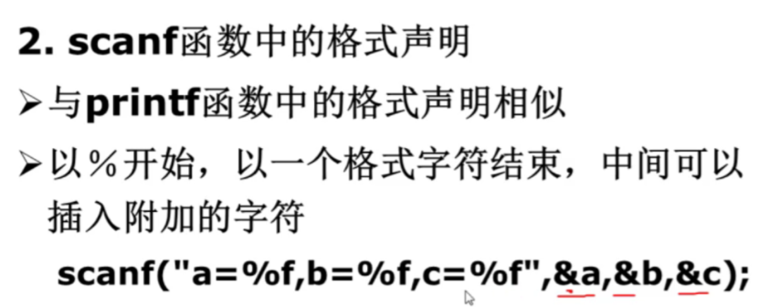
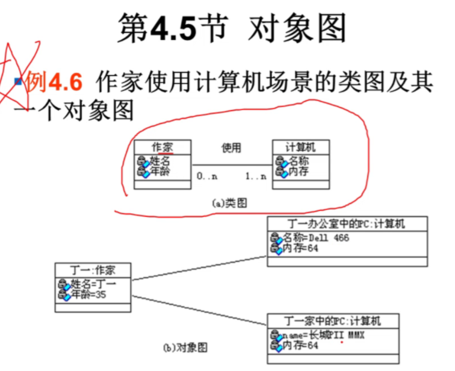

# 第一章 程序设计和C语言

**32分**

人-------------（程序语言）----------------计算机

程序语言4种成分：

- 数据成分（说明的是数据类型）

  - 数据类型
    - int x;
    - float y;
    - char z;
    - bool k;
    - date m;

- 运算成分：+   -  *  /等（算数运算，关系运算，逻辑运算）

- 控制成分：

  - 顺序结构

  - 条件选择结构 if select case

  - 重复结构   for while  until

    ```
    对于多条分支结构，至多只有一条分支被执行！  对的
    ```
    
    ```c
    #include<studio.h>
    int main()
    	{
        	int x;
        	x=10;
        	if(x>5)
            	{printf("good");}
        	else if(x>6)
            	{printf("good1");}
        	else if(x>11)
                {printf("good2");}
        	return 0;
    	}
    答案：返回good
    ```

    全角字符与半角字符的区别
    
    中文字符与英文字符的区别

- 传输成分：

  - scanf()    //输入语句

  - printf()   //输出语句

    - 前面两个需要包含studio.h的头文件

  - cin>>     //输入语句

  - cout<<  //输出语句

    - 这两个需要iostream.h头文件

    面向过程：basic（微软比尔盖茨发明的），C (Unix)，fortran(数值计算)，algol（算法设计）

    面向对象：VB，VB.NET,C++,C#，python（AI 人工智能），JAVA（网络）

    ​	类：概括

    ​	对象：具体

    ​	属性：特征

    ​	事件：相应的动作
  
    ​	方法：执行的行为
  
    ​	三大特征：继承，封装，多态


实操的考试题型：

判断题 1 * 8  	单选题 2 * 20 	填空题 2 * 10 	综合题 6 * 2（c语言一定会有）

​																											数据库里很有可能会有

编程的三阶段：

能读懂----能模仿（抄）----能编程（写）


## 1.1 什么是计算机程序

冯·诺依曼 存储**程序**控制原理：运算器 控制器 存储器 输入设备 输出设备

```
键盘的按键效果有什么决定？B
A.控制器  B.当前执行的指令（程序）
```

指令----程序-----（+文档）-----软件（商品）

指令系统（机器语言）

计算机

```
当中执行的一条命令称为（指令）
很多条指令构成了（程序）
计算机认识的所有指令的集合（指令系统）
```


## 1.2 什么是计算机语言

计算机语言：任何计算机交流信息的、计算机和人都能识别的语言


**计算机语言的发展阶段**

机器语言————汇编语言  可移植性差 执行速度快

高级语言————可移植性强  但相对执行速度慢


## 1.3 C语言的发展及其特点

**ISO：（定的规则）**

​	ISO/IEC 90800（C语言）

​	OSI 开放系统互联参考模型

​	unicode

**C语言的编译系统有：（了解一下）**

VC++6.0，Turbo C++ 3.0，GCC

**C语言的发展（重要，要记一下）**


最初的C语言知识为描述和实现UNIX操作系统提供一种工作语言而设计的。


下图要了解


```
ISO：
	ISO/IEC 90899（c语言）
	OSI 开放系统互联参考模型
	unicode
```


**C语言的编译系统要记一下（选择题）**

**VC++ 6.0，Turbo,C++3.0,GCC**


**C语言的主要特点：**

简洁，紧凑，使用方便，灵活。


**C语言可以定义新的数据类型**


```C++
#include<studio.h>
int main()
	{
    	int x,y,z,m;
    	x=10;
    	y=010;		//8进制
    	z=0x10;		//16进制
    	printf("%d,%d,%d,%d,",x,y,z,m);
    	returen 0;
	}
	
答案：10,8,16,（随机值）
```


C语言用函数作为程序的模块单位，便于实现程序的模块化

C语言允许直接访问物理地址，能进行位操作，可以直接对硬件进行操作

**（下图重要）**


C语言可移植性好

​					.obj（目标程序）

C——（编译器（笔记））——机器语言（.exe可执行程序）


## 1.4 最简单的C语言程序

### 1.4.1最简单的C语言程序

```C
例1.1要求在屏幕上输出以下一样信息
This is a C programe.

#include<studio.h>
int main()
	{
    	printf("This is a C programe. \n");
    	returen 0;
	}

//单行注释
/*
块注释
*/


例1.2求两个整数之和
#include<studio.h>
int main()
	{
    	int a,b,sum;	//定义
    	a = 123;		//赋值
    	b = 456;
        sum = a + b;
    	printf("sum is %d\n",sum);		//输出
    	returen 0;
	}


例1.3求两个数的较大者
#include<studio.h>
int max(int x,int y)
{
    int z;
    if (x > y)
    {z = x;}
    else
    {z = y;}
    return z;
}
int main()
{
	int max(int x,int y);
    int a,b,c;
    scanf("%d,%d",&a,&b); 
    c = max(a,b);
    printf("max=%d",c);
    return 0;
}
```


```C++
第一题
#include<studio.h>
void main()
{
	int i;
    for (i=3;i<=26;i=i+3)
    {
    	i=i+4;
    	printf("%d\n",i);
    }
    printf("%d\n",i);
}
第一行：7  第三行：21（我算错了）  最后一行：31（我算错了）

```


```
程序语言4种成分：
1. 数据成分
2. 运算成分
3. 控制成分
	顺序结构
	条件选择结构	if
	重复结构	for while
4. 传输成分
```


```C++
void main(void)
{
	int i ;
	for (i=3;i<=26;i=i+3)
    {
    	i=i+4;
    	printf("%d\n",i)
    }
    printf("%d\n",i);
}
输出的第一行：7 第三行：21 最后一行：31
循环的每一次起始值=上一次的终止值+步长
7
14
21
28
31

void main(void)
{
	int i ;
	for (i=25;i>=4;i=i-2)
    {
    	i=i-1;
    	printf("%d\n",i)
    }
    printf("%d\n",i);
}
输出的第一行：24 第三行：18 最后一行：1(我错了)
24
21
18
15
12
9
6
3
1（还要再减一次步长）
```


实参——————————形参

1.值传递 不改变

```C++
值传递
void main(void)
{
	int test(int x, int y); 
	int a,b,c;
	a = 100;
	b = 200;
	printf("调用之前 a = %d, b = %d\n",a,b);
	c = test(a,b);//默认值传递
	printf("调用之后 a = %d, b = %d\n",a,b);
	printf("C =%d\n",c);
}
int test( int x, int y)//形参
{
	x = x+10;
	y = y+10;
	return x+;
}
调动之前 a = 100,b=200
调动之后 a = 100,b=200
c = 330
    
    
地址传递
void main(void)
{
	int test(int *x, int *y); 
	int a,b,c;
	a = 100;
	b = 200;
	printf("调用之前 a = %d, b = %d\n",a,b);
	c = test(&a,&b);//地址传递
	printf("调用之后 a = %d, b = %d\n",a,b);
	printf("C =%d\n",c);
}
int test( int *x, int *y)//形参
{
	*x = *x+10;
	*y = *y+10;
	return *x+*y;
}
调动之前 a = 100,b=200
调动之后 a = 110,b=220
c = 330
```

2.地址传递（引用传递）  改变 * &


```C++
地址传递+值
void main(void)
{
	int test(int x, int *y); 
	int a,b,c;
	a = 100;
	b = 200;
	printf("调用之前 a = %d, b = %d\n",a,b);
	c = test(&a,&b);//地址传递
	printf("调用之后 a = %d, b = %d\n",a,b);
	printf("C =%d\n",c);
}
int test( int x, int *y)//形参
{
	x = x+10;
	*y = *y+10;
	return x+*y;
}
调动之前 a = 100,b=200
调动之后 a = 10,b=220
c = 330


void Swap(int *px, int *py)
{
	int tmp;
	tmp = *px;
	*px = *py;
	*py = tmp;
	printf("*px = %d, *py = %d\n",px,*py);
}
int main(void)
{
	int a = 10;
	int b = 20;
	Swap(&a,&b);
	printf("a = %d, b = %d\n",a,b);
	return 0;
}
答案：px=20 ,py=10  a=20,b=10
    
    

```


### 1.4.2 C语言程序的结构

**（重要）C语言程序的结构特点：**

**一个程序由一个或多个源程序文件组成（源文件的后缀 ——.c）**


**（重要）一个源程序文件中可以包括三个部分：**

- 预处理指令	#include <stdio.h>等
- 全局声明     在函数之外进行数据申明
- 函数定义     每个函数用来实现一定的功能


**（重要）函数是C程序的主要组成部分**

- 一个程序是由一个或多个函数组成的
- 必须包含一个main函数（只能有一个）
- 每个函数都用来实现一个或几个特定功能
- 被调用的函数可以使库函数，也可以是自己编制设计的函数


<math.h>数学函数头首部


## 1.5 运行C程序的步骤与方法


## 1.6 程序设计的任务


**考点：C语言的特点**


```C
例1：一个C程序的执行是从__B__。
A.本程序文件的第一个函数开始，到本程序main函数结束
B.本程序的main函数开始，到main函数结束
C.本程序的main函数开始，到本程序文件的最后一个函数结束
D.本程序文件的第一个函数开始，到本程序文件的最后一个函数结束
```


```C
一下叙述不正确的是 D
A.一个C源程序可由一个或多个函数组成
B.C程序的基本组成单位是函数
C.一个C源程序必须包含一个main函数
D.在C程序中，注释说明只能唯一一条语句的后面
```


```
c语言规定：在一个源程序中，mian函数的位置  C
A.必须在最前面
B.必须在系统调用的库函数的后面
C.可以任意
D.必须在最后
```


```
一个C程序是由___B____
A.一个主程序和若干子程序组成
B.函数组成
C.若干过程组成
D.若干子程序组成
```


```
R(A,B,C,D,E)
F={A->B,C->D,B->c}
候选码：AE
```

```c++
例1
C源程序的基本单位是（）。
分析：
C语言程序是由一个或多个函数组成的，其中必须有一个main函数，C语言是函数语言，所以函数是C源程序的基本单位。
答案：
函数

例2
一个c源程序中至少应包括一个（）
分析：
c语言程序是由一个或多个函数组成的，其中必须有一个main函数
答案：
main函数

例3
在一个c源程序中，注释部分两侧的分界符分别为（） 和（）
分析
c语言用“/**/”作注释

例4
在C语言中，输入操作是由库函数（scanf()）完成，输出是由库函数（printf()）完成。
分析：
c语言没有专门的输入输出语句，C语言的输入输出语句是由系统提供的函数完成的。例如输入用scanf（），输出用printf（）等。

实战试题
（1）下面属于C语言保留字的是（B）。
A Int
B typedef
C ENUM
D unien

（2）c语言规定，在一个C程序中main()函数的位置（C）
A 必须在开始
B 必须在最后
C 可以任意
D 必须在系统调用库函数之后

（3）下列4个叙述中，正确的是（D）。
A C程序中的所有字母都必须小写  //不一定 可大写可小写
B C程序中的关键字必须小写，其他表示符不区分大小写//C语言的变量定义是区分大小写的
C C程序中的所有字母都不区分大小写 //区分大小写
D C程序中的关键字必须小写
//c语言的标识符是区分大小写的
//win文件名是不区分大小写的

（4）一个C程序由若干个C函数组成，各个函数在文件中的书写位置为（A）
A 任意
B 第一个函数必须是主函数，其它函数任意
C 必须完全按调用的顺序排列
D 其他函数必须在前，主函数必须在最后

（5）在main函数体内部和外部均允许出现的实体是（A）
A 预处理命令
B 语句  //只能在函数内
C 另一函数的定义 //函数不能定义在另一个函数内
D 函数形式参数声明 //参数放在的是函数的括号内

    

#include <iostream>
#include <stdio.h>    
#define PI 3.14 //预处理命令  可放在函数内部
int main()
{
    void test(int a, int* b);
    int x, y;
    x = 10;
    y = 20;
    test(x, &y);
    printf("%d,%d", x, y);
    return 0;
}

void test(int a, int* b)
{
    a = a + 1;
    *b = *b + 10;
}
//输出结果 10,30


以下C语言正确的是：A
A #define x 100
B #define x=100
C #define x 100;
D #define x=100;
E #DEFINE x 100

```


```
计算机中执行的一条命令称为：指令

为了让计算机去完成一个任务，很多条指令构成：程序（不是指令程序）

计算机认识的所有指令的集合，称为是：指令系统，也称为：机器语言

当程序规模比较大，加上数据，文档构成：软件

告诉计算机解决问题的方法和步骤：算法

算法（1）————————————————程序（n）
一种算法可以由n种程序来写

```

# 第二章 算法

## 2.1 什么是算法

1.概念

 告诉计算机解决问题的方法和步骤


```
怎样表示一个算法
5种表示方法
1.文字
2，流程图(取余数)
	a=56
	b=72
	---->
		a=72
		b=56
		---->
			a=56
			b=16
			---->
				a=16
				b=8
3.N-S盒
4.伪代码
5.用计算机语言表示算法

算法必须满足四个特性
4个特性
	确定性（没有歧义）
	有穷性（程序可以不满足）
	能行性
	有输出
	
请问算法的输入个数>=0
		输出个数>=1
		
衡量算法好坏
	简单，正确
	时间复杂度O（n）数量级
	空间复杂度
	
for(i=1;i<=n;i++)
{......}------>O(n)=n

for(i=1;i<=n;i++){
	for(i=1;i<=n;i++){
	...}
}	--------->O(n)=n^2

沃斯 程序=数据结构+算法
	计算机学科是研究算法的一门学科
```

```
候选码
R(A,B,C,D,E)
F={
	A->B
	C->D
	B->E
}
候选码的求法：
1)X={A,C} 只在决定因素中出现过的属性
2)X^+{A,C,B,D,E} 闭包（把能够决定的因素加进来）
		如果=R 那么{A,C}是关系R的唯一候选码
```

## 2.2 简单的算法


## 2.3 算法的特性


## 2.4怎样表示一个算法


### 2.4.1 用自然语言表示算法

### 2.4.2 用流程图表示算法

### 2.4.3 用三种基本结构和改进的流程图

流程图


### 2.4.4 用N-S流程图表示算法

N-S盒（不要求画，要认识这个图叫啥）


### 2.4.5 用伪代码表示算法

- 伪代码是用介于自然语言和计算机语言之间的文字和符号来描述算法
- 用伪代码写算法并无固定的、严格的语法规则，可以用英文，也可以中英文混用


### 2.4.6 用计算机语言表示算法


# 第三章 最简单的C程序设计

```
程序语言成分：
	数据成分：数据类型 int x;
	运算成分：+ - * /
	控制成分：顺序结构
			条件选择结构 if else
			重复结构 while until for 
	传输成分：
		scanf()
		printf()
```

## 3.1 顺序程序设计举例


```C++
#include<stdio.h> //标准的输入输出函数头文件
int mian(){
	float a;	//注意类型
	scanf("%f" , &a);
	a = (5.0 / 9) * (a - 32);//注意这里是5.0为的是让计算机知道这是浮点型不是整形
	printf("%f", a);
	return 0;
}
```

```C++
float c;
c 5/4;
printf("%f",c)
>>>1.0
```





## 3.2 数据的表现形式及其运算

### 3.2.1 常量和变量

常量：在程序运行过程中，其值不能被改变的量

常量一旦定义，必须马上赋值，且不能改变它的值

```C++
第一题
#include<stdio.h>

int main()
{
    const int x = 016;//016是8进制   0X16是16进制
    printf("%d", x);	//14
}

第二题
#include<stdio.h>
int main()
{
    const int x = 016;//0x16是8进制
    printf("%d", x);	//22
}


第三题
#include<stdio.h>
int main()
{
    const int x = 0x34;//16进制 52
    const int y = 075;//8进制   61
    const int z = 23;//10进制   23
    int k;			//老版可运行，是随机值
    printf("%d\n%d\n%d\n%d\n", x,y,z,k);
    return 0
}

第四题
#include<stdio.h>
int main()
{
    const float x = 1.23E3;
    printf("%8.2f",x);//总共占8位小数占2位 大于5会四舍五入
    return 0;
}
>>> 1230.00
    
第5题
#include<stdio.h>
int main()
{
    const char a = 'g';
    const char x = '\n';    // \n转义字符 \t 制表符 \也是转义字符的前导符 
    const char b = 'o';
    printf("%c%c%c", a,x,b);
    return 0;
}

第六题
#include<stdio.h>
int main()
{
    printf("ab\nc\\d\tk");
    return 0;
}
>>>
ab
c\d		k
    

第七题
int main()
{
    const char x = 'a';
    printf("%d", x);	//97 ASCII码
}
ASCII 美国标准信息交换码
A 65
a 97
0 48
空格 32

int main()
{
    const char x = 'a';
    const int y = 98;
    printf("%d,%c", x,y);
}
>>>97,b
```

注意输入是几进制，输出是几进制


**变量**


### 3.2.2 数据类型


### 3.2.3 整型数据

下图要记住，非常重要


补码的范围[-32768,32767][-2^n , 2^n - 1]

```c++
第一题
int main()
{
    short int x;//[-32767,32768]
    x = 32767;
    printf("%d", x);
}
sizeof()函数测的是字节数
  
第二题
int main()
{
    long long int x;
    x = 32768;
    printf("%d", sizeof(x));//8
}


```

math库

2的十次方




无符号能处理的范围是[0,2^n -1]  无符号int是[0,2^32 -1]



### 3.2.4 字符型数据





### 3.2.5 浮点型数据

float型4字节（单精度）


### 3.2.6 怎样确定常量的类型


### 3.2.7 运算符和表达式


```c++
int main()
{
    int x;
    x = 7 % 2;
    printf("%d", x); //1
}
```


```C++
int main()
{
    int x;
    x = 8 / 3;
    printf("%d", x);//VC取整
}
```


++i先计算，后赋值

i++先赋值，后计算

```C++
int main()
{
    int x, i;
    i = 2;
    x = ++i;//x=3 i=3
    x = i++;//x=3 i=4
    printf("%d,%d", x, i);
}
```


```c++
int main()
{
    int x;
    x = 1;
    char a = 'A';
    printf("%d", x+a);//66
}
```


```c++
#include<stdio.h>
int main()
{
    char x;
    scanf("%c", &x);
    if (x >= 'A' && x <= 'Z') 
    {
        printf("%c", x + 32);
    }
    else 
    {
        printf("你的输入有误");
    }
    return 0 ;
}

```


```c++
#include<stdio.h>

int main()
{
    if (3 + 2 > 4 || 3 * 2 < 6 && 4 != 2) //T || F && T(先算与再算或)
    {
        printf("ok");
    }
}
//算数>关系>逻辑 ！&& ||
输出ok
    
    
#include<stdio.h>

int main()
{
    if (3 + 2 * 4 > 4 + 4 * 1 || 4 * 2 < 6 + 2 * 3 && !4 == 2 * 2) //T || F && F(先算与再算或)
    {
        printf("ok");
    }
    else
    {
        printf("no ok");
    }
}
//输出ok
```


## 3.3 C语句

### 3.3.1 C语句的作用和分类


### 3.3.2 最基本的语句----赋值语句


```C++
#include<stdio.h>
#include<math.h>

int main()
{
    float a;
    a = sqrt(9);
    printf("%f", a);
}
```


## 3.4 数据的输入输出

### 3.4.1 输入输出举例


%lf代表的是双精度浮点类型

### 3.4.2 有关数据输入输出的概念





### 3.4.3 用printf函数输出数据





如果比原来位数小，会保留原来的数，不会被截断

```c++
#include<math.h>

int main()
{
    int x, y;
    x = 123;
    y = 3450;
    printf("%4d,%3d", x,y);
}
>>> 123,3450
    第一个数字有一个空格
```


指定小数个数，是会看后面一位，四舍五入处理


默认是6位，注意上图说明的是计算出的有效数字


上图就是科学计数法

```c++
int main()
{
    double x;
    x = 1234567.2;
    printf("%e", x);
}
注意默认小数保留6位,2省略了，注意这里都会四舍五入
    所以是1.234567e+06
```

### 3.4.4 用scanf函数输入数据





```c++
int main()
{
    float a;
    char b;
    double c;
    scanf("%f%c%lf", &a, &b, &c);
    printf("输出结果：a%f,b=%c,c=%lf",a,b,c);
}
(输入内容)
2e3a54bbbbbbbb
(输出结果)
a=2000.000000.b=a,c=54.000000
    

```

### 3.4.5 字符数据的输入输出


101是八进制

\是转义字符


上图getchar输入


```
第一题
int main(){
	int x;
	x='a';
	printf("%d",x);
}
>>>97

	
putchar('\112') 64+8+2
输出J 
```

# 第五章 关系数据库理论及求精


## 5.1 问题提出

```C++
例5.19 
设关系模式R(A,B,C,D,E,G)
函数依赖集F={B->ADE,A->BE,AC->G,BC->D},找出R所有候选码

1.A,B
2.A,C
3.A,B,C
4.B,C

如果是选择题：
候选码：能够区分任意两条元组的最少属性或属性组

验证
1.{A,B}->{A,B,E,D}不是候选码
2.{A,C}->{A,C,B,D,E,G}是候选码
3.无序验证
4.{B,C}->{B,C,A,D,E,G}是候选码

改为大题目（6分）
A的闭包
{A}+ ={A,B,C,D}
{B}+ ={B,A,D,E}
{A,B}+ ={A,B,D,E}
{A,C}+ ={A,C,B,E,D,G}=R

{A->B,A->C,CG->H,CG->I,B->H} 
{AG}+ ={A,G,B,C,H,I,H}=R(R)
{A}+ ={A,B,C,H}
{G}+ ={G}


```


**判断属性集是否为候选码**


```
X={B,D}
Y={C,A}
X+ = {B,D,C,A}
```


```
例5.18 
给定关系模式r(R)=r(A,B,C,D,E),函数依赖集F={A->B,BC->E,ED->A},找出r(R)的所有候选码
X={C,D}
Y={∅}
R-X-Y={A,B,E}
{A,C,D}+ ={A,B,C,D,E}
{B,C,D}+ = {A,B,C,D,E}
{E,C,D}+ = {A,B,C,D,E}
都为候选码
```


```
R={A,B,C,D,E,G}
F={B->ADE,A->BE,AC->G,BC->D}
X={C}
Y={D,E,G}
{X}+ ={∅}
R-X-Y={A,B}
{A,C}+ ={A,C,B,E,D,G}
{B,C}+ ={B,C,A,D,E,G}
两个都是候选码
```


```
例2
R(A,B,C,D,E,F)
{A->B,A->C,CD->E}
X={A,D,F}
Y={B,E}
{A,D,F}+ = {A,B,C,D,E,F}=R  为唯一候选码

数据库的规范化级别：1NF 2NF 3NF BCNF

```

 **数据冗余导致的问题**


- 冗余数据
  - 信息被重复存储，导致浪费大量存储空间
- 更新异常
  - 当重复信息的一个副本被修改，所有副本都必须进行同样的修改，因此当更新数据时，系统要付出很大的代价来维护数据库的完整性，否则会面临数据不一致的危险
- 插入异常
  - 只有当一些信息事先已经存放在数据库中时，另外一些信息才能存入数据库中
- 删除异常
  - 删除某些信息时可能丢失其他信息


小结


## 5.2 函数依赖定义


```
某个函数依赖是部分函数依赖，那么也是传递函数依赖  对
某个函数依赖是传递函数依赖，那么也是部分函数依赖  错
```

## 5.3 范式


```
主属性，非主属性
R{A,B,C,D,E}
候选码{A,B}或{A,C}
主属性：{A,B,C}
非主属性：{D,E}
```


2NF消灭的是部分函数依赖


3NF消灭的是传递函数依赖(Normal Form 范式)


消失的文字时候选码


**总结**


## 5.4 函数依赖理论

## 5.5 模式分解算法

## 5.6 数据库模式求精


# 第六章 统一建模语言UML概述

## 6.1 UML概述

### 6.1.1 建模的概述


下图是**用例图**


```
E-R图  是数据库设计（概念阶段）
实体-联系图
实体  矩形
联系  菱形
属性  椭圆
```

**模型的分类**


**模型的作用**


**建模的原则**


### 6.1.2 UML的概念


### 6.1.3 UNL的发展史


## 6.2 UML的构成


### 6.2.1 UML的构成


关系


### 6.2.2 UML的模型图与视图


## 6.3 UML2.0新增特性

## 6.4 一个实际案例


```
类：概括 汽车
对象： 具体 这两汽车
属性：特征
```




## 6.5 类之间的关系

### 6.5.1 类之间的关系

**依赖关系**


```
类的名称和方法名称一样，被称为构造方法
```


### 6.5.2 关联关系的相关概念


## 6.6 抽象类和接口


# 第七章 计算机局域网

### 7.1.1 局域网的特点与组成

**计算机局域网（LAN）的特点**


### 7.1.2常用局域网介绍

**局域网的组成**


```
网卡地址：（MAC地址）  物理地址
全球唯一  48b

IP地址：
IPV4 32b
IPV6 128b

Windows 下面:
	ipconfig
	ipconfig /all IP MAC地址
	ping 诊断网络是否通畅的命令
	127.0.0.1 本地回路地址
	
linux
	ifconfig
	cd
	ls
	cat
```


**局域网的拓扑结构**


