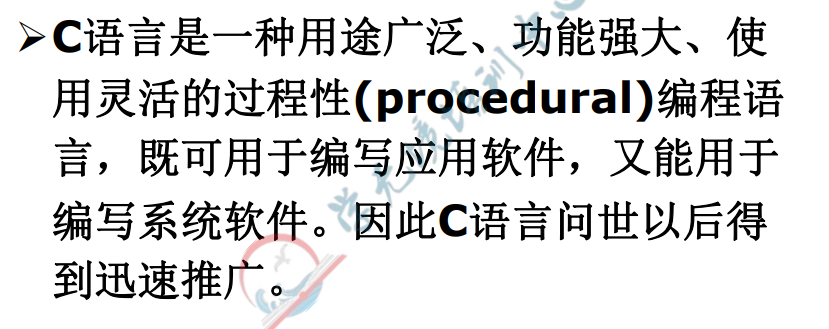

# 第一章 程序设计和C语言

人-------------（程序语言）----------------计算机

程序语言4种成分：

- 数据成分

  - 数据类型
    - int x;
    - float y;
    - char z;
    - bool k;
    - date m;

- 运算成分：+   -  *  /等（算数运算，关系运算，逻辑运算）

- 控制成分：

  - 顺序结构

  - 条件选择结构 if select case

  - 重复结构   for while  until

    对于多条分支结构，至多只有一条分支被执行！  对的

    ```c
    #include<studio.h>
    int main()
    	{
        	int x;
        	x=10;
        	if(x>5)
            	{printf("good");}
        	else if(x>6)
            	{printf("good1");}
        	else if(x>11)
                {printf("good2");}
        	return 0;
    	}
    答案：返回good
    ```

    全角字符与半角字符的区别

    中文字符与英文字符的区别

- 传输成分：

  - scanf()    //输入语句

  - printf()   //输出语句

  - cin>>     //输入语句

  - cout<<  //输出语句

    面向过程：basic（微软比尔盖茨发明的），C (Unix)，fortran(数值计算)，algol（算法设计）

    面向对象：VB，VB.NET,C++,C#，python（AI 人工智能），JAVA（网络）

    ​	类：概括

    ​	对象：具体

    ​	属性：特征

    ​	事件：相应的动作

    ​	方法：执行的行为

    ​	三大特征：继承，封装，多态


实操的考试题型：

判断题 1 * 8  	单选题 2 * 20 	填空题 2 * 10 	综合题 6 * 2（c语言一定会有）

​																											数据库里很有可能会有

编程的三阶段：

能读懂----能模仿（抄）----能编程（写）


## 1.1 什么是计算机程序

冯·诺依曼 存储**程序**控制原理：运算器 控制器 存储器 输入设备 输出设备

```
键盘的按键效果有什么决定？B
A.控制器  B.当前执行的指令（程序）
```

指令----程序-----（+文档）-----软件（商品）

指令系统（机器语言）

计算机

```
当中执行的一条命令称为（指令）
很多条指令构成了（程序）
计算机认识的所有指令的集合（指令系统）
```


## 1.2 什么是计算机语言

计算机语言：任何计算机交流信息的、计算机和人都能识别的语言


**计算机语言的发展阶段**

机器语言————汇编语言  可移植性差 执行速度快

高级语言————可移植性强  但相对执行速度慢


## 1.3 C语言的发展及其特点

**ISO：（定的规则）**

​	ISO/IEC 90800（C语言）

​	OSI 开放系统互联参考模型

​	unicode

**C语言的编译系统有：（了解一下）**

VC++6.0，Turbo C++ 3.0，GCC





**C语言的主要特点：**

简洁，紧凑，使用方便，灵活。


C语言可以定义新的数据类型


```
#include<studio.h>
int main()
	{
    	int x,y,z,m;
    	x=10;
    	y=010;		//8进制
    	z=0x10;		//16进制
    	printf("%d,%d,%d,%d,",x,y,z,m);
    	returen 0;
	}
	
答案：10,8,16,（随机值）
```


C语言用函数作为程序的模块单位，便于实现程序的模块化

C语言允许直接访问物理地址，能进行位操作，可以直接对硬件进行操作


C语言可移植性好

.obj（目标程序）

C——（编译器（笔记））——机器语言（.exe可执行程序）


## 1.4 最简单的C语言程序

### 1.4.1最简单的C语言程序

```C
例1.1要求在屏幕上输出以下一样信息
This is a C programe.

#include<studio.h>
int main()
	{
    	printf("This is a C programe. \n");
    	returen 0;
	}

//单行注释
/*
块注释
*/


例1.2求两个整数之和
#include<studio.h>
int main()
	{
    	int a,b,sum;	//定义
    	a = 123;		//赋值
    	b = 456;
        sum = a + b;
    	printf("sum is %d\n",sum);		//输出
    	returen 0;
	}


例1.3求两个数的较大者
#include<studio.h>
int max(int x,int y)
{
    int z;
    if (x > y)
    {z = x;}
    else
    {z = y;}
    return z;
}
int main()
{
	int max(int x,int y);
    int a,b,c;
    scanf("%d,%d",&a,&b); 
    c = max(a,b);
    printf("max=%d",c);
    return 0;
}
```


```
第一题
#include<studio.h>
void main()
{
	int i;
    for (i=3;i<=26;i=i+3)
    {
    	i=i+4;
    	printf("%d\n",i);
    }
    printf("%d\n",i);
}
第一行：7  第三行：21（我算错了）  最后一行：31（我算错了）

```


实参——————————形参

1.值传递 不改变

2.地址传递（引用传递）  改变


```
写出这段程序执行结果
void Swap(int *px, int *py)
{
	int tmp;
	tmp = *px;
	*px = *py;
	*py = tmp;
	printf("*px = %d, *py = %d\n",px,*py);
}
int main(void)
{
	int a = 10;
	int b = 20;
	Swap(&a,&b);
	printf("a = %d, b = %d\n",a,b);
	return 0;
}
答案：px=20 ,py=10  a=20,b=10
```


### 1.4.2 C语言程序的结构

**（重要）C语言程序的结构特点：**

一个程序由一个或多个源程序文件组成（源文件的后缀 ——.c）


**（重要）一个源程序文件中可以包括三个部分：**

- 预处理指令	#include <stdio.h>等
- 全局声明     在函数之外进行数据申明
- 函数定义     每个函数用来实现一定的功能


（重要）函数是C程序的主要组成部分

- 一个程序是由一个或多个函数组成的
- 必须包含一个main函数（只能有一个）
- 每个函数都用来实现一个或几个特定功能
- 被调用的函数可以使库函数，也可以是自己编制设计的函数


<math.h>数学函数头首部


## 1.5 运行C程序的步骤与方法


## 1.6 程序设计的任务


**考点：C语言的特点**


```C
例1：一个C程序的执行是从__B__。
A.本程序文件的第一个函数开始，到本程序main函数结束
B.本程序的main函数开始，到main函数结束
C.本程序的main函数开始，到本程序文件的最后一个函数结束
D.本程序文件的第一个函数开始，到本程序文件的最后一个函数结束
```


```C
一下叙述不正确的是 D
A.一个C源程序可由一个或多个函数组成
B.C程序的基本组成单位是函数
C.一个C源程序必须包含一个main函数
D.在C程序中，注释说明只能唯一一条语句的后面
```


```
c语言规定：在一个源程序中，mian函数的位置  C
A.必须在最前面
B.必须在系统调用的库函数的后面
C.可以任意
D.必须在最后
```


```
一个C程序是由___B____
A.一个主程序和若干子程序组成
B.函数组成
C.若干过程组成
D.若干子程序组成
```


```
R(A,B,C,D,E)
F={A->B,C->D,B->c}
候选码：？
```

```c++
例1
C源程序的基本单位是（）。
分析：
C语言程序是由一个或多个函数组成的，其中必须有一个main函数，C语言是函数语言，所以函数是C源程序的基本单位。
答案：
函数

例2
一个c源程序中至少应包括一个（）
分析：
c语言程序是由一个或多个函数组成的，其中必须有一个main函数
答案：
main函数

例3
在一个c源程序中，注释部分两侧的分界符分别为（） 和（）
分析
c语言用“/**/”作注释

例4
在C语言中，输入操作是由库函数（scanf()）完成，输出是由库函数（printf()）完成。
分析：
c语言没有专门的输入输出语句，C语言的输入输出语句是由系统提供的函数完成的。例如输入用scanf（），输出用printf（）等。

实战试题
（1）下面属于C语言保留字的是（B）。
A Int
B typedef
C ENUM
D unien

（2）c语言规定，在一个C程序中main()函数的位置（C）
A 必须在开始
B 必须在最后
C 可以任意
D 必须在系统调用库函数之后

（3）下列4个叙述中，正确的是（D）。
A C程序中的所有字母都必须小写  //不一定 可大写可小写
B C程序中的关键字必须小写，其他表示符不区分大小写//C语言的变量定义是区分大小写的
C C程序中的所有字母都不区分大小写 //区分大小写
D C程序中的关键字必须小写
//c语言的标识符是区分大小写的
//win文件名是不区分大小写的

（4）一个C程序由若干个C函数组成，各个函数在文件中的书写位置为（A）
A 任意
B 第一个函数必须是主函数，其它函数任意
C 必须完全按调用的顺序排列
D 其他函数必须在前，主函数必须在最后

（5）在main函数体内部和外部均允许出现的实体是（A）
A 预处理命令
B 语句  //只能在函数内
C 另一函数的定义 //函数不能定义在另一个函数内
D 函数形式参数声明 //参数放在的是函数的括号内

    

#include <iostream>
#include <stdio.h>    
#define PI 3.14 //预处理命令  可放在函数内部
int main()
{
    void test(int a, int* b);
    int x, y;
    x = 10;
    y = 20;
    test(x, &y);
    printf("%d,%d", x, y);
    return 0;
}

void test(int a, int* b)
{
    a = a + 1;
    *b = *b + 10;
}
//输出结果 10,30


以下C语言正确的是：A
A #define x 100
B #define x=100
C #define x 100;
D #define x=100;
E #DEFINE x 100

```


```
计算机中执行的一条命令称为：指令

为了让计算机去完成一个任务，很多条指令构成：程序（不是指令程序）

计算机认识的所有指令的集合，称为是：指令系统，也称为：机器语言

当程序规模比较大，加上数据，文档构成：软件

告诉计算机解决问题的方法和步骤：算法

算法（1）————————————————程序（n）
一种算法可以由n种程序来写

```

# 第二章 算法

## 2.1 什么是算法

1.概念

 告诉计算机解决问题的方法和步骤

```
5种表示方法
1.文字
2，流程图(取余数)
	a=56
	b=72
	---->
		a=72
		b=56
		---->
			a=56
			b=16
			---->
				a=16
				b=8
3.N-S盒
4.伪代码
5.用计算机语言表示算法

4个特性
	确定性（没有歧义）
	有穷性（程序可以不满足）
	能行性
	有输出
	
请问算法的输入个数>=0
		输出个数>=1
		
衡量算法好坏
	简单，正确
	时间复杂度O（n）数量级
	空间复杂度
	
for(i=1;i<=n;i++)
{......}------>O(n)=n

for(i=1;i<=n;i++){
	for(i=1;i<=n;i++){
	...}
}	--------->O(n)=n^2

沃斯 程序=数据结构+算法
	计算机学科是研究算法的一门学科
```

```
候选码
R(A,B,C,D,E)
F={
	A->B
	C->D
	B->E
}
候选码的求法：
1)X={A,C} 只在决定因素中出现过的属性
2)X^+{A,C,B,D,E} 闭包（把能够决定的因素加进来）
		如果=R 那么{A,C}是关系R的唯一候选码
```

## 2.2 简单的算法


## 2.4怎样表示一个算法

### 2.4.1 用自然语言表示算法

### 2.4.2 用流程图表示算法

### 2.4.3 用三种基本结构和改进的流程图

流程图


### 2.4.4 用N-S流程图表示算法

N-S盒（不要求画，要认识这个图叫啥）


### 2.4.5 用伪代码表示算法


### 2.4.6 用计算机语言表示算法


