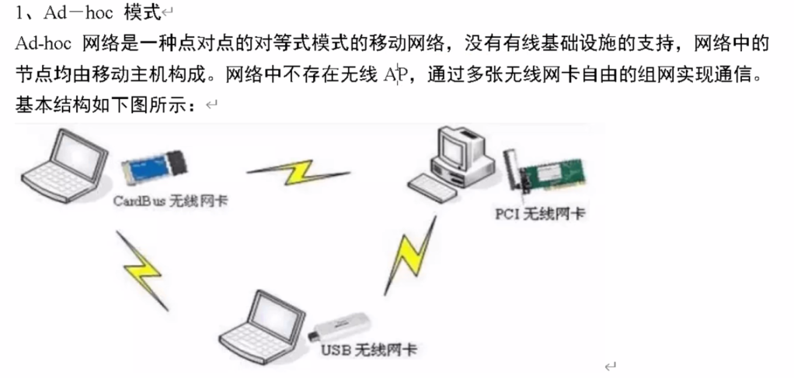
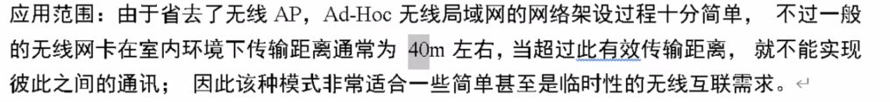
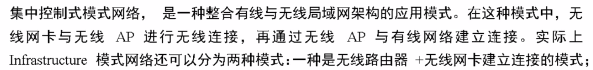
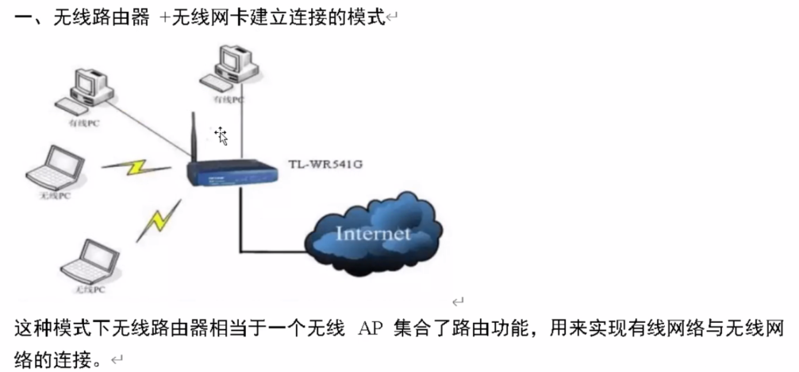
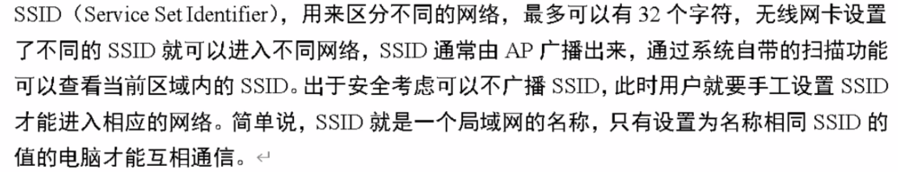
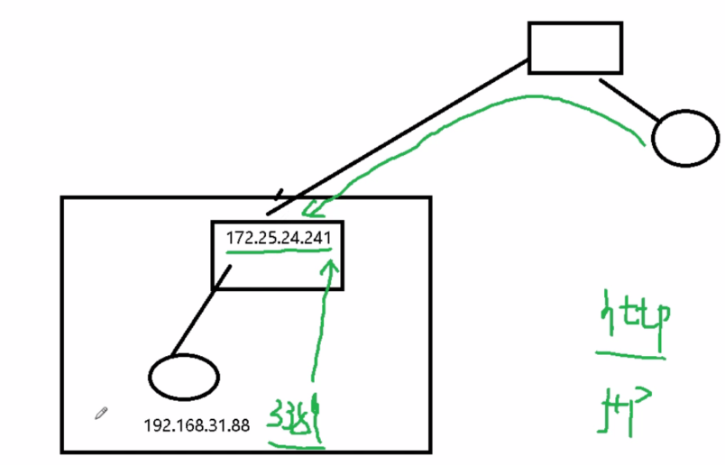
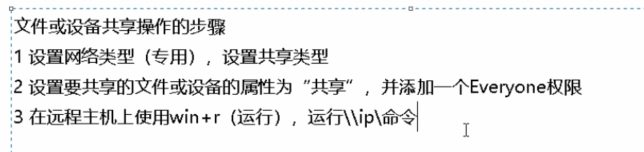

第一章 计算机硬件

## **1.1计算机基本原理**

### 1.1.1计算机的发展与作用

### 1.1.2计算机的逻辑组成

上图：上北下南，上北桥（高速），下南桥（有接口，低速）。总线连接南北桥。

上图注意性质：字节编址和数据块编址

一台电脑有多个微处理器，用于执行系统软件和应用软件的CPU，显卡的绘图处理器GPU，声卡包含的DSP（用于数字信号处理）

### 1.1.3计算机的分类

### 1.1.4CPU的逻辑结构与工作原理

冯诺依曼计算机的结构与原理：**“存储程序控制”原理**  

1. 计算机的工作有程序控制，程序是一个指令序列，指令是能被计算机理解和执行的操作命令。
2. 程序（指令）和数据均以二进制编码表示，均存放在存储器中
3. 存储器中存放的指令和数据按地址进行存取。
4. 指令是由CPU一条一条顺序执行的。

看下图：

#### 指令是什么

指令就是命令，他用来规定CPU执行什么操作。

#### CPU的结构和任务

- CPU主要由运算器、控制器和寄存器组3个部分组成
- CPU的任务：取指令并完成指令所规定的操作

**指令计数器：**存放待执行指令的地址

**执行过程：**（取指，翻译，执行，修改）

1. 取指令：把指令从内存取到指令寄存器
2. 指令译码：把存放待执行的指令并进行译码
3. 执行指令：把数据抓进来，运算，送走
4. 修改指令计数器：修改下一条指令的地址

#### 指令系统

- CPU可执行的全部指令称为该CPU的指令系统，即它的机器语言
- 指令应该简单，简单才能提高速度（RISC）
  - 操作功能要简单，不宜太多，太复杂
  - 指令的格式要统一：固定长度、统一分段
  - 操作数的来源要有限制：
    - 算数逻辑运算指令的操作数只能来自寄存器
    - LOAD/STORE指令的操作数来自（或送到）内存
      - 寄存器<-内存  内存<-寄存器
- ARM处理器符合上述要求，Intel处理器由于历史的原因，并不符合上述原则

#### 关于指令的操作功能

- 指令系统中的指令分成许多类，例如Intel公司
  - 数据传送类（mov）
  - 算数运算类（加减乘除）
  - 逻辑运算类（或与非，整体）
  - 移位操作类（左移右移）
  - 位（位串）操作类（二进制，单个）
  - 控制转移类（if，jump）
  - 输入/输出类等（I/O）
- 每一类指令（如数据传送类、算术运算类）又按照操作数的性质（如整数还是实数）、长度（16,32,64,128位）而区分位许多不同的指令，因此Intel公司CPU有数以百计的不同的指令

#### 关于CPU的兼容性

- 不同公司生产不同的CPU产品，一般互不兼容
  - Intel和AMD这两家公司是兼容的
- 同一公司同一系列的CPU具有向下兼容性
- 平板电脑和智能手机与PC不兼容

i7-4790 

i7系列 第四代 790（主频，越高越好）

#### CPU的性能指标

一分价钱一分货

#### 影响CPU的性能的主要因素

- 字长（位数）
  - 指通用寄存器和定点运算器的宽度（即二进制整数运算的位数）
- 指令系统
  - 指令的类型、数目和功能等都会影响程序的执行速度
- 逻辑结构（微架构）
  - CPU包含的定点运算器和浮点运算器的数目。采用的流水线结构和级数、指令分支预测的机制、执行部件的数目等。
- 高速缓存（cache）的容量与结构
- 主频（CPU内部时钟频率）
  - 指CPU芯片中电子线路（门、触发器）的工作频率，它决定着CPU芯片内部数据传输与操作速度的快慢。
- 内核数目：1,2,..,6，8个甚至更多 

提高CPU性能的三大措施

提高复杂度有限制，复杂度提高一倍，至多提高性能百分之40

主频有散热问题

多核提高性能：并行处理

## 1.2集成电路

AR：增强现实  VR：虚拟现实

嵌入式计算机：把运算器，控制器啊，存储器，输入/输出控制，接口电路全都集成在一块芯片上，这样的超大规模集成电路称为“单片机”。**内嵌**在其他设备中。

#### 集成电路

以半导体单晶片最为基片，采用片面工艺，将晶体管，电阻，电容等元器件及其连线所构成的电路制作在基片上所构成的一个微型化的电路或系统。

优点

- 体积小，重量轻
- 工号小，成本低
- 速度快，可靠性高

#### 集成电路分类

按用途

- 通用集成电路
- 专用集成电路

按电路功能分

- 数字集成电路（D）（离散的，x对应2个y）
- 模拟集成电路（A）（连续的    x对应1个y）

按晶体管结构、电路和工艺分：

- 双极型（Bipolar）电路
- 金属氧化物半导体（MOS）电路

按集成度（芯片中包含的元器件数目）分：

#### **集成电路的制造（选修）**

#### 集成电路的发展趋势

取决去晶体管的尺寸，越小越好。

**（最重要）Moore定律：**单块集成电路的集成度平均每18-24个月翻一翻。（不可能永远成立）

#### IC卡简介

集成电路卡：把集成电路芯片密封在塑料卡的基片内，使其成为能存储信息、处理和传递数据的载体。

特点：

- 存储信息量大
- 保密性能强
- 可以防止伪造和窃用
- 抗干扰能力强
- 可靠性高

#### IC卡的分类

安芯片分类

- 存储器卡：封装的集成电路为存储器，结构简单，使用方便，有一定安全措施。
- CPU卡：处理能力强，保密性更好，常用作银行卡，信用卡使用。（手机中使用的SIM卡就是一种专用的CPU卡）

按使用方式

- 接触式IC卡（如电话IC卡）：有方型镀金接口，共有8个或6个接触点。要读卡机
- 非接触式IC卡（称为射频卡、感应卡）：无线传输，无接触问题，使用寿命长。
- 双界面卡：即可通过接触方式的触点，也可相隔一定距离。

#### 非接触式IC卡在身份证中的使用

非接触式CPU卡，可实现“电子防伪”和“数字管理”两大功能：

- 电子防伪：个人数据，人脸识别。生物指纹
- 数字管理：
  - 存储信息，按照不同安全等级授权读写。
  - 采用数据库和网络技术，实现全国联网快速查询和身份识别。

#### 电子标签（RFID）

射频标识技术，用于控制、检测和跟踪物体。

举例：ETC，图书馆

## 1.3 PC 主机的组成

### 1.3.1主板、芯片组与BIOS（最重要）

 

- BIOS ROM（Read Only Memory,只读存储器属于非易失性存储器）：
  - 存放最基础的软件——基本输入/输出系统（BIOS）
- CMOS RAM（Random Access Memory ,随机存取存储器属于易失性存储器，所以主板上有块电池专门给它供电保证内容不丢失）：
  - 存放硬件配置信息和系统基本参数（日期、时间、口令等）

#### 芯片组的作用

**芯片组**是PC机各组成部分相互连接和通信的枢纽，决定所有硬件。

**北桥芯片：**

1. 存储器控制功能
2. 连接CPU、存储器（内存）、显卡、南桥芯片的枢纽

**南桥芯片：**

1. 多种I/O设备的控制功能
2. I/O总线（PCI总线）功能
3. 提供了各种IO接口

BISO：基本输入\输出系统——存放在主板只读存储器芯片中的一组机器语言程序。

包含的程序：

- 加电自检程序(POST)(power on self test)
  - 检测计算机硬件故障

- 系统自举程序（Boot）
  - 启动计算机工作，加载并进入系统运行状态

- CMOS设置程序

  - 设置系统参数：日期、时间、口令、配置参数等

- 常用外部设备的驱动程序（Driver）

  - 实现对键盘、显示器、软驱和硬盘等常用外部设备输入输出操作的控制

### 1.3.2内存储器

#### 半导体存储器的分类及其应用

**Cache存储器，主存储器为重点**

刷新：意思是要充电

#### 主存器（RAM）的功能与原理

- 主存是CPU可直接访问的存储器，用于存放供CPU处理的指令和数据
- 特点
  - 以字节为单位进行连续编址，每个存储单元为1个字节（8个二进位）
  - 存储容量：主存储器中所包含的存储单元的总数（单位：MB或GB）（末地址-首地址+1）X1B
  - 存取时间：从CPU送出内存单元的地址码开始，到主存读出数据并送到CPU（或者是把CPU数据写入主存）所需要的时间（单位：ns，1ns=10（-9）s）

**（看上图）总线可分为三种：**

- 数据总线：同时传64位的数据，每个存储单元位1个字节（8个二进位）
- 地址总线（最重要）： 看上图有36位（8X8B）所以有2^(36)个地址=64GB（CPU可访问的最大内存）（1G是30次方）
- 控制总线：控制读和写

#### PC主存储器的物理结构

#### DDR内存条的类型、速率及相关参数（常识性了解）

DDR SDRAM相对于SDR SDRAM的好处是，SDR（前者）只能在时钟周期内传输1次数据，上升期传输数据，DDR（后者）能够同时在钟的上升和下降传输数据，（传输两次数据，提高一倍）看下图红线：

**CL：**列地址选通脉冲（CAS）延迟，是从处理器发出数据内存请求到存储器返回内存间的时间。（响应时间）越小越好

**内存封装：**目的：防止氧化，防止污染。

#### 存储器与CPU速度差距越来越大

cup工作速度很快，内存速度比较慢，从内存取数据或向内存写数时，CPU往往需要等待。

**解决方法：**

在CPU和内存之间增加一个存储器——**高速缓存(cache)**

- 一种小容量高速缓冲存储器。由SRAM组成。
- 直接制作在CPU芯片内，速度几乎和CPU一样快
- CPU使用的一部分数据/指令预先成批复制在cache中，cache的内容是主存储器中部分内容的映象。
- CPU先检查cache中有没有，有直接从cache读取，而不用访问主存存储器

**提高cache的命中率方法**

- 增加cache容量
- 采用多级cache技术（2级或3级）
- cache中采用快速的查找算法，判定是否命中
- 不能命中时，采用有效的算法将读入的内容替换cache中暂时不使用的内容
- 编译器优化目标程序
- 程序员写出cache-friendly的程序

为了获得好的性能/价格比，计算机中各种存储器组成一个层状的塔式结构，取长补短，协调工作。

**分析：**速度越快，成本较高。为了获得好的性能/价格比，计算机中各种存储器组成一个层状的塔式结构，取长补短，协调工作。

**CPU存储数过程：**

1. CPU运行时，需要的操作大部分来自寄存器
2. 如需要从(向)存储器中取(存)数据时，先访问cache，如在，取自cache
3. 如操作数不在cache，则访问RAM，如在RAM中，则取自RAM，同时替换cache中暂时不使用的内容
4. 如操作数不在RAM中，则访问硬盘，操作数从硬盘中读出—>RAM，CPU取自RAM，同时替换cache中暂时不用的数据。

### 1.3.3 IO控制与IO接口

输入的任务：将输入设备输入的信息送到内存储器的指定区域

输出的任务：将内存储器指定区域内的内容送出到输出设备

(I/O操作也包括外存与内存之间的数据传输)

**I/O操作的特点**

- I/O操作与CPU的运算可同时运行
- 多个I/O设备的操作也可同时进行工作
- 每类I/O设备都有各自的控制器，它们按照CPU的I/O操作命令，独立地控制I/O操作的全过程

**总线：**

用于在CPU、内存、外存和各种输入输出设备之间传输信息的一个共享信息传输通路及其控制部件。

**总线参数：**

- 数据通路宽度（一次传输的二进制位位数）
- 总线工作频率
- 每秒传输次数

**（重要）总线带宽（最高传输速率）=（数据通路宽度/8）X 总线工作频率 X 传输次数**

**总线类型：**

- CPU总线（前端总线FSB）
- 存储器总线
- I/O总线（目前使用的是PCI和PCI-E两种，对应主板上的两种扩充插槽：PCI插槽和PCI-E插槽，之前使用的是ISA和EISA）

**I/O接口：**

​	指I/O设备与主机之间的连接器——包括：插头/插座的形式、通讯规程和电气特性

分类：

- 从数据传输方式来分（这只是一个传输方式，和速率没关系）
  - 串行（一次只传输1位）
  - 并行（多位一起进行传输）
- 是否能连接多个设备来分
  - 总线式（可连接多个设备）
  - 独占式（只能连接1个设备）
- 从是否符合标准来分
  - 标准接口（通用接口）
  - 专用接口（专用接口）

I/O设备通常都是相互独立的设备，一般通过I/O接口与I/O控制器（或I/O总线）连接，I/O控制器通过扩展卡或者南桥芯片与I/O总线连接，I/O总线经过北桥芯片与内存、CPU连接。

#### USB接口

- 通用串行总线式接口
- 高速，可连接多个设备，串行传输
- 传输速率
  - USB2.0：最高达480Mb/s(60MB/s)
  - USB3.0：最高达3.2Gbps(400MB/s)
- 体积小，复合即插即用规范
- 最多可以连127个设备
- 可以通过USB接口由主句向外设提供电源（+5v,100~500mA）

## 1.4常用输入设备

### 1.4.1键盘（Keyboard）

作用：向计算机输入字母、数字、符号、命令等信息

使用的接口：PS/2接口，USB接口，无线接口（红外线或无线电波）

### 1.4.2鼠标器（Mouse）

鼠标操作

### 1.4.3手写输入与触摸屏

手写输入

触摸屏

### 1.4.4扫描仪

 

### 1.4.5数码相机

作用：获取现实世界中景物的数字图像

都是CCD CMOS是CMOS CCD

**性能指标**

### 1.4.6传感器

是一种检测装置，能自动简则设备自身和周边环境的信息

是一种换能器，能将检测到的信息变换成为电信号供计算机进行处理

#### 指纹传感器

#### 其他传感器

## 1.5常用输出设备

### 1.5.1显示器与显示卡

#### 计算机显示器的作用于组成

**作用：**是计算机必不可少的图文输出设备，他能将数字信号转化为光电信号，使文字和图像在屏幕上显示出来

组成与分类：

**液晶显示器（LCD）原理**

**LED背光源显示器**（也是液晶显示器，只是后面的光源不一样）

前者荧光灯管（CCFL）

后者发光二极管（LED）

**显示器的性能指标**

**显示控制卡（显示卡）**

**图形处理GPU**

**显卡的性能指标**

### 1.5.2打印机

**作用：**将程序、数据、字符、图形打印输出在纸上

类型：

- 针式打印机
- 激光打印机
- 喷墨打印机

**（重要）记住这些打印机的优缺点**

#### 针式打印机

#### 热敏打印机

#### 激光打印机

#### 喷墨打印机

#### 主要性能指标（激光/喷墨）

#### 3D打印机：原理与技术

### 1.5.3声音和力反馈输出

## 1.6外存储器

### 1.6.1硬盘存储器

功能：长期保存二进制信息（非易失性存储器）

特点：

- 可读可写，按块存取
- 容量很大（当前台式PC：500GB~2000GB）
- 可靠性高
- 成本极低（当前：1~2GB/元）
- 技术发展快，容量将更大，成本会更低

#### 磁盘存储器的信息存储原理

#### 硬盘存储器的结构

盘片最多3~5片，每一面都有一个磁头

#### 磁盘的磁道和扇区

最外的是0磁道

**容量=磁头X磁道数（柱面号）X扇区数X512B**

#### 信息的平均存取时间

 

**平均存储时间T=寻道时间+旋转等待时间+数据传输时间**

rmp：r圈 p每 m分钟  

平均等待时间就是转半圈

#### 硬盘的性能指标

**（比较重要）一般情况下：外部速率大于内部速率**

一般看内部传输速率

#### 移动硬盘

已经比较少了（因为U盘容量越来越大了）

- 工作原理与固定硬盘相同
- 存储容量较大
- 采用USB或IEE1384接口，即叉即拔，支持热插拔（必须下停止工作）
- 小巧儿便于携带
- 速度快，安全可靠
- 

### 1.6.2U盘、存储卡和固态硬盘

#### 闪速存储器（flash memory）

闪速存储器是半导体集成电路存储器，非易失性存储器

- 优点：闪存没有机械运动部件，工作时无噪音，尺寸小，轻便，抗震性更好，能耐受高压高温
- 不足之处：写入过程较复杂，写入速度鳗鱼读出速度，写入次数有限制，性价比低于传统硬盘

分类

- NOR型闪存，可以按字节地址读出，用来存储需要运行儿不要经常更新的程序代码，可作内存使用
- （我们现在常用）NAND型闪存，比NOR型闪存的存储密度高，每个比特的成本也低，它具有较快的抹写速度，可抹除次数也高出NOR闪存是被。但NAND闪存不能按自己随机读写，只能向硬盘那样以数据块为单位存取信息
  - TLC：1k次（U盘） MLC ：10k次 SLC：100k次（固态硬盘）

#### 存储卡 

#### 固态硬盘（SSD）

- 固态硬盘（Solid State Disk、 Solid State Drive）是使用NAND型闪存做成的外存储器
- 用途：在便携式计算机中代替传统的硬盘
- 外形及与主机的接口和常规硬盘相同，如1.8英寸、2.5英寸或3.5英寸
- 存储容量：64GB~128GB或者更大
- 优点：重量轻，低功耗、无噪音、抗震动、低热量、读写速度也快于传统硬盘
- 存在问题：
  - 成本：高于常规硬盘
  - 寿命：Flash存储器都有一定的写入寿命，寿命到期后数据会读不出来且难以修复

#### 平板电脑/智能手机的辅助存储器

### 1.6.3光盘存储器

#### 光盘存储器的发展

#### 光盘的信息记录原理

螺旋形存储，不像硬盘同心圆。

#### 为什么DVD容量比CD大得多

#### 光盘驱动器的类型

#### 光盘的类型

## 1.7 信息在计算机中的表现

### 1.7.1信息的基本单位——比特

**比特**

- 比特中文翻译：二进位数字、二进位、简称“位”
- 比特只有两种取值（状态）：0和1

**计算机中表示与存储二进位的方法：**

- CPU内部
  - 通常使用高电平表示1，低电平表示0
- 磁盘表面微小区域
  - 磁芯材料粒子的两种不同的此话状态分别表示0和1
    - 断电后信息不丢失，属于非易失性存储器
- 计算机内存储器中用电容器存储二进位的信息
  - 电容处于充电状态时表示1，电容处于放点状态时，表示0
    - 断电后信息丢失，属于易失性存储器
- 光盘
  - 利用光盘面上的凹凸状态表示0和1

**总结：计算机不使用十进制，使用二进制——制作两个稳定状态的元器件比较容易，成本低**

**存储容量的计量单位**

8bit=1B

- 计算机内存储器容量的计量单位 2^10
  - B-KB-MB-GB-TB-PB-EB-ZB-YB
- 外存储器 容量经常使用10的次幂来计算10^3
  - B-KB-MB-GB-TB-PB-EB-ZB-YB

#### 比特的传输速率

**传输速率：**表示每秒钟可传输的二进位数目

比特/秒（b/s），也称“bps” 2400bps(2400b/s)

**速率之间转化是1000**

1**Tb/s**=10^3**Gb/s**=10^6**Mb/s**=10^9**Kb/s**=10^12**b/s**

不同进位制前缀的使用场合： 

- 二进制：
  - 内存、cache、半导体存储器芯片的容量、文件和文件夹大小、外存存储器（操作系统显示）
- 十进制：
  - 频率(1GHz)、传输速率(100Mbps) 、外存储器（厂家标记容量）	

#### BCD码简介

**BCD码：**是用4位二进制数来表示1位十进制数中的0~9个10个数码

8421BCD码：最基本和最常用的BCD码

先将二进制数转化为10进制数，然后按，个十百位，分别用二进制依次表示（是独立的）比如：

123（十进制）=00000001/00000010/00000011 

**BCD码的运算法则**

当两个BCD码相加。如果和等于或小于1001及（十进制数9），不需要修正，如果相加之和在1010到1111（即十六进制数0AH~0FH）之间，则需加6进行修正，如果相加时，本为产生了进位，也许加6进行修正。

### 1.7.2比特与二进制数

R为整数

任意进制化十进制

**乘权求和**

看下图的每一个数的求法（什么数的几次方相加）

#### 十进制（D）

#### 二进制(B)

十进制转二进制的快速方法

记住这些方便运算 记：（n）为n次幂 

2（1）=2，2（2）=4，2（3）=8，2（4）=16，2（5）=32，2（6）=64，2（7）=128,2（8）=256，2（9）=512，2（10）=1024

2（20）=1M，2（30）=1G，2（40）=1T，2（50）=1P，2（60）=1E，2（70）=1Z

#### **十进制转二进制**

整数部分：逆序取余

小数部分：顺序取整

看下图联系理解

#### **十进制转任意进制**

将上图中的2改为R（任意）进制

#### 八进制数(Q)

#### 八进制与二进制数的互换

#### 十六进制数(H)

#### 十六进制与二进制数的互换

#### **不同进位制数的比较**

#### 二进制的算数运算

### 1.7.3信息在计算机中的表示

#### 数值的表示

**无符号整数的表示**

**带符号整数的表示**

符号用最高位表示：0表示正号（+），1表示负号（-）

**补码表示：**

- 正整数：绝对值以二进制自然码表示
- 负整数：取反加一：-43（10101011）->(取反符号位不变)(11010100)->(+1得补码)（11010101）

**原码表示法：**

- 优点：与日常使用的十进制表方法一直，简单直观
- 缺点：加法与减法运算规则不一致，增加了成本，整数0有00000000和1000000两种表示形式，不方便

**补码表示法：**

- 优点：加法与减法运算规则统一，没有“-0”，可表示的数比原码多一个
- 缺点：不直观，人使用不方便

**结论：**带符号整数在计算机内不采用“原码”而采用“补码”的形式表示。

**原码—>补码（取反加一）	补码—>原码（取反加一）**(简单方法，第一1和最后一个1不变，夹在中间的数取反)

[x]补±[y]补=[x±y]补

原码表示范围是对称的，补码的表示范围是非对称的

**实数的特点与表示方式**

**二进制实数的浮点表示**

p正是点向左移负是点向右移（注意这些数是二进制数）

#### （西文）字符的表示

- 日常使用的书面文字由一系列称为“字符”（character）的书写符号所构成
- 计算机中常用字符的集合叫做“字符集”
  - 西文字符集
  - 中文（汉字）字符集

#### （黑白）图像的表示

### 1.7.4比特的基本运算（逻辑运算）

####  比特的三种基本逻辑运算

优先级：取反>乘>加

每一位都是独立运算，每一位都不受其他位的影响

逻辑运算是用“门”电路实现的

# 第二章 计算机软件

## 2.1软件基本概念

### 2.1.1什么是计算机软件

计算机系统=硬件+软件，计算机系统是由硬件和软件组成的，两者缺一不可。

硬件的能力非常有限，只是速度极高而已，没有软件，硬件几乎什么任务也完成不了。

**什么是程序：**

- 程序是告诉计算机做什么和如何做的一组指令（语句），这些指令（语句）都是计算机能够理解并能够执行的一些命令
- 程序的特性
  - 用于完成某一确定的信息处理任务
  - 使用某种计算机语言描述如何完成该任务
  - 预先存储在计算机中，启动运行后才能完成任务

**程序与数据的关系**

- 程序所处理的对象和处理后得到的结果统称为**数据**（分别称为输入数据和输出数据）
- 程序必须处理合理的输入数据，否则不会产生有意义的输出
- 程序和数据有相对性

**程序与软件是什么关系**

- 软件往往指的是设计比较成熟、功能比较完善、具有某种使用价值、且有一定规模的程序
- 软件既包含程序、也包含与程序相关的数据和文档
  - 程序是软件的主体
  - 数据指的是程序运行过程中处理的对象和必须使用的一些参数（如三角函数表、英汉词典等）
  - 文档指的是与程序开发、维护及操作有关的一些资料（如设计报告、维护手册和使用指南）
- “软件”强调的是产品、工程、产业或学科等宏观方面的含义，“程序”更侧重技术层面的含义
- 软件和程序本质上相同，再不会发生混淆的场合，软件和程序两个名称经常混用，并不严格加以区分。

### 2.1.2计算机软件的特性

计算机软件的特性：

1. 不可见性（是无形的，不能被人们直接观察、欣赏和评价）
2. 适用性（可以适应一类应用问题的需要）
3. 依附性（依附于特定的硬件、网络和其他软件）
4. 复杂性（规模越来越大，开发人员越来越多，开发成本也越来越高）
5. 无磨损性（功能和性能一般不会发生变化）
6. 易复制性（可以非常容易且毫无失真地进行复制）
7. 不断演变性（软件的生命周期）（版本不断改版）
8. 有限责任（有限保证）
9. 脆弱性（黑客攻击、病毒入侵、信息盗用）

### 2.1.3计算机软件的分类

版权所有者享有的权利包括：拷贝、发布、修改、署名、出售等。

购买一个软件，用户仅仅得到了该软件的使用权，并没有获得它的版权。

**软件只是产权对软件进行分类：**

- 商品软件
- 共享软件(shareware) （也称为试用软件demoware）
  - 具有版权，可免费试用一段时间，允许拷贝和散发（但不可修改），试用期满后需交费才能继续使用
- 自由软件（Free Software）（≈开放源代码软件）
  - 用户可共享，并允许随意拷贝。修改其源代码，允许销售和自由传播。但是，对软件源代码的任何修改都必须向所有用户公开，还必须允许此后的用户享有进一步拷贝和修改的自由
- 免费软件（Freeware）（≠Free Software）
  - 无需付费即可获得软件。
  - 自由软件很多都是免费软件。免费软件不全是自由软件。

**软件许可证（许可证协议）**

​	规定了就是那几软件使用方式的法律合同，软件使用有哪些额外的限制，有哪些额外的权利

许可证类型有：单用户许可证、多用户许可证、并发用户许可证和定点（fixed site）许可证。

例如：

- 不能再次出售
- 只能安装在1台计算机上
- 不得进行反汇编、反编译
- 不得将其组成部分分散在多台计算机上使用
- 不得出租或出借
- ......

**从用途对计算机进行分类：**

- 应用软件（APP）
  - 专门用于帮助最终用户解决各种具体应用问题的软件。按开发方式可分为：定制应用软件和通用应用软件。
  - 分类（按开发方式）
    - 定制应用软件
      - 教务管理系统
    - 通用应用软件
      - 几乎所有领域、所有人都需要使用
      - 设计精巧，易学易用
      - 商品化，价格较低
- 系统软件
  - 不为了解决某种具体应用，而是为了给用户使用计算机提供方便、给应用软件的开发与运行提供支持以及使计算机有效、安全、可靠的运行。

**最重要的系统软件如下：**

- 操作系统（OS）（如Windows、Unix、Linux等）
  - OS是最重要的系统软件，所有计算机都需要OS
  - 功能上也包含BOIS在内
- 程序设计语言处系统
  - 编译器
  - 解释器
  - 汇编程序（汇编器）
  - 开发工具与平台
  - C语言编译器
- 数据库管理系统（DBMS）
  - 大：Oracle、DB2
  - 中：SQL Server、MySQL
  - 小：Access、Visual FoxPro
- 实用程序（Utility）
  - 实用程序用于协助OS或用户完成日常系统维护和监管任务，是计算机系统更加安全、可靠、方便。有效。如：
    - 磁盘清理程序、备份程序、杀毒软件、防火墙等

## 2.2计算机操作系统

### 2.2.1什么是操作系统

- 没有安装任何软件的计算机称为裸机，裸机是无法使用的
- 操作系统是用于执行各种具有共性和基础性操作的软件，是最重要的一种系统软件，几乎所有计算机都要安装OS（Operation System）。

- OS为用户提供了一个操作使用计算机友善的用户界面。

- OS屏蔽了计算机中几乎所有物理设备的技术细节，为开发和运行其他软件提供了一个高效、可靠的平台

**操作系统的重要作用**

**三个主要作用：（看图说话）**

1. 为运行的程序（称为“进程”）管理和分配软/硬件资源
2. 为用户提供友善的人机界面（图形用户界面）
3. 为开发/或运行应用程序提供高效率的平台

**操作系统是一种大型、复杂的软件产品，它包括：**

- 操作系统内核（kernel）
- 其他配套软件 如：
  - 图形用户界面程序GUI
  - 实用程序（如上文）
  - 为支持应用软件开发和/或运行的各种软件构件（如应用框架、编译器、程序库等）
- 常用的应用程序 如：
  - 日历，计算器，资源管理器，网络浏览器等

**OS内核：**

指能提供进程管理（任务管理)、存储管理和设备管理等功能的那些模块，它们是操作系统中最基本的部分。

**OS内核的特点：**

- 常驻在内存中
- 以CPU的最高优先级运行，能执行指令系统中的特权指令
- 具有直接访问各种外设和全部主存空间的特权
- 负责系统资源的管理和分配

**常用的3种OS内核：**微软公司的NT内核、Linux内核（自由软件）和Darwin内核（类Unix系统）

**基本输入输出系统（BIOS）**

- BIOS是存放在主板上只读存储器（flash ROM）中的一组程序（也称为firmware，固件）
- 主要包含4个部分：
  - 加电自检程序（诊断计算机故障）
  - 系统自举（装入）程序（装入Bootloader程序以加载OS）
  - CMOS设置程序（设定和修改计算机配置）
  - 基本外围设备的驱动程序（控制基本的I/O操作）
- 计算机断电后，BIOS程序和CMOS程序中的数据仍保持不变
- 需要时BIOS程序可以升级（update）

**BIOS和操作系统的启动过程**

1. 当加电启动计算机时，CPU首先执行主板上固件（如：BIOS）中的自检程序，测试计算及主要部件的工作状态是否正常。
2. 无异常，CPU继续执行BIOS中的引导装入程序，按照CMOS中预设的启动顺序，依次搜寻计算机中的辅助存储器
3. 若找到需要启动的操作系统所在的辅存，则将第一个扇区的内容（主引导记录）读到内存
4. 然后将控制权交给其中的操作系统引导加载程序，由引导加载程序继续将硬盘中的操作系统装入内存
5. 操作系统加载到内存后，整个计算机就处于操作系统的控制之下，就可以正常地使用计算机了

### 2.2.2多任务处理

- 什么是任务：
  - 通俗的说，“任务”指的是要计算机做的一件事，计算机执行一个任务同行就对对应着运行一个应用程序APP

- “单任务处理”与“多任务处理”
  - 单任务处理：计算机依次只能执行一个任务。启动新任务必须暂停或结束老任务的运行，任务是一个一个执行的
  - 多任务处理（Multitasking）：允许计算机同时执行多个任务，任务是并发执行的
- 多任务处理举例：
  - 编辑PPT讲稿+播放音乐+收发邮件
- 多任务处理的优点：
  - 大大提高了用户的工作效率
  - 大大提高了计算机的使用效率

**前台任务和后台任务**

- 前台任务：能接受用户输入（击键或按击鼠标）的窗口只能有一个，称为活动窗口，它所对应的任务称为前台任务
- 后台任务：除前台任务外，所有其他任务均为后台任务
- 前台任务与后台任务的区别：
  - 前台任务对应的窗口（活动窗口）位于其他窗口的前面
  - 活动窗口的标题栏比非活动窗口颜色更深（深蓝色）
- 前台任务与后台任务的共同点：**都在计算机中运行**
- 前台任务与后台任务的切换
  - 为了输入信息到某个后台任务中去，必须切换窗口（单击要激活的后台任务窗口任何不为，或单机任务栏中对应的任务按钮）

如何结束任务运行：这个就不用多说了吧，xx，按钮结束，强制结束

**操作系统运行时内存的态势**

**（重要）操作系统的五大管理一定要记住**

想那个总线图

**CPU管理（处理器管理）**

- 目的：让CPU轮流为所有任务服务
- 原则：公平性；优先级；负载均衡
- 方法
  - 按时间片轮转（10-20ms 为1个时间片）
  - 按优先级调度

**并行：**要大于等于两个CPU不等同于轮流

智能手机的多任务处理，有的转移到后台暂停执行（称为“挂起”或“冻结”）。一些特定软件除外，如音频播放，地理位置检测等。

### 2.2.3存储管理和虚拟存储器

**（重要）存储管理管内存，文件管理管外存**

内存储器空间划分为2个部分：系统区和用户区，用户区用来存放正在运行的应用程序

**存储管理需要解决的问题：**

- 为每个任务分配存储空间，任务结束后收回存储空间
- 对存储空间进行保护
  - 保护操作系统所在区域不被应用程序修改；保护每个应用程序的私有区域不被其他程序修改
- 对存储空间进行扩充，使用程序的存储空间不受实际存储容量大小的限制

**解决方案——虚拟存储器**

**虚拟存储的设计思想**

**特点：**

1. 整个过程自动完成
2. 程序可用内存容量超过实际物理容量
3. 多个程序互不干扰

**虚拟存储技术的基本思想：**

内存按固定大小分成一个一个“框”，操作系统则把程序（及数据）划分成一个一个页面，页的大小与内存的框相同。

在用户启动一个任务向内存装入程序及数据时，操作系统只将当前要执行的一部分程序和数据页面装入内存中处于空闲状态的框，其余页面放在辅存提供的虚拟内存中（哪些页面装入内存的哪个框中均记录在“页表”中），然后开始执行程序

**虚拟存储器的工作过程**

**特点：**

1. 整个过程自动完成
2. 程序可用内存容量超过实际物理容量
3. 多个程序互不干扰

Windows 操作系统中每个程序的虚存空间最大可达到4GB，页面的大小通常是4KB。虚拟内存是系统盘根目录下的一个名为**pagefile.sys**的文件，其大小和位置用户可以设置

### 2.2.4文件及其管理

**“文件”概念的由来**

**什么是文件（file）**

文件是存储在外存储器中的一组相关信息的集合

**关于文件名和扩展名**

**文件的组成和文件说明信息**

**文件属性在文件管理中的作用**

**文件在磁盘中如何存储**

**文件目录/文件内容在辅存中的存放**

**Windows的文件组织**

**Windows中文件如何定位**

**文件管理和文件系统**

文件系统是OS的一个组成部分，它负责管理计算机中的文件，使用户（和程序）能很方便地进行文件的存取操作

文件系统需要解决的问题：

- 有效管理**外存**储器的存储空间
- 实现对文件方便而快速的按名存取
- 对**硬盘、光盘、U盘、存储卡**等不同外存储器实现统一管理
- 统一本地**文件/远程文件的存取**操作
- 实现**文件**的安全存取

### 2.2.5设备管理

**OS中的“设备管理”程序负责：**

- 对系统中的各种输入输出设备进行管理
- 处理用户（或应用程序）的输入/输出请求，方便、有效、安全地完成输入/输出操作。

**Windows的设备驱动程序和“设备管理器”**

### 2.2.6常用操作系统介绍

**操作系统的四种类型**

- PC机使用的操作系统一般都具有**多任务处理**功能
- （重要）网络服务器上安装运行的是“**服务器操作系统**”，的特点是：
  - 具有青大的多用户并发处理能力
  - 支持多种网络通信功能，提供专门的网络应用服务
  - 安全性强，可靠性好，支持7x24服务
- 军事指挥和武器控制系统、电网调度和工业控制系统。证券教育系统等，安装运行的是“**实时操作系统**”，特点是：
  - 对外部事件能在允许的时间范围内快速做出响应
  - 具有很高的可靠性和安全性
- 嵌入式计算机应用中运行的是“**嵌入式操系统**”特点是：
  - 快速、高效、具有实时处理功能
  - 代码非常紧凑，存储器需求小

**微软Windows操作系统的特点**

- 提供了多任务处理能力
- 采用图形界面
- 简化计算机操作
- 在个人计算机上广泛使用

**微软Windows操作系统的演变**

**对Windows从操作系统的分析**

###  2.2.7关于UNIX和Linux操作系统

**UNIX操作系统**

 **Linux发行版及其应用**

**安卓（Android）操作系统**

**安卓软件系统**

**Apple iOS 操作系统**

## 2.3算法和程序设计

### 2.3.1算法

算法是解决问题的方法与步骤

**计算机求解问题的步骤：**

1. 确定并理解问题
2. 寻找问题的方法与步骤，并将其表示成算法（Algorithm）
3. 使用某种程序设计语言描述该算法（编程），并编译诚目标程序和进行调试
4. 运行程序，获得问题的解答
5. 进行评估，改进算法和程序

**关于算法的三方面问题：**

- 如何确定算法（算法设计）
- 如何表示算法（算法表示）
- 如何使算法更有效（算法分析）

**算法设计：**

- 算法设计一般采用由粗到细。由抽象到具体的逐步求精的方法

**算法表示的多重形式:**

- 文字（自然语言）叙述
- 流程图表示
- 伪代码描述
- 程序设计语言

**算法分析的基本内容：**

- 正确性
  - 给定有效输入后，经过有限时间的计算，产生正确的输出结果
- 简单性
  - 算法是否容易理解，是否容易验证其正确性，程序是否容易调试
  - 简单的算法效率不一定高，要在保证一定效率的前提下力求算法简单
- 时间复杂性
  - 当问题的规模n充分大时，运行该算法所需要的时间的数量级表示
- 空间复杂性
  - 除原始数据之外，额外占中的存储空间的大小

**算法是计算机软件的灵魂**

**计算机算法的4个特点：**

1. 确定性：算法中每一步操作的含义必须清楚明确，无二义性
2. 能行性：算法中有待实现的操作都是计算机可执行的，即必须在计算机的能力范围之内
3. 有穷性：算法在执行了有限步操作后必须结束
4. 算法结束后至少产生一个输出（包括参量或状态的变化）

### 2.3.2程序设计语言

**什么是程序设计语言**

- 什么是程序：
  - 程序是为了用计算机解决某个问题而采用**程序设计语言**编写的一个指令序列
- 什么是程序设计语言
  - 语言的目的是用于通信
  - 程序设计语言用于人与计算机之间的通信
  - 程序设计语言是由人使用但计算机可以理解的一种语言
  - 程序设计语言用于编制程序，表达需要计算机完成什么任务和怎样完成任务，然后交给计算机去完成

**机器语言**

**汇编语言**

**高级程序设计语言**

**面向过程：**有严格的步骤，顺序（比较古板）

**面向对象：**比较灵活，符合人的认知

### 2.3.3程序设计语言处理系统

**（重要）编译程序与解释程序的区别：** 

- 解释：解释器直接解释并且执行源语言程序，不产生目标程序（相当于口译）
- 编译：把源程序编译为机器语言目标程序后，再由计算机运行（相当于笔译）

**编译程序的处理过程**

### 2.3.4数据结构

数据结构研究如何再计算机中表示被处理的对象及对象之间的关系，即如何组织数据。

数据结构是计算机存储、组织数据的方式。

数据结构是指相互之间存在一种或多种特定关系的数据元素的集合。

数据结构往往同高效的检索算法和索引技术有关。

著名计算机科学家尼沃斯提出：**“数据结构+算法=程序”**

精心设计的数据结构可使**算法**获得更高的时间效率或空间效率

数据结构具体指同一类数据元素中，各元素之间的相互关系，包括三个组成成分，数据的逻辑结构，数据的存储结构和数据运算结构

#### 数据结构的内容

**1.数据的逻辑结构：**

反映数据元素之间的逻辑关系的数据结构，其中的逻辑关系是指数据元素之间的前后件关系，而与他们在计算机中的存储位置无关

**逻辑结构包括：**

- 集合：数据结构中的元素之间除了同属一个集合的相互关系外，别无其他关系
- 线性结构：数据结构中的元素存在一对一的相互关系
- 树形结构：数据结构中的元素存在一对多的关系
- 图形结构：数据结构中的元素存在多对多的关系

**2.数据的物理结构**指数据的逻辑结构在计算机存储空间的存放形式。是数据结构在计算机中的表示（又称映像），他包括数据元素的机内表示和关系的机内表示。由于具体实现的方法有顺序、链接、索引、散列等多种，所以，一种数据结构可表示成一种或多种存储结构。（如：线性表可采用顺序存储结构，也可采用链接结构）。

**3.定义在数据结构上的一组运算（操作）及其实现方法**

**常用的两种存储结构：**顺序存储结构和链式存储结构

数据元素之间的关系的机内表示可以分为顺序映像和非顺序映像

- 顺序映像：借助元素在存储器中的相对位置来表示数据元素之间的逻辑关系。
- 非顺序映像：借助指示元素存储位置的指针（pointer）来表示数据元素之间的逻辑关系

不同数据结构各有其相应的若干运算，常用的运算有：检索、插入、删除、更新、排序等。

数据的运算定义在数据逻辑结构上，而其运算的具体实现要在存储结构上进行。

常用额数据结构有：

- 数组
- 栈
- 队列
- 链表
- 树
- 图

#### 线性表

线性表：简称表，是n（n≥0）个具有相同类型额数据元素的有限序列。

线性表的长度：线性表中数据元素的个数。

空表：长度等于零的线性表，记为：L=（）

非空表记为：L=（a1,a2,...,ai,...,an）

**线性表的特征：（逻辑结构）**

1. 集合中必存在唯一的一个“第一元素”
2. 集合中必存在唯一的一个“最后元素”
3. 除最后元素在外，均有唯一的后继
4. 除第一元素之外，均有唯一的前驱

**线性表的顺序存储（物理结构）**

 

顺序表的插入操作

顺序表的删除操作

这些都自己理解吧，挺简单的就不作笔记了。

#### 栈和队列

**栈的定义：**

限制只能在表的一段进行插入和删除的线性表。

允许插入和删除的一端，被称为栈顶。（top）

不允许插入和删除的另一端，称为栈底。（bottom）

把一个元素从栈顶放入栈中的操作，称为进栈、入栈或压栈。（push）

从栈顶取出一个元素的操作称为出栈或弹出（pop）

**栈的操作特性：先进后出**

**栈的顺序存储及实现**

顺序栈

栈的顺序存储是利用一组连续的存储单元依次存放从栈底到栈顶的数据元素

栈底（base）为这个存储空间的基地址

若base的值为NULL，表示栈结构不存在

栈顶（top）定义为栈中第1个元素所在位置、top的值实际上反映了栈中元素的个数，和顺序表中length值的意义相同。

top=-1，表示空栈。

当top=StackSize-1（StackSize为栈的容量），表示栈已满

**顺序栈示意图**

顺序栈的初始化

顺序栈的入栈

顺序栈的弹栈

顺序栈取栈顶元素

上面的网上查吧，有点麻烦，不做笔记。

**队列：**

只允许在表的一段进行插入，而在另一端删除元素的线性表。

在队列中，允许插入的一段叫队尾（rear），允许删除的一段称为队头（front）。

**特点：**先进先出（FIFO）

**队列的书序存储结构及实现**

顺序存储：利用一组连续的存储单元存放从队头至队尾的数据元素。

采用顺序存储结构的队列称为“顺序队列（sequential queue）”

**实现：**事先分配一个可以容纳最多元素的存储空间，并且为方便操作，需设置队头（front）、队尾（rear）指针分别指示对头、队尾位置。

初始化队列

入队

出队

网上查找，就不做笔记了。

**顺序队列结构及操作示意**

对于上图描述的假溢解决方法，就是首尾相连。当指针移到最大之后又从最小值开始。

#### 单链表

**线性表的链式存储**

是指用一组任意的存储单元存放线性表的元素，这组存储单元可以是连续的也可以是不连续的。

详情网上去了解吧

 **单链表：**再线性链表节点中质保函一个指针域的链表。

算法单链表按位查找

算法单链表插入元素：头插法，尾插法

算法单链表的删除元素

自己网上查吧，不做笔记。

#### 双向链表

**双向链表的插入**

**双线链表的删除**

#### 循环链表

#### 双向循环链表

#### 树的基本概念

 **树的定义：**

树是一个有限的非空的结点集。

**树的基本术语：**

- 结点：数据元素—+若干指向子树的分支
- 结点的度：结点所拥有的子树的个数
- 树的度：树种各结点度的最大值
- 叶子结点：度为0的结点，也称为终端结点
- 分支结点：度不为0的结点，也称为非终端结点。
- 孩子、双亲：树中某结点子数的根结点称为这个结点的孩子结点，这个结点称为它孩子结点的双亲结点
- 兄弟：具有同一个双亲的孩子结点互称为兄弟
- 祖先、后代（子孙）：在树中，如果有一条路径从结点x到结点y，那么x就称为y的祖先，而y称为x的后代（子孙）。
- 路径：如果树的结点序列n1,n2,...,nk有如下关系：结点ni是ni+1的双亲（1<= i <k），则把n1,n2,...,nk称为一条由n1,至nk的路径；路径上经过的边的个数称为路径长度
- 结点所在层数：根结点的层数为0；对其余任何结点，某结点在第k层，则其孩子结点在第k+1层
- 树的深度：树中所有结点的最大层数也称高度
- 有序树、无序数：如果一棵树种结点的各子数从左到右是有次序的，称这棵树为有序树，反之，称为无序树。
- 森林：是m（m>=0）棵互不相交的树的集合
- 任何一棵非空树是一个二元组

#### 二叉树的定义

是一个有限元素的集合，该集合或者为空，或者由一个称为根（root）的元素及两个不相交的、被分别称为左子树和右子树的二叉树组成。

说明：

1.  当集合为空时，称该二叉树为空二叉树
2.  二叉树是有序的，即若将其左、右子树颠倒，就成为另一棵不同的二叉树。

**二叉树的五种基本形态** 

**两类特殊的二叉树：**

**满二叉树**

指的是深度为k且含有2^(k+1)-1个结点的二叉树

**满二叉树的特点**

叶子只能出现在最下一层

只有度为0和度为2的结点

满二叉树在同样深度的二叉树中**结点**个数最多

满二叉树在同样深度的二叉树中叶子结点个数最多

**完全二叉树**

树种所含的n个结点和满二叉树中编号为1至n的结点一一对应

在满二叉树中，从最后一个结点开始，连续去掉任意个结点，即是一棵完全二叉树

**完全二叉树的特点**

- 叶子结点智能出现在最下两层，且最下两层的叶子结点都集中在二叉树的左部
- 完全二叉树中如果有度为1的结点，只可能有一个，且该节点只有左孩子。
- 深度为k的完全二叉树在k-1层上一定是满二叉树

**二叉树的主要性质：**

1.  在二叉树的第i层上至多有2^i个结点（i>=1）
2.  深度为k的二叉树上，至多含有2^(k+1)-1个结点（k≥1）
3.  在任意一棵二叉树中，若它含有n0个叶子结点、n2个度为2的结点，则必存在关系式：n0=n2+1
4.  具有n个结点的二叉树，其深度至少为［log2n］+1，其中［log2n］表示取log2n的整数部分
5.  若对含n个结点的完全二叉树从上到下且从左至右进行1至n的编号，则对完全二叉树中任意一个编号为i的结点：
    1.  若i=1，则该结点是二叉树的根，无双亲，否则编号为i/2的结点为其双亲结点
    2.  若2i>n，则该结点无左孩子，否则编号为2i的结点为其左孩子结点
    3.  若2i+1>n,则该结点无右孩子结点，否则，编号为2i+1的结点为其右孩子结点

#### 二叉树的存储结构与实现

**1.顺序存储结构**

二叉树的顺序存储结构就是用一维数组存储二叉树中的结点，并且结点的存储位置（下标）应能体现结点之间的逻辑关系——父子关系。

 

**不是完全二叉树的表示方法**

一棵二叉树改造后成完全二叉树形态，需增加很多空结点，造成存储空间的浪费。二叉树的顺序存储结构一般仅存储完全二叉树。

#### 二叉树的链式存储表示

- 二叉链表
- 三叉链表

**二叉链表**

令二叉树的每个结点对应一个链表结点，链表结点除了存放与二叉树结点有关的数据信息外，还要设置只是左右孩子的指针。

**三叉链表**

相对于二叉链表，多了个父节点

#### 二叉树的遍历

遍历的定义：按照某种顺序访问二叉树中的每个结点，使得每个结点均被访问依次，而且仅被访问依次。

**二叉树的遍历方法**

**层序遍历：**按二叉树的层序编号的次序访问各结点

**先序遍历：**

若二叉树为空树，则空操作，否则：

1. 访问根结点
2. 先序遍历左子树
3. 先序遍历右子树

**中序遍历：**

若二叉树为空树，则空操作，否则：

1. 中序遍历左子树
2. 访问根结点
3. 中序遍历右子树

中序遍历序列：ABDGCEF

**后序遍历：**

若二叉树为空树，则空操作，否则：

1. 后序遍历左子树
2. 后序遍历右子树
3. 访问根结点

 后序遍历序列：GDBEFCA

 

## 2.4软件工程基础

软件工程：（比较认可的定义）

是研究应用如何以系统性的、规范化的、可定量的过程化方法去开发和维护软件，以及如何把经过时间考验而证明正确的管理技术和当前能够得到的最好的技术方法结合起来的学科。

**软件开发的三个阶段：**

- 定义阶段
  - 可行性研究初步项目计划，需求分析
- 开发阶段
  - 概要设计、详细设计、实现、测试
- 运行和维护阶段
  - 运行、维护、废弃

**原则：**

1.抽象，2.信息隐蔽，3.模块化，4.局部化，5.确定性，6.一致性，7.完备性，8.可验证性

**程序设计阶段**：自行网上查找历史

**基本目标：**

在给定成本、进度的前提下，开发出具有适用性，有效性、可修改性、可靠性、可理解性、可维护性、可重用性、可移植性、可追踪性、可互操作性和满足用户需求的软件产品。追求这些目标有助于提高软件产品的质量和开发效率，减少维护的困难

**软件工程的原则有以下四项基本原则**

1. 选取适宜开发范型
2. 采用合适的设计方法
3. 提供高质量的工程支持
4. 重视开发过程的管理

**开发方法**

- 结构化方法
- 面向数据结构的软件开发方法
- 面向问题的分析方法（由抽象到具体，由粗到细）
- 原型化方法（从用户的角度考虑）
- 生命周期法

**软件生命周期**

1. 软件计划与可行性研究阶段（问题定义、可行性研究）（规划）
2. 需求分析阶段（分析）
3. 软件设计阶段（概要设计和详细设计）（设计）
4. 软件编码阶段（编码）
5. 软件测试阶段
6. 软件运行与维护阶段

**模型分类**

典型的几种生命周期模型包括瀑布模型，快速原型模型，迭代模型，螺旋模型

#### 结构化的设计方法

**结构化的设计步骤**

1. 评审和细化数据流图
2. 确定数据流图的类型
3. 把数据流图映射到软件模块结构，设计出模块结构的上层
4. 基于数据流图逐步分解高层模块，设计中下层模块
5. 对模块结构进行优化，得到更为合理的软件结构
6. 描述模块接口

**结构化设计方法的设计原则**

- 使每个模块执行一个功能（坚持功能性内聚）
- 每个模块用过程语句（或函数方式等）调用其他模快
- 模块间传送的参数作数据用
- 模块间共用的信息（如参数等）尽量少

**结构化的设计方法**

结构化的设计方法是基于模块化、自顶向下细化、结构化程序设计等程序设计技术基础发展起来的。

**基本思想**

讲软件设计成有相对独立且具有单一功能的模块组成的结构，分为概要设计和详细设计两个阶段

概要设计工具——结构图

#### 总体设计与详细设计

#### 面向对象分析与设计

**特点：**

1. 封装性
2. 继承性
3. 多态性

**名词解释**

- 对象
- 类
- 封装
- 继承
- 组合
- 多态
- 动态绑定
- 静态绑定
- 消息传递
- 方法

**设计优点**

**设计缺陷**

- 运行效率较低
- 类库庞大
- 类库可靠性

**UML**

在UML系统开发中有三个主要的模型：

- 功能模型
- 对象模型
- 动态模型

#### 软件测试方法

软件测试是使用人工或自动的手段来运行或测定某个软件系统的过程，其目的在于检验它是否满足规定的需求或弄清预期结果与实际结果之间的差别。

**原则：**

1. 尽早不断测试的原则
2. IPO原则
3. 独立测试原则
   1. 独立测试原则
   2. 合法和非合法原则
   3. 错误群集原则
   4. 严格性原则
   5. 覆盖原则
   6. 定义功能测试原则
   7. 回归测试原则
   8. 错误不可避免原则

**分类：**

- 依据执行的状态：
  - 静态测试和动态测试
- 以具体实现算法细节和系统内部结构的相关情况为根据：
  - 黑盒测试、白盒测试和灰盒测试
- 从程序执行的方式来分类：
  - 人工测试和自动化测试

**静态测试和动态测试**

静态测试：被测程序不运行，只依靠分析或检查源程序的语句、结构、过程等来检查程序是否错误。

动态测试：与静态测试相对，通过运行被测试程序，对得到的运行结果与预期的结果进行比较分析，同时分析运行效率和健壮性能等。

**黑盒测试、白盒测试、和灰盒测试**

白盒测试：看的到内部逻辑

黑盒测试：看不到内部逻辑

灰盒测试（教材大纲没写）：介于黑白盒之间

#### 不同阶段测试

1. 单元测试
2. 集成测试
3. 系统测试
4. 验收测试

#### 软件测试的重要性

工作的主要目的是**发现软件的错误**、有效定义和实现软件成分有低层到高层的组装过程、验证软件是否满足任务书和系统定义文档所规定的技术要求。为软件质量模型的建立提供依据。

**软件测试的目的是发现错误**

#### 程序调试

**修正语法错误和逻辑错误的过程**

发现和纠正错误

**分类**

静态调试

动态调试

# 第三章 计算机局域网

## 3.1数字通信入门

### 3.1.1数字通信的基本原理

**什么是通信**

通信是信息的（远距离）传递与交流，而现代通信是使用**电波或光波传递信息**的技术，也称为电信（telecommunication）

如：电报、电话、传真、电子邮件、BBS、QQ、微信等

**通信的基本要求：**远距离、高速度、低成本、安全、可靠、方便。

**通信的三要素：**

- 信源：发送信息的设备
- 信道：信道的任务是迅速、可靠而准确地将信号从信源传输到信宿
- 信宿：接受信息的设备

通信系统中被传输的信息都必须以某种电（或光）信号的形式才能进行传输

**电信号（或光信号）有两种形式：**

- 模拟信号形式
  - 通过连续变化的物理量（如信号的幅度）来表示信息。
    - 例如人们打电话或者播音员播音乐时声音经话筒（麦克风）转换得到的电信号。
- 数字信号形式
  - 是使用有限个状态（一般是2个状态）来表示（编码）信息
    - 例如电报机，传真机和计算机发出的信号都是数字信号。

**有线通信与无线通信**

- 有线通信：需要使用物理介质进行信号传输

  - 金属导体（双绞线、同轴电缆）
    - 传输电流信号

  - 光导纤维（简称光纤）
    - 传输光信号

- 无线通信：在自由空间进行信号传输

  - 传输的是电磁波信号

**传输介质的类型与特点**

**光纤通信：**

利用光波携带信息在光纤中传输

**光纤通信的主要优点：**

- 通信容量大：一束光每秒能传输2.5G或10Gb信息
- 传输距离远：无中继距离超过几十公里
- 保密性强。信息不易泄露

为了实现远距离传输，光纤通信中需要使用中继器，光纤通信属于中继通信。

**无线通信：**

利用电磁波携带信息在自由空间中传播

**微波通信：**

**直线传播**，不能沿地球表面传播（**无绕射性**），需要每隔几十公里设立一个中继站，容量大，可靠性高，建设费用低，抗灾能力强

主要应用场景：长途电话，蜂窝移动电话，全数字高清晰度电视（HDTV）等通信领域

**卫星通信：**是将中继站设置在人造地球卫星上的一种微波通信

通信距离远、频带宽、容量大、抗干扰强、通信稳定、

但是造价高，技术复杂、有较大的延迟、同步轨道卫数目仅有180个（最后一个我不确定）

**微波通信的方式有三种：地面接力，卫星通信，对流层散射**

**个人移动通信**

**移动通信原理：**

每10km~20km 的区域称为单元（形似蜂窝），每个单元中心高处建有一个基站，所有单元既相互分割，有彼此交叠（单个通信服务网内部），形成整个移动通信服务网，所以也称为“蜂窝式移动通信”。位于某单元内的所有手机都向该基站发送信号，并接收基站发给它的信号。所有基站都通过微波或光缆与移动交换通信。手机每个时刻都处于某个特定单元的基站控制之下，同一单元内同一时刻的不同手机使用不同的频率与基站进行通信，相互不影响。

**数字通信采用的技术：**

- 数字调制/调解技术（调幅；调频；调相）
  - 解决信号传得远的问题
- 多路复用技术（时分多路；频分多路；波分多路）
  - 提高传输线路使用效率、降低传输成本
- 交换技术（电路交换：分组交换）
  - 动态分配信道资源，提高传输效率和质量
- 数字编码和数据压缩技术

**调制/解调技术**

 研究发现，高频振荡的正弦波信号在长距离同性中能够比其他型号传送的更远。因此若把高频振荡的正弦波信号作为携带信息的**载波**，把数字信号放在（**调制**在）在载波上传输，则可比直接传输的距离远得多。

**数字信号的三种调制方法**

实现信号的调制与解调的设备分别称为“调制器”和“解调器”

通信一般是双向进行的，收发双方都需要调制器与解调器，它们通常做在一起，称为调制解调器（MODEM）

**多路复用技术：**

为了提高传输线路的利用率，降低通信成本，一般总是让多路信号共用一条传输线同时进行传输，这就是多路复用技术。

方法有：频分多路复用（FDM）、时分多路复用（TDM）和波分多路复用（WDM）。

**思想和原理**

- 频分多路复用（FDM）
  - 将每个通信终端发送的信号调制在不同频率的载波上，通过频分多路复用器（MUX）将它们复合成为一个信号，然后在统一传输线路上进行传输。抵达接收端之后，借助分路器（DEMUX）把不同频率的载波分离 出来，送到不同的接收设备。
    - 主要用在广播电台节目的发送和电视节目的发送与接收
- 时分多路复用（TDM）
  - 各通信终端（计算机、电话）以规定的顺序和时间轮流使用同一传输线路进行数据传输。
    - 数据发送放和接收方也可以异步地进行信息传输：即发送方有数据且信道有空闲时就发送，没有数据时即使轮到它也不占用信道。这样可以大大提高信道的利用率。
      - 实现方法：在被传输数据中必须附加上接收方的“地址”。
      - 同步TDM主要应用在电话中继线上多路话音信息的传输
      - 异步TDM则应用在总显示以太网上以太帧的传输，互联网上IP数据报的传输
  - 主要使用在数字通信领域，如电话中继通信、GSM手机、总线式以太网等
- 波分多路复用
  - 为了提高传输效率，1根光纤中可以同时传输几种不同波长的光波，每种光波各自传输自己所携带的信息，速率可达到40G—100Gbit/s

**多路复用技术使得成千上万路通信可以再同一条传输线上同时进行，大大节省了通信成本。**

**频分多路复用**

**时分多路复用**

**异步时分多路复用**

**波分多路复用**

### 3.1.2分组交换原理

**交换**就是按照某种方式动态地分配传输路线

常用的两大类交换方式：

- 电路交换

  - 将每个电话与电话交换机连接。通话时经过拨号交换机把双方的线路接通（建立一条物理通路），通话后再释放该路线（拆线）。
  - 特点是：通话全过程用户始终占用端到端的传输信道
  - 过程：建立连接、通信和释放连接

- 分组交换

  - 又称包（packet）交换，要求被传输的数据必须划分为若干”分组“进行传输。

  - 每个分组中必须包含收、发双方的地址、数据块的编号、校验信息（以上称为头部）和传输的数据块（有效载荷）。

    - | 发送计算机地址 | 目的计算机地址 | 编号 | 有效载荷（传输的数据） | 校验信息 |
      | -------------- | -------------- | ---- | ---------------------- | -------- |

  - 文件被分为多个包，然后依次送入网络。网络中有若干分组交换机，它们之间由许多通信链路连接。数据包在网络中被分组交换机一站一站地向前传输，每个包经过的路径不一定完全相同，到达目的地先后次序也可能发生变化。当这些包全部到达目的计算机后，由目的计算机剥去头部，再将它们按编号顺序重新合成为原来的数据文件。

**分组交换的示意图**

交换机与交换机是高速的

交换机与计算机是低速的

**分组交换机的任务**是：负责包（分组）的转发

**分组交换机的工作方式**是：存储转发+路由选择

**分组交换机的工作过程：**

1. 从输入端口收到一个包后，放入缓冲区
2. 检查数据包的目的地址，查转发表，决定该送哪个输出端口进行转发
3. 把包从输入缓冲器中取出，送到相应输出端口的缓冲区排队
4. 输出端口每发送完一个包，就从自己的缓冲区中提取下一个包进行发送

**分组交换与存储转发的过程**

**分组交换技术的优点：**

- 高效	动态分配传输带宽，对通信链路是逐段占用
- 灵活    以分组为传送单位和查找路由
- 迅速    不必先建立连接就能想其他主机发送分组
- 可靠    保证可靠性的网络协议；分布式的路由选择协议使网络有很好的生存性。

**分组交换机的不足**

1. 分组在各节点存储转发时需要排队，这就会造成一定的延迟
2. 分组必须携带的首部（里面有必不可少的控制信息）也造成了一定的开销

**分组交换技术的应用场景：**

交换式以太局域网、公用数据网（传统的广域网）、互联网（internet）和移动通信网（手机）。

**不同的分组交换网，基于不同的技术，采用不同的协议（协议（protocol）是通信各方协商一致并必须严格遵守的规则和约定），因而性能与应用各不相同。**

**分组交换网的2种通信方式**

**协议：**

无连接用：UDP

面向连接用：TCP

## 3.2计算机网络基础

### 3.2.1网络的组成与分类

计算机网络是利用通信设备和网络软件，把多台计算机连接起来的一个系统。他是一种通信系统（与电话、电视系统不同，它是一种数据通信系统），它是计算机系统的延伸与扩展，需要使用多种复杂的技术。

**计算机网络一般有以下几个部分组成：**

- 终端设备：计算机、手机、平板电脑、电子书、监控探头等
- 数据通信链路：
  - 用于传输数据的介质：双绞线、光缆、无线电波等
  - 通信控制设备：如网卡、集线器、交换器、调制解调器、路由器等。确保通信正确、可靠，有效地进行
- 网络通信协议——共同遵循的一组的规定和约定
  - 通信如何开始、如何结束？数据如何表示？命令如何表示？通信对象如何区分？其身份如何鉴别？发生错误如何处理？等等。例如：TCP/IP,HTTP,FTP.POP3等。
- 网络操作系统和网络应用软件：
  - 实现通信协议、管理网络资源等
  - 实现各种网络应用，如浏览器、电子邮件程序、qq、搜索引擎等

**网络操作系统（NOS）：**

运行在服务器上的操作系统，也称之为“服务器操作系统”。

网络操作系统的责任是：

- 支持大量客户机同时发出服务请求并快速做出响应
- 管理并协调资源的分配与共享
- 管理、监测与记录客户机的操作
  - （记录用户每一次登录和退出的时间，以及每一次使用服务器资源的情况）
- 数据保护和错误处理等

**当前使用的主流网络操作系统有：**

1. Linux，源代码开放，可免费得到许多应用软件
2. UNIX系统，稳定性和安全性好，可用于大型网络
3. 微软公司的Windows系统的服务器版（windows Server2003...）

**网络管理员（超级管理员）的职责：**

为用户建立账号（开户）、分配资源使用权、撤销账号（销户）、维护网络正常工作和保证信息安全。

**计算机组网的目的：**

1. 数据通信
   - 使计算机之间可以相互传送数据，方便的交换信息
2. 资源共享
   - 用户可以共享网络中其他计算机的软件、硬件和数据资源
3. 实现分布式信息处理
   - 大型问题可以借助分散在网络中的多台计算机协同完成
   - 分散在各地各部门的用户通过网络合作完成一项共同的任务
4. 提高计算机系统的可靠性和可用性
   - 计算机出现故障时，网络中的计算机可以互为后备
   - 计算机负荷过重时，可将部分任务分配给空闲的计算机

**其中根本目的是为了实现资源共享**

**计算机网络的分类：**

- 按使用的传输介质可分为：
  - 有线网络和无线网
- 按网络的使用性质可分为：
  - 公用网、专用网和**虚拟专网（VPN）**（VPN属于远程访问技术，简单地说明就是利用公用网络架设专用网络。）（例：某公司员工出差到外地，他想访问企业内网的服务器资源，这种访问就属于远程访问）
- 按网络的使用对象可以分为：
  - 企业网、政府网、金融网和校园网等
- 按网络所覆盖的地域范围可以分为：
  - **局域网（LAN）**：使用专用通信线路吧较小地域范围（一幢楼房、一个楼群、一个点位或一个小区）中的计算机连接而成的网络
  - **城域网或市域网（MAN**）：作用范围在广域网和局域网之间，其作用距离约为（5km~50km）。例如一个城市范围的计算机网络
- **广域网（WAN）**：吧相距遥远的许多局域网和计算机用户连接在一起的网络。广域网有时也称为远程网，最大的广域网就是互联网。

**网络的主要性能指标：**

- 传输速率与带宽：
  - **数据传输速率即数据率**（data rate），也称为比特率（bit rate），是计算机网络总最终要的性能指标，指数据链路中每秒传输的二进位数目。（速率单位：b/s , kb/s , Mb/s Gb/s等）
  - **带宽：**数据链路所能达到的“**最高数据传输速率**”，有时也称为“**信道容量**”。带宽与采用的传输速率与信道容量、发送/接受器速率、网络的拥挤程度等都有关。通常，∑传输速率 I <x信道容量。
- **误码率**（error rate）:
  - 指数据传输中规定时间内出错数据占被传输数据总数的比例
- **端—端延迟**（end-end delay）：
  - 指数据从信源传送到信宿所花费的时间。
- **吞吐量**（throughput）：
  - 表示在单位时间内通过某个网络（或信道、接口）的数量、吞吐量受网络的带宽或网络额定速率的限制。

**网络中的计算机可以扮演两种角色，从共享资源的角度来看：**

- 服务器
  - 提供资源（如数据文件，磁盘空间，打印机，处理器等）给其他计算机使用的计算机
- 客户机
  - 需要使用计算机资源的其他计算机

每一台联网的计算机，其“身份”或者是客户机，或者是服务器，或者两种身份兼而有之

**计算机网络有两种基本的工作模式：**

- 对等（peer-to-peer，简称P2P）

  - 特点：网络中的每台计算机既可以作为客户机（也称为“网络工作站”）也可以作为服务器，即每一台计算机既充当服务的请求者，又充当服务的提供者。
  - 原先对等模式以局域网居多，可共享的资源主要是文件和打印机，有资源所在计算机自己管理。使用比较简单。不需要专门的硬件服务器，也不需要网络管理员，但一般限于小型网络，性能不高，安全性也较差。
  - Windows操作系统中的“网上邻居”、“工作组”、“家庭组”等就是按对等模式工作的。
  - 近些年它已在互联网上广泛使用，BitTorrent(BT下载)，eMule（电驴），迅雷、Skype(网络IP电话)等都是对等工作模式的例子。P2P业务已占互联网业务流量的相当一部分

- 模式和客户/服务器（Client/Server，简称C/S）模式。

  - 特点：网络的计算机有专门的分工，要么是客户机，要么是服务器。服务器大多是一些专门设计的性能较高的计算机，并发处理能力强，存储容量大，网络数据传输速率高。
  - 服务器按用途分类：
    - Web服务器，打印服务器，邮件服务器，文件服务器，数据库服务器等。
  - 客户机：
    - 客户机用户必须预先在服务器上注册，由网络管理员为该用户分配访问网络资源的权限。每个注册的用户都有自己的账号和口令，并获得使用某些服务的授权。需要获得服务时，用户应先登录（login，输入用户名和口令），登录成功后才能访问服务器上的资源。客户机想服务器提出请求，服务器响应请求，完成相应的处理，并将结果返回给客户端。
  - 文件服务（共享存储服务）
    - 客户机可以使用服务器中可共享的数据文件，使用方法如同使用本地磁盘一样，必须在获得服务器授权的情况下进行。
  - 打印服务
    - 打印管理程序的一般原则是先来先服务（排队处理），可更改打印任务的顺序，也可取消某个正在排队的打印任务。

  

### 3.2.2局域网的基本原理

**局域网（LAN）的特点：**

单位自建自管，地理范围有限；使 用专门铺设的传输介质进行联网；数据传输速率高（10Mbps~10Gbps）、延迟时间短；数据传输误码率低（10^-8~10^-11）

**局域网的组成：**

包括：网络工作站（PC、智能手机、摄像头等）、网络服务器、网络打印机、网络接口卡、传输介质（双绞线、光缆、无线电波等）、网络互联设备（即通信控制器、集线器、交换机）等

网络上的每一台设备都有自己的物理地址（称为MAC地址），以便相互识别，实现计算机之间的通信。

局域网传输数据也采用将数据分组（包）的方法。局域网要求每台计算机都要把传输的数据分成“帧”，一次只能传输1帧，而不允许任何计算机连续传输任意多的数据。所以多台计算机的不同数据帧就以时分多路复用的方式共享传输介质。

**局域网的类型：**

- 按照所使用的传输介质
  - 有线网和无线网
- 按照网络中各种互连的拓扑结构（设备的互连方式）
  - 总线型、环形、星型、和树型
- 按照传输介质所使用的访问控制方法（介质访问控制简称MAC，是解决当局域网中共用信道的使用产生竞争时，如何分配信道使用权的问题）
  - 以太网（internet）、FDDI（光纤分布式数字接口）网和令牌网等

不同类型的局域网采用不同的MAC地址格式和数据帧格式，使用不同的网卡和通信协议。现在广泛使用的是以太网，其他网现在已经很少使用了。

**不同局域网采用不同的拓扑结构**

**以太网原理：MAC地址（局域网）**

**以太网原理：帧格式（局域网）**

### 3.2.3四种以太网介绍

近几年来局域网技术的变化与发展方向是：

- 技术单一化（交换式以太网）
- 传输高速化（千兆网、万兆网）
- 主干采用树形结构
- 无线局域网（WLAN）开始普及

**以太网1：总线式以太网（广播）**

**以太网2：交换式以太网**

**以太网3：千（万）兆位以太网**

**以太网4：无线局域网**

无线局域网需要使用无线网卡、无线接入点等设备构成，其本质上是在有线网络的基础上增加了无线接入点（无线接入点提供从无线节点对有线局域网和从有线局域网对无线节点的访问）。每一台联网的设备都有安装一块无线网卡。**无线局域网还不能完全脱离有线网络，他只是有线网络的补充。**

**网卡的具体功能**

WIFI速度远远大于蓝牙

**无线接入点AP**

**网卡的具体功能：**

1. 在计算机与网络之间建立一个通信链路（link），通过传输介质发送信息和接受信息
2. 将数据分成帧（frame），以帧为单位发送和接收信息
3. 将计算机的输出转换为适合网络传输的信号（并一串转换，码型转换、电平转换...）
   1. 每块网卡均由生产厂家分配一个全球唯一的MAC地址。该地址就是使用这块网卡的结点MAC地址，也是这台计算机的物理地址

无线局域网

- 优点：具有很好的灵活性，最大通信范围可达几米~几公里，组网、配置和维护较容易。
- 缺点：还不能完全脱离有线网络，只是有线网络的补充，传输速度较慢，产品相对较贵。

## 3.3互联网的组成

### 3.3.1网络分层结构与TCP/IP协议

**计算机网络为什么要划分层次**

**计算机网络分层的优点：**

各层之间是独立的，灵活性好，结构上可分割开，易于实现和维护，能促进标准化工作。

**网络协议：**

计算机网络的分层结构中，不同计算机的同一层必须共同遵守相同的规则和约定，才能正确地进行数据通信，这些规则和约定就是网络协议。

**TCP/IP协议（栈）**

TCP/IP是网络互联的工业标准，它包含了100多个协议，其中：**TCP（传输控制协议）和IP（网际协议）**是两个最基本，最重要的协议。

- 第四层：应用层
  - 规定了运行在终端设备上的应用程序之间如何通过互连的网路进行通信。
    - 不同的应用需要使用不同的应用层协议，如电子邮件程序使用SMTP协议（简单邮件传输协议）。Web网页传输使用HTTP协议（超文本传输协议）
- 第三层：传输层
  - 规定了怎样进行端——端的数据传输。
    - 主要有TCP和UDP两个协议。TCP负责可靠的数据传输，如电子邮件的传输和网页的下载等；而使用UDP协议时，网络只是尽力而为进行快速数据传输，但不保证传输的可靠性。如音频和视频数据的传输。
- 网络互连层
  - 规定了在整个互连的网络中所有计算机统一使用的编址方案和数据包格式（IP数据报），以及怎样将IP数据报从一台计算机逐步通过一个个路由器送达最终目标的转发机制。
- 网络接口层，又称为链路层
  - 规定了怎样与各种不同的物理网络进行接口
    - 负责吧IP报转换成合适在特定物理网络中传输的帧格式。

### 3.3.2路由器和IP协议(IPV4)

**互联网上的计算机如何统一编址**

IP地址的分类

**5类IP地址的具体格式**

**网络类型、网络号和IP地址举例**

**主机号全0或全1是不能作为主机号的**

**什么是子网**

**关于子网掩码**

**IP地址的用途：**

为了屏蔽不同物理网络中计算机地址格式的差异，互联网上的每台计算机使用统一格式的“IP地址”作为其标识。

**IP地址的特点：**

- 唯一性：网络上每台计算机都有一个与众不同的唯一的IP地址
- 简明性：所有地址的长度都是32个二进位

**IP地址的“点分十进制”表示**

**子网掩码的用途：**

从IP地址中分离出网络号和子网号。只要将子网掩码与IP地址进行逻辑乘就能获得网络号了

**IP数据报的格式**

#### IPV6

地址长度为**128位**，是IPV4地址长度的4倍。采用十六进制表示

**冒分十六进制表示法**

**0位压缩表示法**

**内嵌IPv4地址表示法**

**IPv6协议定主要定义了三种地址类型：**单播地址组播地址，任播地址

**IPv6使用两种地址自动配置协议：**1.无状态地址动态分配，2.IPv6动态主机配置协议

**与IPv4相比IPv6具有以下几个优势：**

1. IPv6具有更大的地址空间
2. IPv6使用更小的路由表
3. IPv6增加了增强组播支持以及对流的控制
4. IPv6加入了对自动配置的支持
5. IPv6具有更高的安全性
6. 允许扩充
7. 更好的头部格式
8. 新的选项

**路由器的功能**

路由器只有两层

**路由器的作用与IP地址设置（重要）**

- 路由器是一种能够连接异构网络的**分组交换机**，其作用是：
  - 按照路由表在网络之间转发数据包
  - 根据需要对数据包的格式进行转换
- 路由器的IP地址设置：
  - 当路由器某端口连接一个物理网络是，该端口应分配IP地址
  - 该IP地址的网络号，必须与所有连接物理网络的网络号相同

**数据在计算机、通信链路和路由器中的流动过程**

**路由器的工作过程**

**路由器设备**

### 3.3.3互联网的发展及组成

**Internet,internet与intranet**

Internet是功能最强，影响最大的IT技术

**互联网的两大组成部分**

计算机网络分为：通信子网和资源子网

**基于ISP的三层结构的互联网**

**互联网主机的IP地址及其域名**

**互联网域名的结构**

互联网域名命名规则

总长度不超过255个字符

**域名系统与域名服务**

**将域名翻译成IP地址的过程**

### 3.3.4互联网的接入

**城域网在互联网介入中起重要作用**

**接入技术1：电话拨号接入（现在很少使用）**

**接入技术2：ADSL**

**接入技术3：有线电视网接入**

**接入技术4：光纤接入**

**光纤入户与三网合一**

**接入技术5：无线接入**

**例：无线路由器+ADSL接入**

**解决IP地址紧张的一种有效方法：——网络地址转换（NAT）技术**

**互联网接入技术的比较**

## 3.4互联网提供的服务

### 3.4.1互联网通信服务

互联网可以提供下列不同形式的通信服务：异步通信和同步通信

**Internet通信服务**

同步（实时）通信：要求通信双（多）方同时在线

异步（非实时）通信：通信双（多）方不必同时在线

**电子邮件（E-mail）的特点**

**电子邮件如何开通**

**电子邮件的组成**

电子邮件可包含多媒体信息

**电子邮件的工作过程**（核心部分）

**电子邮件使用须知**

**注意电子邮件的负面作用**

#### 即时通信

**即时通信的工作过程**

**常用的即时通信系统**

#### 文件传输

**什么是文件传输（FTP）**

FTP实际上是一种协议，解决不同计算机文件系统不兼容问题。

**FTP服务的组成**

**使用公开账号访问FTP服务器**

### 3.4.2Web信息服务

**什么是WWW**

**网站（Web site）和网页（Web page）**

**网页和HTML文档**

**HTML文档的格式**

**网页中的超链接**

 **网页的地址——URL**

**超文本传输协议**

**Web浏览器**

**网页下载和处理过程（圈一下）**

浏览器支持几乎所有的协议

**基于Web信息处理系统**

**静态网页与动态网页**

**访问动态网页的工作过程**

**动态web的三层结构**

**关于数据库系统**

## 3.5网络信息安全

### 3.5.1概述

**确保信息安全的技术措施**

为了确保网络应用的信息安全，在系统和软件设计时通常会采用如下一些安全措施：

1. 真实性鉴别：对通信双方的身份和所传送信息的真伪能准确地进行鉴别。
2. 访问控制：控制用户对信息等资源的访问权限，防止未经授权使用资源。
3. 数据加密：保护数据秘密，未经授权其内容不会显露。
4. 保证数据完整性：保护数据不被非法修改，使数据在传送前、后保持完全相同
5. 保证数据可用性：保护数据在任何情况（包括系统故障）下不会丢失
6. 防止否认：防止接收方或发送方抵赖
7. 审计管理：监督用户活动，记录用户操作等

**网络信息安全受到的威胁**

### 3.5.2数据加密

数据加密包含4个概念：

1. 明文：未加密的报文
2. 密文：加密以后的报文
3. 加密、解密算法：将明文与密文进行相互转换的算法
4. 秘钥：之后收/发双方知道的，用于加密和解密的信息

加密算法按照其使用的秘钥分为两类：对称秘钥加密算法和非对称秘钥加密算法。

**数据加密的概念**

**加密算法的基本思想**

**对称密钥加密方法**

**非对称密钥加密方法——公钥加密**

**公钥加密举例（RSA算法）**

### 3.5.3数字签名

数字签名是通信过程中附加在消息上并随着消息一起发送的无法伪造的一串代码。它是发送者发送信息真实性的一个有效证明。

数字签名的目的：

让对方相信消息的真实性。（主要在电子商务和电子政务中用来鉴别消息的真伪）

数字签名能发现消息内容的任何变化且无法伪造。

**数字签名的处理过程**

**数字签名中的双重加密**

### 3.5.4身份鉴别与访问控制

身份鉴别：

是证实某人的真实身份是否与其所声称的身份相符，以防止欺诈和假冒。

用于：

鉴别一般在用户登录某个系统，或者在访问/传送重要消息时进行。

**身份认证（鉴别）**

**常用方法分为三种：**

1. 鉴别对象本人才知道的信息（如口令、私钥、身份证号等）
2. 鉴别对象本人才具有的信物（令牌）（例如此卡、IC卡、USB钥匙等）
3. 鉴别对象本人才具有的身理特征（例如指纹、手纹）

**采用令牌的缺点：**

采用令牌进行身份鉴别认证的缺点是丢失令牌将导致他人能轻易假冒。

借助身理特征进行身份鉴别的做法是现在智能手机上开始流行。

**访问控制：**

是计算机对系统内的每个信息资源规定各个用户（组）对它的操作权限（是否可读、是否可写、是否可修改等。）

**（重要）访问控制是在身份鉴别的基础上进行的。**

**访问控制的任务：**

对所有信息资源进行集中管理，对信息资源的控制没有二义性，有审计功能，记录所有访问活动，事后可以查核。

**什么是访问控制**

### 3.5.5防火墙与入侵检测

**防火墙：**

是用于将互联网的子网（最小子网是1台计算机）与互联网的其余部分相隔离，已维护网络信息安全地一种软件或硬件设备。

作用过程，功能：

防火墙对流经它的信息进行扫描，确保进入子网和流出子网的信息合法性，他还能过滤掉黑客的攻击，关闭不是用的端口，禁止特定端口流出信息，等等。

**防外不防内**

**互联网防火墙**

**入侵检测：**

是主动保护系统免受攻击的一种网络安全技术。

**作用过程：**

通过在网络若干关键点上监听和收集信息并对其进行分析，从中发现问题，及时进行报警、阻断和审计跟踪。

**功能：**

入侵检测是防火墙的有效补充，它可检测来自内部的攻击和越权访问，防火墙智能防外，同时还可以有效防范利用防火墙的开放的服务进行的入侵。

### 3.5.6计算机病毒防范

**计算机病毒：**

是有人蓄意编址的一种具有自我复制能力的、寄生性的、破坏性的计算机程序。

**病毒程序的特点：**

破坏性、隐蔽性、传染性、传播性和潜伏性

**什么是计算机病毒**

**计算机病毒的表现和危害**

**杀毒软件的功能与缺陷**

**预防计算机病毒侵害的措施**

### 3.5.7网络安全应急响应流程

目前的应急处理工作分为以下几个流程：

1. 准备工作
2. 事件检测
3. 抑制处理
4. 应急场景

总之信息安全应急响应体系应该从以上几个方面来更加完善，统一规范事件报告格式，建立及时堆确的安全事件上报体系，在分类的基础上，进一步研究针对各类安全事件的响应对策，从而建立一个应急决策专家系统，建立网络安全事件数据库，这项工作对于事件应急响应处置过程具有十分重要的意义。

# 第四章 多媒体技术

## 4.1文本与文本处理

**计算机文字处理过程**

### 4.1.1字符的编码

**字符、字符集、及其编码表**

**文字符号在计算机中的表示**

每个存储ASCLL字符的字节的最高位为0

**标准ASCII字符集及其码表**

30H=48 ：0的ASCII码

41H=65：A的ASCII码

61H=97：a的ASCII码

数字大小写字母是连续的

同一字母的大小写相差20H（32）

数字<大写字母<小写字母

**西文字符的编码——ASCII**

**常用的汉字编码字符集**

**GB2312汉字编码字符集**

区位码+A0A0H得出机内码

**GB2312汉字的编码**

**GBK汉字内码扩充规范**

**UCS/Unicode多文种大字符集**

**GB18030汉字编码标准**

**4种支持汉字的编码标准的比较**

### 4.1.2文本准备——文稿如何输入计算机

**文字符号输入计算机的方法**

**汉字的键盘输入**

**条形码**

**常用自动识别输入技术的比较**

### 4.1.3文本的分类

**文本的分类**

**简单文本（纯文本）**

**丰富格式文本**

**超文本**

### 4.1.4文本的编辑与排版

### 4.1.5文本的展现（输出）

**文本的展现（输出）**

**输出过程中字形的生成**

## 4.2图像与图形

### 4.2.1数字图像的获取

**图像的获取过程**

### 4.2.2图像的表示与压缩编码

**数字（取样）图像的组成**

**黑白图像的表示**

**灰度图像的表示**

**彩色图像的表示**

**（最重要）数字（取样）图像的主要参数**

RGB三个都是0为黑色

RGB三个都是255位白色

**数字图像的数据量（必考）**

**图像文件格式例2：GIF图**

**图像文件格式例3：JPEG图像**

**数字图像的常用文件格式**

### 4.2.3数字图像处理与应用

**数字图像处理的目的：**

1. 提高图像的视觉质量
2. 恢复与重建有失真和畸变的图像
3. 图像分析，包括：图像的分类、识别和理解等
4. 图像数据的变换、编码和数据压缩
5. 图像的存储、管理与检索
6. 图像内容与知识产权的保护

**数字图形处理的具体内容包括：**去噪，增强、复原、分割、提取特征、压缩、存储、检索等。

**数字图像处理主要应用如下：**

1. 图像通信，包括图像传输、电视电话、电视会议等
2. 遥感
3. 医疗诊断
4. 工业生产中的应用，如产品质量检测，生产过程自动控制等
5. 机器人视觉
6. 军事、公安、档案管理等其他方面的应用

**常用的图像编辑软件**

### 4.2.4计算机图形

**什么是计算机图形**

**景物的两类描述（建模）方法**

**景物图像的绘制过程**

**图形绘制的硬件——显卡（图形卡）**

**计算机图形的应用**

**常用的矢量绘图软件**

**图像与图形的比较**

图像：通过数字化设备获取的“图”

图形：通过计算机建模并绘制而成的“图”，称为矢量图形

**图像与图形的对比**

## 4.3数字音频及应用

### 4.3.1数字音频的获取

**声音/音频的特性和类型**

**数字波形声音的获取步骤：**

1. 取样（sampling）：把时间上连续的音频信号离散成为不连续的一系列的样本。
2. 量化（quantization，模数转换）：取样得到的每个样本一般使用8位、12位、14位或16位二进制整数表示（量化精度），量化精度越高，声音的保真度越好。
3. 编码（encoding）：经过取样和量化得到的数据，还必须进行数据压缩，以减少数据量，并按某种格式将数据进行组织，以便于计算机进行存储、处理和传输。

**数字音频的获取**

**数字音频的获取设备**

**计算机输出声音过程通常分为两步：**

1. 重建：把音频信号从数字形式转换成模拟信号形式，由声卡完成
2. 播放：将模拟音频信号经处理和放大后送到音响（扬声器）

**音频的重建与播放**

**声卡的作用与逻辑组成**

### 4.3.2数字音频的表示与应用

**数字音频的表示及其参数**

**为防止失真，取样频率必须是声音信号最高频率的2倍以上**

**（重要）数字音频码率的计算**

**数字音频的数据压缩**

**数字音频的文件类型及其应用**

**什么是流媒体**

### 4.3.3数字音频的编辑

数字音频编辑软件的主要功能：

1. 编辑音频：如声音剪辑、复制、调节音量
2. 效果处理：如混响、回声、淡入、淡出等
3. 录音
4. 音频的格式转换
5. 播放声音

### 4.3.4语音识别与语音合成

计算机合成的MIDI的优点：

数据量极小（比CD立体声少三个数量级，比MP3少3个数量级），易于制作和编辑修改，可以与波形声音同时播放。

MIDI的不足：
只能合成音乐，不能合成歌曲和语言，音质与硬件设备相关。

**什么是计算机合成音频**

**计算机合成音乐**

**计算机合成的MIDI音乐**

## 4.4数字视屏及应用

### 4.4.1数字视频基础

**什么是视频**

**数字视频的主要参数**

**数字视频信号的获取**

### 4.4.2数字视频的压缩编码

**数字视频的压缩编码**

**目前流行的数字视频编码国际标准**

编码标准与编/解码器（Xodec）

### 4.4.3数字视频的编辑

**简单的视频编辑软件——Windows Movie Make**

### 4.4.4合成视频——计算机动画

计算机动画——使用计算机生成一系列内容连续的画面供实时演播的一种技术，它是计算机合成的数字视频，而不是用摄像机拍摄的“自然视频”。

主要的应用领域：

- 影视和广告领域：电影特技。动画片、电视广告制作等
- 教育和培训领域：辅助教学、驾驶员训练等
- 科技领域：科学计算可视化，复杂系统的动态模拟
- 军事领域：军事训练，作战模拟等
- 游戏

**动画制作软件**

**互联网动画：GIF和Flash**

计算机动画制作包括在计算机中建立景物模型。描述它们的运动、生成一系列逼真的图像。

三维计算机动画制作过程分为以下几个阶段：

1. 描述景物的形状与结构（建模）
2. 确定景物的颜色和材质（纹理）
3. 设置灯光和确定虚拟摄像机的位置
4. 描述场景中物体的运动和摄像机的移动
5. 绘制一系列的图像
6. 输出动画结果

### 4.4.5数字视频的应用

**可视电话和视频会议**

**数字电视**

**数字电视的优点：**

1. 频道利用率高
   - 可传输的数字电视节目比传输模拟电视节目增加好几倍
2. 抗干扰能力强
   - 同等传输条件下的抗干扰能力优于模拟电视
3. 图像清晰度高
   - 用户接受到的图像质量能达到演播室水平
4. 音响效果好
   - 具有CD级音质效果，可支持5.1环绕立体声家庭影院
5. 可开展基于TV的交互式数据业务
   - 包括电视购物、电视银行、电视商务、电视游戏、点播电视等业务

**数字电视的传播途径**

**视频监控**

视频监控是建立安全防范系统的重要组成部分

# 第五章 上机操作题

## 5.1局域网的搭建

### 5.1.1根据实际应用场景选择合适的拓扑结构

**星型拓扑**（家庭网络）

**总线拓扑**（集线器）

**环形拓扑**（服务器机房）

**树形拓扑**（校园网）

最顶层：核心路由器

直接面向pc的是：接入层交换机

中间的称为：汇聚层

**网型拓扑**（广域网）

存储转发+路由选择

**混合式拓扑**

**蜂窝拓扑**（移动网络）

### 5.1.2根据实际应用场景选择合适的交换机、路由器等网络设备

**路由器（Router）：**是连接因特网中各局域网、广域网的设备。在路由器中记录着路由表，它会根据信道的情况自动选择和设定路由，以最佳路径，按前后顺序发送信号。发生在网络层。

**交换机（Switch）：**是一种用于电（光）信号转发的网络设备。它可以为接入交换机的任意两个网络结点提供独享的电信号通路，把传输的信息送到复合要求的相应路由上。发生在数据链路层。

**集线器（Hub）：**是指两多条以太网双绞线或光纤集合连接在同一段物理介质下的设备。发生在物理层。

| OSI网络体系结构有七层 | TCP/IP四层 |
| --------------------- | ---------- |

TCP：面向连接，安全，可靠，有保障

UDP：面向无连接。尽可能型的服务器

**路由器和集线器的区别**

（看下图）pc1->pc4 进行数据同性。mac进行局域网的广播，我要和pc4通信，请返回mac地址给我。所有pc都收到消息，但只有pc4作出响应。然后点对点通信。

路由器连接不同网段

**集线器和交换机的区别**

交换机有目的的发送，集线器是广播发送

单工：接收方的角色确定，数据单向：遥控器

半双工：双方都可以作为接或收，但是在某一时刻，数据单向：对讲机

全双工：双方都可以作为接或收，可能会有冲突，需要有冲突检测

集线器已经逐渐被淘汰了 

WAN口：广域网

LAN口：局域网

最右边的口：console口：配置交换机

中间的口：插光纤模块

最左边：插网线

### 5.1.3搭建有线局域网

双绞线内部：

打钩的是联网的，它必须要有

剩下4根可有可无：作用：

1. 作为电话线
2. 供电  但是需要POE交换机的支持 

两台计算机直连也可组成局域网（需要将IP地址配置在同一网段下）

**ping：主要三个用途**

1. 测试网络上两个主机直接的网络连通性（windows下发送4个icmp数据包）
2. 解析域名所对应的ip地址
3. 大概判断目标操作系统的类型TTL生存周期（TTL：该字段指定IP包被路由器丢弃之前允许通过最大的网段数量）

## 5.2搭建无线局域网组网模式

### 5.2.1根据实际应用场景选择合适的无线局域网的组网模式

WLAN：无线局域网

无线局域网是计算机网络技术与无线通信技术相结合的产物，它采用无线电波、红外线或激光，通过无线信道传输没接代替传统网线，提供传统有线局域网的功能，能够使用户实现随时、随地接入宽带网络。

优点：

1. 灵活性和移动性
2. 安装便捷
3. 易于进行网络规划和调整
4. 故障定位容易
5. 易于扩展

缺点：

1. 性能，容易被障碍物阻挡，影响网络性能
2. 速率：无限信道的传输速率与有线信道相比要低得多
3. 安全性：无线信号是发散的，从理论上讲，更容易造成通信信息泄露

**无线局域网的组网方式**

无线局域网的组网模式大致上可分为两种

1. Ad—hoc 模式，即点对点无线网络
2. Infrastructure 模式，即集中控制网络

**Ad-hoc模式**

**Infrastructure模式**

二、无线AP+无线网卡建立连接的模式

点对点模式（Point to Point）

点对多点网桥模式（Point to Multi-Point）

无线接入点模式（AP 模式）

无线中继器模式（repeater 模式）

无线客户端模式（AP Client 模式）

### 5.2.2配置无线局域网的SSID、安全类型和加密类型

**SSID**

**无线局域网的安全类型：**
7种安全类型分述如下：

1. 无身份验证（开放式）
2. 共享式（WEP）（密码非常容易破）
3. WPA（更具安全性）而后分出个人，企业版加

### 5.2.3搭建无线局域网

进入本地地址，进入路由器设置页面

2.4G：频率低，波长长，适用于距离远的连接设备，绕射能力相对较好，但是数据传输较慢

5G：频率高，波长短，绕射能力弱，适用于近距离连接设备，绕射能力弱，数据传输快

DNS：域名解析服务器，用来翻译ip和域名之间的关系

DDNA：动态域名解析，将用户的动态IP地址，映射到固定的域名域名服务器上

端口转发：当使用路由器后，里面形成一个封闭的网络，外面访问不进来，如果外面想要访问192.16831.88，我们使用端口转发，映射到172.25.24.241，这样我们就能够访问内容部的服务器了

## 5.3操作系统配置与管理

### 5.3.1启动或关闭Windows功能

从控制面板进行管理

软件卸载，升级，安装

### 5.3.2创建、删除本地或管理员账户

创建，配置用户

查看系统设备信息

IP地址DNS服务器的配置

文件共享三大步骤

